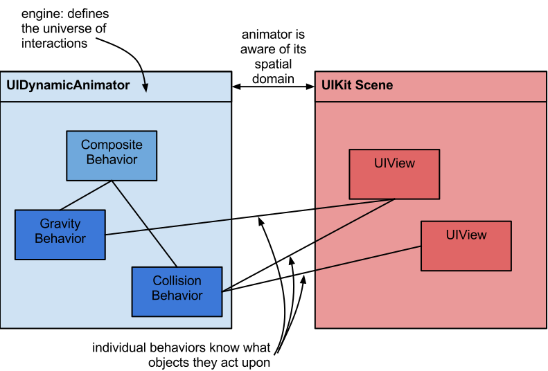
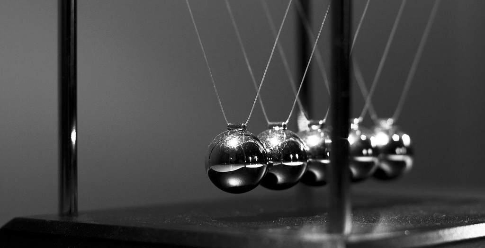

# iOS7 Day-by-Day: Day 0
## UIKit Dynamics

With the introduction of iOS7 Apple made it very clear that they are pushing the
interaction between devices and the real world. One of the new APIs they introduced
was UIKit Dynamics - a 2-dimensional physics engine which lies underneath the
entirety of UIKit. In day 0 of this blog series we're going to take a look at
UIKit Dynamics and build a Newton's cradle simulation.

### The physical universe

In order to model the physics of real world we use `UIDynamicBehavior` subclasses
to apply different behaviors to objects which adopt the `UIDynamicItem` protocol.
Examples of behaviors include concepts such as gravity, collisions and springs.
Although you can create your own objects which adopt the `UIDynamicItem`
protocol, importantly `UIView` already does this. The `UIDynamicBehavior` objects
can be composited together to generate a behavior object which contains all the
behavior for a given object or set of objects.

Once we have specified the behaviors for our dynamic objects we can provide them
to a `UIDynamicAnimator` instance - the physics engine itself. This runs the
calculations to determine how the different objects should interact given their
behaviors. The follows shows a conceptual overview of the UIKit Dynamics world:

### Building a pendulum

Remembering back to high school science - one of the simplest objects studied in
Newtonian physics is a pendulum. Let's create a `UIView` to represent
the ball-bearing:

    UIView *ballBearing = [[UIView alloc] initWithFrame:CGRectMake(0,0,40,40)];
    ballBearing.backgroundColor = [UIColor lightGrayColor];
    ballBearing.layer.cornerRadius = 10;
    ballBearing.layer.borderColor = [UIColor grayColor].CGColor;
    ballBearing.layer.borderWidth = 2;
    ballBearing.center = CGPointMake(200, 300);
    [self.view addSubview:ballBearing];

Now we can add some behaviors to this ball bearing. We'll create a composite
behavior to collect the behavior together:

    UIDynamicBehavior *behavior = [[UIDynamicBehavior alloc] init];

Next we'll start adding the behaviors we wish to model - first up gravity:

    UIGravityBehavior *gravity = [[UIGravityBehavior alloc] initWithItems:@[ballBearing]];
    gravity.magnitude = 10;
    [behavior addChildBehavior:gravity];

`UIGravityBehavior` represents the gravitational attraction between an object and
the Earth. It has properties which allow you to configure the vector of the
gravitational force (i.e. both magnitude and direction). Here we are increasing
the magnitude of the force, but keeping it directed in an increasing `y` direction.

The other behavior we need to apply to our ball bearing is an attachment
behavior - which represents the string from which it hangs:

    CGPoint anchor = ballBearing.center;
    anchor.y -= 200;
    UIAttachmentBehavior *attachment = [[UIAttachmentBehavior alloc] initWithItem:ballBearing attachedToAnchor:anchor];
    [behavior addChildBehavior:attachment];

`UIAttachmentBehavior` instances attach dynamic objects either to an anchor point
or to another object. They have properties which control the behavior of the
attaching string - specifying its frequent, damping and length. The default values
for this ensure a completely rigid attachment, which is what we want for a pendulum.

Now the behaviors are specified on the ball bearing we can create the physics
engine to look after it all, which is defined as an ivar `UIDynamicAnimator *_animator;`:

    _animator = [[UIDynamicAnimator alloc] initWithReferenceView:self.view];
    [_animator addBehavior:behavior];

`UIDynamicAnimator` represents the physics engine which is required to model the
dynamic system. Here we create it and specify which view it should use as its
reference view (i.e. specifying the spatial universe) and add the composite
behavior we've built.

With that we've actually created our first UIKit Dynamics system. However, if
you run up the app, nothing will happen. This is because the system starts in
and equilibrium state - we need to perturb the system to see some motion.

### Gesture responsive behaviors

We need to add a gesture recognizer to the ball bearing to allow the user to
play with the pendulum:

    UIPanGestureRecognizer *gesture = [[UIPanGestureRecognizer alloc] initWithTarget:self action:@selector(handleBallBearingPan:)];
    [ballBearing addGestureRecognizer:gesture];

In the target for the gesture recognizer we apply a constant force behavior
to the ball bearing:

    - (void)handleBallBearingPan:(UIPanGestureRecognizer *)recognizer
    {
        // If we're starting the gesture then create a drag force
        if (recognizer.state == UIGestureRecognizerStateBegan) {
            if(_userDragBehavior) {
                [_animator removeBehavior:_userDragBehavior];
            }
            _userDragBehavior = [[UIPushBehavior alloc] initWithItems:@[recognizer.view] mode:UIPushBehaviorModeContinuous];
            [_animator addBehavior:_userDragBehavior];
        }
        
        // Set the force to be proportional to distance the gesture has moved
        _userDragBehavior.pushDirection = CGVectorMake([recognizer translationInView:self].x / 10.f, 0);

        
        // If we're finishing then cancel the behavior to 'let-go' of the ball
        if (recognizer.state == UIGestureRecognizerStateEnded) {
            [_animator removeBehavior:_userDragBehavior];
            _userDragBehavior = nil;
        }
    }

`UIPushBehavior` represents a simple linear force applied to objects. We use the
callback to apply a force to the ball bearing, which displaces it. We have an
ivar `UIPushBehavior *_userDragBehavior` which we create when a gesture start,
remembering to add it to the dynamics animator. We set the size of the force to
be proportional to the horizontal displacement. In order for the pendulum to
swing we remove the push behavior when the gesture has ended.

### Combining multiple pendulums

A Newton's cradle is an arrangement of identical pendulums, such that the ball
bearings are almost touching. 

(attr: flickr/xraijs)

To recreate this using UIKit Dynamics we need to create multiple pendulums -
following the same pattern for each of them as we did above. They should be
spaced so that they aren't quite touching (see the sample code for details).

We also need to add a new behavior which will describe how the ball bearings
collide with each other. We now have an ivar to store the ball bearings
`NSArray *_ballBearings;`:

    UICollisionBehavior *collision = [[UICollisionBehavior alloc] initWithObjects:_ballBearings];
    [behavior addChildBehavior:collision];

Here we're using a collision behavior and a set of objects which are modeled in
the system. Collision behaviors can also be used to model objects hitting boundaries
such as view boundaries, or arbitrary bezier path boundaries.

If you run the app now and try to move one of the pendulums you'll notice that
the cradle doesn't behave as you would expect it to. This is because the collisions
are currently not elastic. We need to add a special type of dynamic behavior to
specify various shared properties:

    UIDynamicItemBehavior *itemBehavior = [[UIDynamicItemBehavior alloc] initWithItems:_ballBearings];
    // Elasticity governs the efficiency of the collisions
    itemBehavior.elasticity = 1.0;
    itemBehavior.allowsRotation = NO;
    itemBehavior.resistance = 2.0;
    [behavior addChildBehavior:itemBehavior];

We use `UIDynamicItemBehavior` to specify the elasticity of the collisions, along
with some other properties such as resistance (pretty much air resistance) and
rotation. If we allow rotation we can specify the angular resistance. The dynamic
item behavior also allows setting of linear and angular velocity which can be
useful when matching velocities with gestures.

Running the app up now will show a Newton's cradle which behaves exactly as you
would expect it in the real world. Maybe as an extension you could investigate
drawing the strings of the pendulums as well as the ball bearings.

The code which accompanies this post represents the completed Newton's cradle
project. It uses all the elements introduced, but just tidies them up a little
into a demo app.

### Conclusion

This introduction to UIKit Dynamics has barely scratched the surface - with these
building blocks really complex physical systems can be modeled. This opens the 
door for creating apps which are heavily influenced by our inherent understanding
of motion and object interactions from the real world.
