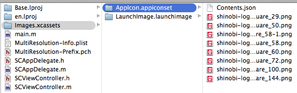
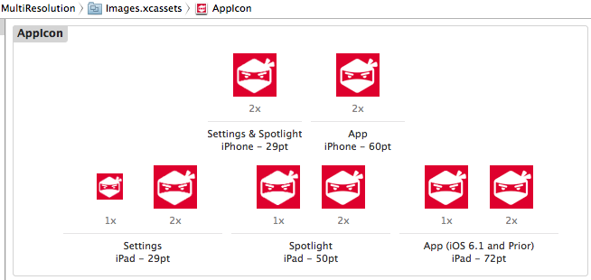
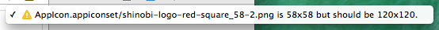
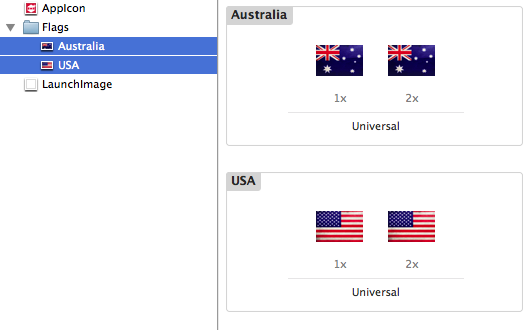
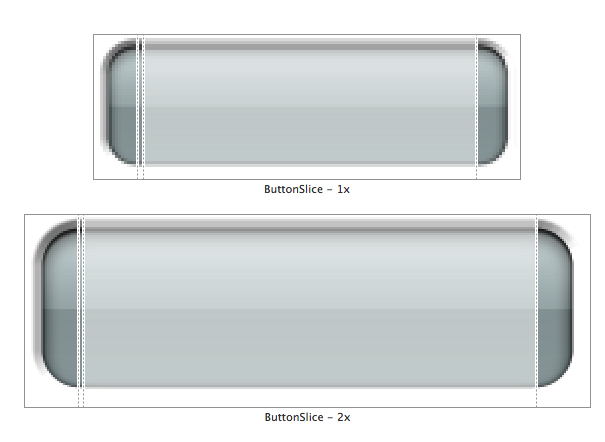

# iOS7 Day-by-Day: Day 2
## Asset Catalog

### Introduction

We have all spent time fiddling with organizing image assets in Xcode projects
in the past - never sure whether we've got the retina versions of all the image,
or whether we've got all the different icon versions we need. In the past this
has been a disjoint process at best, but with Xcode 5 and iOS 7 Apple have
introduced a new concept in Asset Catalogs which organize both the physical image
files and the contextual information about them. An asset catalog comprises a
collection of image sets, app icons and launch screens and is created within
Xcode. When creating a new project in Xcode 5 an asset catalog will be created
called Images, and will be prepared for holding app icons and launch screens.
Xcode provides a facility to migrate old apps to using asset catalogs.

In iOS 7 the catalogs are compiled into an optimized binary format for release
to reduce the size of the completed app.

Asset catalogs are a directory on disk which is managed by Xcode. It is structured
in a particular way, and includes a json file to store the meta-data associated
with the catalog:

### App icons and launch images

The asset catalog auto-created by Xcode is called `Images.xcassets` and contains
entries for `AppIcon` and `LaunchImage`. Each of these has fields appropriate for
the deployment target of your project, and includes the sizes required:

Simply dragging images from the finder into the asset catalog manager in finder
will bring the image into the asset catalog. If you have provided an incorrectly
sized image this will raise a warning in Xcode:

### Custom imagesets

As well as the standard collections, you can use asset catalogs to manage your
own images. Images are contained within an `ImageSet`, with a reference for both
retina and non-retina versions of the same image.

Creating an image set is done within Xcode, and you can organize image sets within
folders for ease of navigation. Using the images stored inside an asset catalog
is as simple as using `UIImage:imageNamed:`:

    UIImage *image = [UIImage imageNamed:@"Australia"];

### Slicing images

The other major feature of asset catalogs is the ability to do image slicing.
Creating images which are re-sizable in this manner has been available since
iOS 2, but this new feature in Xcode makes it really simple to do.

Resizing images using slicing is a common technique for creating visual elements
such as buttons - where the center of the image should be stretched or tiled to
the new size, and the edges should be stretched in one direction only and the
corners should remain the same size.

Slicing is available on an `ImageSet` within the asset catalog - enabled by
clicking the 'Show Slicing' button. You can choose horizontal, vertical or both
for scaling direction. Your image will then be overlaid with guides which mark
the fixed endpoints, and size of the re-sizable central section:

Using these sliced images is really easy - simply create a `UIImage` as before,
and then when you resize the `UIImageView` used to display it, the image will
rescale as per the slicing.

    UIImage *btnImage = [UIImage imageNamed:@"ButtonSlice"];
    
    // Let's make 2
    UIImageView *iv = [[UIImageView alloc] initWithImage:btnImage];
    iv.bounds = CGRectMake(0, 0, 150, CGRectGetHeight(iv.bounds));
    iv.center = CGPointMake(CGRectGetWidth(self.view.bounds) / 2, 300);
    [self.view addSubview:iv];

    // And a stretched version
    iv = [[UIImageView alloc] initWithImage:btnImage];
    iv.bounds = CGRectMake(0, 0, 300, CGRectGetHeight(iv.bounds));
    iv.center = CGPointMake(CGRectGetWidth(self.view.bounds) / 2, 350);
    [self.view addSubview:iv];

### Conclusion

Asset catalogs aren't a ground-breaking addition to the iOS developers toolkit,
but they really do take some of the pain out of the fiddly aspects of development.
They come as enabled for new projects with Xcode 5, and will make asset management
a much less arduous task.

