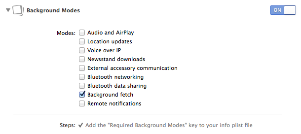
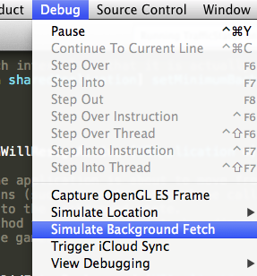
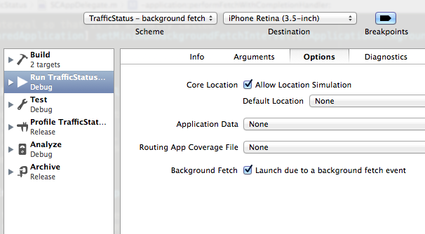

# iOS7 Day-by-Day: Day 3
## Background Fetch

### Introduction

iOS7 introduces a few new multi-tasking APIs - we've already seen the data
transfer daemon offered by `NSURLSession` which allows file downloads to be
continued when the app is in the background. Another new feature is the
background fetch API, which allows an app to get updated content even when it
isn't running. This enables your app to have up to date content the second a
user opens it, rather than having to wait for the update to be delivered over the
network. iOS intelligently schedules the background fetch events based on your
app usage and to save battery life - e.g. it might notice that a user checks their
social network every morning when they wake up, and therefore schedule a fetch
just before.

### Enabling background fetch

An app has to register that it wishes to use background fetch, which with the new
capabilities tab in Xcode 5 is really easy to do:

The other thing that you need to do is specify how often you would like to be
woken up to perform a background fetch. If you know that your data is only going
to be updated every hour, then that's information that the iOS fetch scheduler
can use. If you aren't sure then you can use the recommended value:

    - (BOOL)application:(UIApplication *)application didFinishLaunchingWithOptions:(NSDictionary *)launchOptions
    {   
        // Set the fetch interval so that it is actually called
        [[UIApplication sharedApplication] setMinimumBackgroundFetchInterval:UIApplicationBackgroundFetchIntervalMinimum];
        
        return YES;
    }

Note that the default value for `minimumBackgroundFetchInterval` is
`UIApplicationBackgroundFetchIntervalNever`, and therefore this value needs to
be set so that your app is called.

### Implementation

When a background fetch occurs, iOS starts the app and then makes a call to the
application delegate method `application: performFetchWithCompletionHandler:`.
The app then has a certain amount of time to perform the fetch and call the
completion handler block it has been provided.

The project which accompanies this article is a traffic status app - which has
simulates receiving notifications about traffic conditions on roads and then
displaying them in a `UITableView`. In this demo, the updates are randomly
generated - and this can be seen from pulling the table to refresh, which has the
following method as its target:

    - (void)refreshStatus:(id)sender
    {
        [self createNewStatusUpdatesWithMin:0 max:3 completionBlock:^{
            [refreshControl endRefreshing];
        }];
    }

This calls a utility method `createNewStatusUpdatesWithMin:max:completionBlock:`:

    - (NSUInteger)createNewStatusUpdatesWithMin:(NSUInteger)min max:(NSUInteger)max completionBlock:(SCTrafficStatusCreationComplete)completionHandler
    {
        NSUInteger numberToCreate = arc4random_uniform(max-min) + min;
        NSMutableArray *indexPathsToUpdate = [NSMutableArray array];
        
        for(int i=0; i<numberToCreate; i++) {
            [self.trafficStatusUpdates insertObject:[SCTrafficStatus randomStatus] atIndex:0];
            [indexPathsToUpdate addObject:[NSIndexPath indexPathForRow:i inSection:0]];
        }
        
        [self.tableView insertRowsAtIndexPaths:indexPathsToUpdate withRowAnimation:UITableViewRowAnimationFade];
        if(completionHandler) {
            completionHandler();
        }
        
        return numberToCreate;
    }

In this we create a random number of random updates (using the `randomStatus`
class method on `SCTrafficStatus`, which, as its name suggests, generates a
random status object). We then update our backing data store, refresh the table
and call the completion handler. This is all standard `UITableView` code, and
this is where you can slot in the code which actually updates your datastore from
the network.

In order to add the facility to create updates using background fetch, we add
a method to the API of our view controller:

    - (NSUInteger)insertStatusObjectsForFetchWithCompletionHandler:(void (^)(UIBackgroundFetchResult))completionHandler
    {
        NSUInteger numberCreated = [self createNewStatusUpdatesWithMin:0 max:3 completionBlock:NULL];
        NSLog(@"Background fetch completed - %d new updates", numberCreated);
        UIBackgroundFetchResult result = UIBackgroundFetchResultNoData;
        if(numberCreated > 0) {
            result = UIBackgroundFetchResultNewData;
        }
        completionHandler(result);
        return numberCreated;
    }

This method takes a completion handler of the form used by the app delegate
background fetch method - so we can use this later on. First we're creating
some new updates, using the method we described before. The completion handler
needs to be informed whether the update worked, and if it did, whether new
data was delivered. We establish this using the return value of our create
method, and then call the completion handler with the appropriate result.

This completion handler is used to tell iOS that we're done and that, if
appropriate, we're ready to have our snapshot taken to update the display in
the app launcher.

Finally, we need to link this up with the app delegate method:

    - (void)application:(UIApplication *)application performFetchWithCompletionHandler:(void (^)(UIBackgroundFetchResult))completionHandler
    {
        // Get hold of the view controller
        SCViewController *vc = (SCViewController *)self.window.rootViewController;
        // Insert status updates and pass in the completion handler block
        NSUInteger numberInserted = [vc insertStatusObjectsForFetchWithCompletionHandler:completionHandler];
        [UIApplication sharedApplication].applicationIconBadgeNumber += numberInserted;
    }

Now, when the app is woken up for a background fetch, it will call through to the
view controller, and perform the update. Refreshingly simple.

### Testing

So far, we haven't tested any of this code, and it's not immediately obvious how
to simulate background fetch events. Xcode 5 has this sorted, but before we dive
in we need to consider 2 cases:

1. __App currently running in background__

The user has started the app and has left it to do something else, but the app
is continuing to run in the background (i.e. it hasn't been terminated). Xcode
provides a new debugging method to simulate this, so testing is as simple as
running up the app, pressing the home button and then invoking the new debug
method:

Whilst debugging it's a good idea to have some logging in your fetch update
methods to observe the fetch event taking place. In the sample app, this will
update the app's badge on the home screen.

2. __App currently in terminated state__

The app has run before, but was terminated, either by the user or by iOS. The
easiest way to simulate this is to add a new scheme to Xcode. Click manage
schemes from the scheme drop down in Xcode, and then duplicate the existing
scheme. Editing the new scheme then update the run task with the option to launch
as a background fetch process:

Now, when you run this scheme you'll see the simulator start up, but your app
won't be lauched. If you've got some logging in the background fetch delegate
method then you'll see that output. See the attached project for an example of
this.

### Conclusion

Background fetch offers the opportunity to enhance the user experience of your
app for a small amount of effort. If your app relies on data updates from the
internet, then this is a really simple way to ensure that your user always has 
the latest information when the app launches. 

