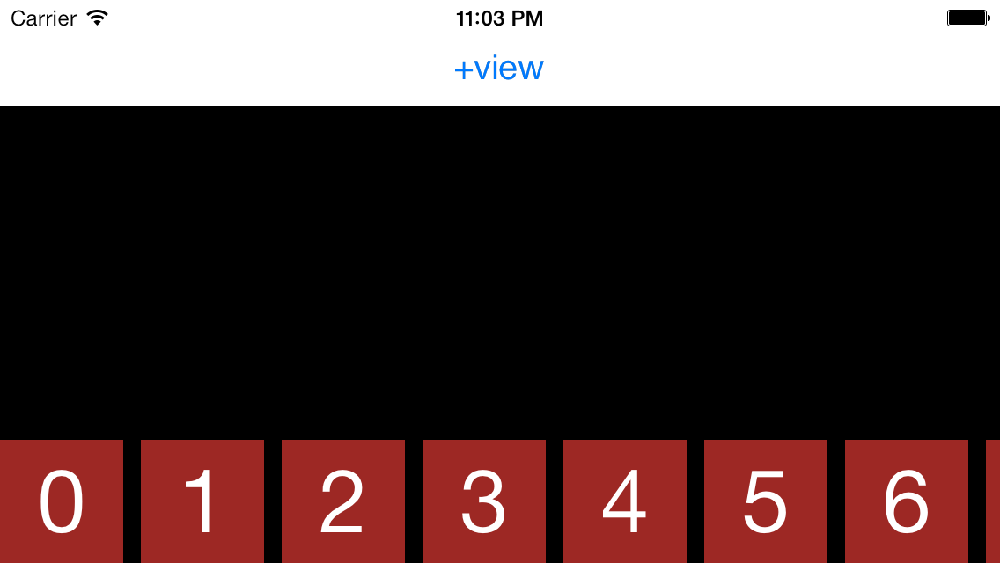
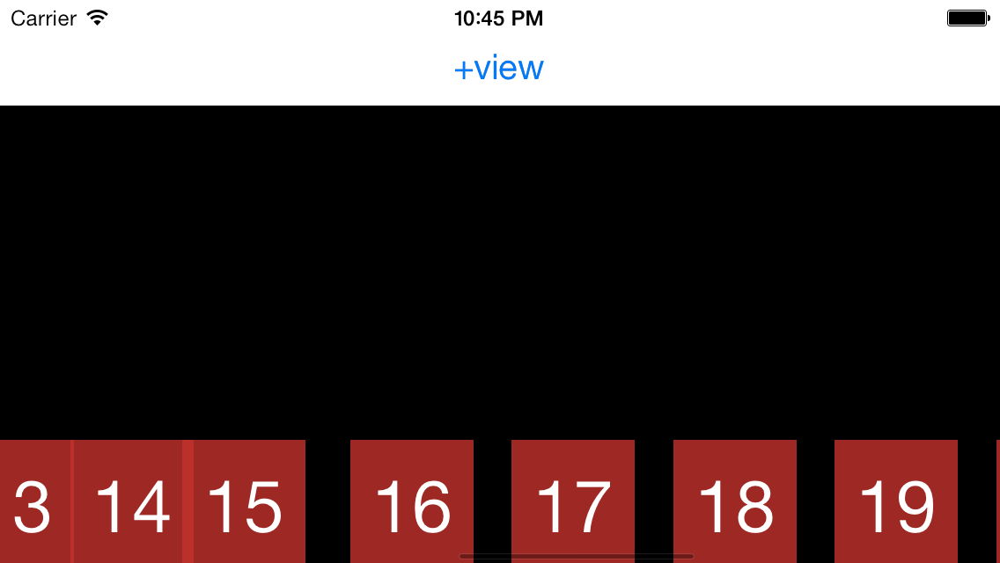

# iOS7 Day-by-Day: Day 5

## UIDynamics and Collection Views

Back at the beginning of this series, day 0 took a look at the new UIKit Dynamics
physics engine, and used it to build a Newton's Cradle. Although this was a lot
of fun, and served as a good introduction to UIKit Dynamics, it's not particularly
obvious how this can be useful when building apps. Today's DbD looks at how to
link the physics engine with UICollectionViews - resulting in some subtle effects
noticeable as the user interacts with the collection.

The demo project which accompanies today's post is a horizontal 'springy' carousel,
where the individual items are attached to springs. We will also show how to
use the dynamics engine to animate the newly added cells.

### Building a Carousel

In order to demonstrate using the physics engine with a collection view, we
firstly need to make a carousel out of a `UICollectionView`. This post isn't a
tutorial on how to use `UICollectionView`, so I'll skip briefly through this part.
We'll make the view controller the datasource and delegate for the collection
view, and implement the methods we need:

    #pragma mark - UICollectionViewDataSource methods
    - (NSInteger)numberOfSectionsInCollectionView:(UICollectionView *)collectionView
    {
        return 1;
    }

    - (NSInteger)collectionView:(UICollectionView *)collectionView numberOfItemsInSection:(NSInteger)section
    {
        return [_collectionViewCellContent count];
    }

    - (UICollectionViewCell *)collectionView:(UICollectionView *)collectionView cellForItemAtIndexPath:(NSIndexPath *)indexPath
    {
        SCCollectionViewSampleCell *cell = (SCCollectionViewSampleCell *)[self.collectionView dequeueReusableCellWithReuseIdentifier:@"SpringyCell" forIndexPath:indexPath];
        cell.numberLabel.text = [NSString stringWithFormat:@"%d", [_collectionViewCellContent[indexPath.row] integerValue]];
        return cell;
    }

    #pragma mark - UICollectionViewDelegate methods
    - (CGSize)collectionView:(UICollectionView *)collectionView layout:(UICollectionViewLayout *)collectionViewLayout sizeForItemAtIndexPath:(NSIndexPath *)indexPath
    {
        return itemSize;
    }

The cells are each square tiles which contain a number inside a `UILabel`. The
numbers of the cells we are currently displaying in the collection view are
stored inside an array (`_colletionViewCellContent`) as `NSNumber` objects. We
do this to preserve the ordering of the cells - not important at this stage, but
will be once we work out how to insert new cells.

In order to get the collection view to appear as a horizontal carousel we need
to provide a custom layout. As is often the case, the flow layout has a lot of
what we need, so we'll subclass that:

    @interface SCSpringyCarousel : UICollectionViewFlowLayout
    - (instancetype)initWithItemSize:(CGSize)size;
    @end

In order to force all of the items into a horizontal carousel at the bottom of the 
view we need to know the item height - hence the constructor which requires an
item size. We override the `prepareLayout` method to set the content inset to
push the items to the bottom of the collection view:

    - (void)prepareLayout
    {
        // We update the section inset before we layout
        self.sectionInset = UIEdgeInsetsMake(CGRectGetHeight(self.collectionView.bounds) - _itemSize.height, 0, 0, 0);
        [super prepareLayout];
    }

Setting this as the layout on the collection view will create the horizontal
carousel we're after.

    - (void)viewDidLoad
    {
        [super viewDidLoad];
        
        ...
        // Provide the layout
        _collectionViewLayout = [[SCSpringyCarousel alloc] initWithItemSize:itemSize];
        self.collectionView.collectionViewLayout = _collectionViewLayout;
    }

### Adding springs

Now on to the more exciting stuff - let's fix this up with the UIKit Dynamics
physics engine.

The physical model we're going to use has each item connected to the position it
would have been fixed to in a vanilla flow layout - i.e. the we take the items 
from the carousel we've already made, and attach the them to their positions with
springs. Then, as we scroll the view, the springs will stretch and we'll get the
effect we want. Well, nearly, we need to perturb the springs a distance proportional
to the distance from the touch point, but we'll come to that when the time is
right.

Translating this model into a UIDynamics concept is as follows:
- When we are preparing the layout we request the positioning information from
the flow layout super class.
- We add appropriate behaviors to these positioning objects to allow them to
be animated in the physics world.
- These behaviors and position objects are passed to the animator so that the
simulation can run.
- The methods on the `UICollectionViewLayout` are overridden to return the
positions from the animator, instead of the flow layout superclass.

This all sounds a lot more complicated than it actually is - honestly! Let's
work through it in stages.

#### Behavior Manager

In order to keep the code nice and tidy, we'll create a class which manages
the dynamic behaviors inside the animator. It's API should look like the
following:

    @interface SCItemBehaviorManager : NSObject
    @property (readonly, strong) UIGravityBehavior *gravityBehavior;
    @property (readonly, strong) UICollisionBehavior *collisionBehavior;
    @property (readonly, strong) NSDictionary *attachmentBehaviors;
    @property (readonly, strong) UIDynamicAnimator *animator;

    - (instancetype)initWithAnimator:(UIDynamicAnimator *)animator;

    - (void)addItem:(UICollectionViewLayoutAttributes *)item anchor:(CGPoint)anchor;
    - (void)removeItemAtIndexPath:(NSIndexPath *)indexPath;
    - (void)updateItemCollection:(NSArray*)items;
    - (NSArray *)currentlyManagedItemIndexPaths;
    @end

The behavior of each of our cells is constructed from a shared `UIGravityBehavior`,
a shared `UICollisionBehavior` and an individual `UIAttachmentBehvaior`. We create
our behavior manager with a `UIDynamicAnimator` and expose methods for adding,
removing items, as well as a method to update the collection to match an array.

When we create a manager object then we want to create the shared behaviors, and
attach them to the animator:

    - (instancetype)initWithAnimator:(UIDynamicAnimator *)animator
    {
        self = [super init];
        if(self) {
            _animator = animator;
            _attachmentBehaviors = [NSMutableDictionary dictionary];
            [self createGravityBehavior];
            [self createCollisionBehavior];
            // Add the global behaviors to the animator
            [self.animator addBehavior:self.gravityBehavior];
            [self.animator addBehavior:self.collisionBehavior];
        }
        return self;
    }

with the 2 utility methods called here being very simple, and having similar
composition to what we used for the Newton's Cradle project back on day 0:

    - (void)createGravityBehavior
    {
        _gravityBehavior = [[UIGravityBehavior alloc] init];
        _gravityBehavior.magnitude = 0.3;
    }

    - (void)createCollisionBehavior
    {
        _collisionBehavior = [[UICollisionBehavior alloc] init];
        _collisionBehavior.collisionMode = UICollisionBehaviorModeBoundaries;
        _collisionBehavior.translatesReferenceBoundsIntoBoundary = YES;
        // Need to add item behavior specific to this
        UIDynamicItemBehavior *itemBehavior = [[UIDynamicItemBehavior alloc] init];
        itemBehavior.elasticity = 1;
        // Add it as a child behavior
        [_collisionBehavior addChildBehavior:itemBehavior];
    }

You'll notice that we don't add any dynamic items to the behaviors at this stage -
principally because we don't actually have any yet. The collision behavior isn't
going to be used for collisions between the individual cells, but instead within
the boundary of the collection view. Hence the setting the two properties:
`collisionMode` and `translatesReferenceBoundsIntoBoundary`. We also add a
`UIDynamicItemBehavior` to specify the elasticity of the collisions, in the same
way that we did with the pendula.

Now we have created these global behaviors we need to implement the `addItem:`
and `removeItem:` methods. The add method will add the new item to the global
behaviors and also set up the spring which attaches the cell to the background
canvas:

    - (void)addItem:(UICollectionViewLayoutAttributes *)item anchor:(CGPoint)anchor
    {
        UIAttachmentBehavior *attachmentBehavior = [self createAttachmentBehaviorForItem:item anchor:anchor];
        // Add the behavior to the animator
        [self.animator addBehavior:attachmentBehavior];
        // And store it in the dictionary. Keyed by the index path
        [_attachmentBehaviors setObject:attachmentBehavior forKey:item.indexPath];
        
        // Also need to add this item to the global behaviors
        [self.gravityBehavior addItem:item];
        [self.collisionBehavior addItem:item];
    }

The spring behavior is created using a utility method:

    - (UIAttachmentBehavior *)createAttachmentBehaviorForItem:(id<UIDynamicItem>)item anchor:(CGPoint)anchor
    {
        UIAttachmentBehavior *attachmentBehavior = [[UIAttachmentBehavior alloc] initWithItem:item attachedToAnchor:anchor];
        attachmentBehavior.damping = 0.5;
        attachmentBehavior.frequency = 0.8;
        attachmentBehavior.length = 0;
        return attachmentBehavior;
    }

We also store the attachment behavior in a dictionary, keyed by the `NSIndexPath`.
This will allow us to work out which spring we need to remove when we implement
the remove method.

Once we created the attachment behavior we add it to the animator, and add the
provided item to the shared gravity and collision behaviors.

The remove method performs exactly the opposite operation - remove the attachment
behavior from the animator and the item from the shared gravity and collision
behaviors:

    - (void)removeItemAtIndexPath:(NSIndexPath *)indexPath
    {
        // Remove the attachment behavior from the animator
        UIAttachmentBehavior *attachmentBehavior = self.attachmentBehaviors[indexPath];
        [self.animator removeBehavior:attachmentBehavior];

        
        // Remove the item from the global behaviors
        for(UICollectionViewLayoutAttributes *attr in [self.gravityBehavior.items copy])
        {
            if([attr.indexPath isEqual:indexPath]) {
                [self.gravityBehavior removeItem:attr];
            }
        }
        for (UICollectionViewLayoutAttributes *attr in [self.collisionBehavior.items copy])
        {
            if([attr.indexPath isEqual:indexPath]) {
                [self.collisionBehavior removeItem:attr];
            }
        }
        
        // And remove the entry from our dictionary
        [_attachmentBehaviors removeObjectForKey:indexPath];
    }

This method is slightly more complicated than we would like. Removing the
attachment behavior is as we would expect, but removing the item from the shared
behaviors is a little more complicated. The item objects have been copied, and
have different references. Therefore we need to search though all of the items
the gravity behavior is acting upon, and remove the one with the same index path.
Hence we loop through the items searching for the item with the same index path.

There is one more method on the API of the behavior manager - `updateItemCollection:`.
This method takes a collection of items and then calls the `addItem:anchor:`
and `removeItem:` methods with the correct arguments to ensure that the manager
is currently managing the correct items. We'll see very soon why this is useful,
but let's take a look at the implementation:

    - (void)updateItemCollection:(NSArray *)items
    {
        // Let's find the ones we need to remove. We work in indexPaths here
        NSMutableSet *toRemove = [NSMutableSet setWithArray:[self.attachmentBehaviors allKeys]];
        [toRemove minusSet:[NSSet setWithArray:[items valueForKeyPath:@"indexPath"]]];
        
        // Let's remove any we no longer need
        for (NSIndexPath *indexPath in toRemove) {
            [self removeItemAtIndexPath:indexPath];
        }
        
        // Find the items we need to add springs to. A bit more complicated =(
        // Loop through the items we want
        NSArray *existingIndexPaths = [self currentlyManagedItemIndexPaths];
        for(UICollectionViewLayoutAttributes *attr in items) {
            // Find whether this item matches an existing index path
            BOOL alreadyExists = NO;
            for(NSIndexPath *indexPath in existingIndexPaths) {
                if ([indexPath isEqual:attr.indexPath]) {
                    alreadyExists = YES;
                }
            }
            // If it doesn't then let's add it
            if(!alreadyExists) {
                // Need to add
                [self addItem:attr anchor:attr.center];
            }
        }
    }

It's a very simple method - we first find the items we need to remove - using
some simple set operations ({Items we currently have} / {Items we should have}).
Then we loop through the resultant set and call the `removeItem:` method.

To work out the items we need to add we loop try to find each item in the collection
we've been sent in our dictionary of managed items. If we can't find it then we
need to start managing the behavior for it, so we call
the `addItem:anchor:` method. Importantly, the anchor point is the current center
position provided in the `UIDynamicItem` object. In terms of the `UICollectionView`,
this means that we want our item to be anchored to the position the flow layout
would like to place them.

#### Using the manager in the collection view layout

Now we've created the behavior manager, we've actually implemented nearly all of
the UIDynamics code we need. All that remains is to wire it up to the collection
view layout. This wiring up takes the form of overriding several methods in our
`UICollectionViewFlowLayout` subclass: `SCSpringyCarousel`.

We had already overridden `prepareLayout` to force the flow layout to take the
form of a horizontal carousel. We now add more to that method to ensure that the
dynamic animator has all the relevant items under its control:

    - (void)prepareLayout
    {
        // We update the section inset before we layout
        self.sectionInset = UIEdgeInsetsMake(CGRectGetHeight(self.collectionView.bounds) - _itemSize.height, 0, 0, 0);
        [super prepareLayout];
        
        // Get a list of the objects around the current view
        CGRect expandedViewPort = self.collectionView.bounds;
        expandedViewPort.origin.x -= 2 * _itemSize.width;
        expandedViewPort.size.width += 4 * _itemSize.width;
        NSArray *currentItems = [super layoutAttributesForElementsInRect:expandedViewPort];
        
        // We update our behavior collection to just contain the objects we can currently (almost) see
        [_behaviorManager updateItemCollection:currentItems];   
    }

The first few lines of code are exactly as before. We then work out an expanded
viewport bounds. This involves taking the current viewport and expanding it to
the left and right, ensuring that the items which are soon to appear on screen
are under the control of our dynamic animator. Once we have the viewport we ask
our superclass for the layout attributes for all the items which would appear
within this rectangle - i.e. all the items which would have appeared within that
range had we been using a vanilla flow layout. Like `UIView` these
`UICollectionViewLayoutAttributes` objects all adopt the `UIDynamicItem` protocol,
and hence can be animated by our `UIDynamicAnimator`. We pass this collection
of objects through to our behavior manager to ensure that we are managing the
behavior of the correct items.

The next method we need to override is `shouldInvalidateLayoutForBoundsChange:`.
We don't actually want to change the behavior of this method (the default returns
`NO` and we won't change this), but it gets called whenever the bounds of our
collection view changes. In the world of scroll views, the bounds property
represents the current viewport position - i.e. the `x` and `y` values are not
necessarily `0` as they usually are. Therefore, a 'bounds change' event in
a `UIScrollView` subclass actually occurs as the scrollview is scrolled.

This method is the most complicated part of this demo project, so we'll step
through it bit-by-bit.

    - (BOOL)shouldInvalidateLayoutForBoundsChange:(CGRect)newBounds
    {
        CGFloat scrollDelta = newBounds.origin.x - self.collectionView.bounds.origin.x;
        
        CGPoint touchLocation = [self.collectionView.panGestureRecognizer locationInView:self.collectionView];
        
        for (UIAttachmentBehavior *behavior in [_behaviorManager.attachmentBehaviors allValues]) {
            CGPoint anchorPoint = behavior.anchorPoint;
            CGFloat distFromTouch = ABS(anchorPoint.x - touchLocation.x);
            
            UICollectionViewLayoutAttributes *attr = [behavior.items firstObject];
            CGPoint center = attr.center;
            CGFloat scrollFactor = MIN(1, distFromTouch / 500);
            
            center.x += scrollDelta * scrollFactor;
            attr.center = center;
            
            [_dynamicAnimator updateItemUsingCurrentState:attr];
        }
        
        return NO;
    }

1. Firstly we find out how much we have just scrolled the scroll view - since we
were last called, and hence last updated our springs.
2. We can then find the location of the current touch within the collection view,
since we have access to the `panGestureRecognizer` of the underlying scrollview.
3. Now we need to loop through each of the springs in the behavior manager,
updating them.
4. Firstly we find out how far our item's rest position (i.e. the behavior's 
anchor point) is from the touch. This is because we're going to stretch the springs
proportionally to how far they are from our touch point.
5. Then we work out the new position of the current cell - using a magic 
`scrollFactor` and the actual scrollDelta.
6. We tell the dynamic animator that it should refresh its understanding of the
item's state. When an item is added to a dynamic animator it makes an internal copy
of the item's state and then animates that. In order to push new state in we update
the `UIDynamicItem` properties and then tell the animator that it should reload
the state of this item.
7. Finally we return `NO` - we are letting the dynamic animator manage the positions
of our cells, we don't need the collection view to re-request it from the layout.

There are 2 more methods we need to override, the purpose of both is to remove
the responsibility of item layout from the flow layout class, and give it instead
to the dynamic animator:

    - (NSArray *)layoutAttributesForElementsInRect:(CGRect)rect
    {
        return [_dynamicAnimator itemsInRect:rect];
    }

    - (UICollectionViewLayoutAttributes *)layoutAttributesForItemAtIndexPath:(NSIndexPath *)indexPath
    {
        return [_dynamicAnimator layoutAttributesForCellAtIndexPath:indexPath];
    }

The dynamic animator has 2 helper methods for precisely this purpose, which
plug nicely into the collection view layout class. These methods are used by the
collection view to position the cells. We simply get the dynamic animator to return
the positions of the relevant cells - either by `indexPath` or for the cells which
are visible in the specified rectangle.

#### Test run

Well, if you run this project up now you should have a horizontal carousel, which
as you drag items around you get a springy effect - where cells ahead of the drag
direction bunch up, and those behind spread out.

### Inserting items

Now that we've got this springy carousel working, we're going to see how difficult
it is to govern adding new cells using the dynamic animator as well as scrolling.
We've actually done a lot of the work, so let's see what we need to add.

With a standard `UICollectionView`, the layout provides the layout attributes for
an appearing item, and then the item will be animated to its final position
within the collection - i.e. the position returned by `layoutAttributesForItemAtIndexPath:`.
However, we are going to perform the animation using our `UIDynamicAnimator`, and
therefore need to prevent `UIView` animations. To do this add the following line
to `prepareLayout`:

    [UIView setAnimationsEnabled:NO];

This will ensure that we don't have 2 different animation processes fighting
against each other.

As mentioned, the `UICollectionViewLayout` will get called to ask for where a
new item should be positioned, using the snappily named
`initialLayoutAttributesForAppearingItemAtIndexPath:` method. We are going to
let our animator handle this:

    - (UICollectionViewLayoutAttributes *)initialLayoutAttributesForAppearingItemAtIndexPath:(NSIndexPath *)itemIndexPath
    {
        return [_dynamicAnimator layoutAttributesForCellAtIndexPath:itemIndexPath];
    }

Now we actually need to do let the animator know that it a new item arriving,
update the positions of the existing items appropriately, and position the new
one. To do this we override the `prepareForCollectionViewUpdates:` method on
the `SCSpringyCarousel` class:

    - (void)prepareForCollectionViewUpdates:(NSArray *)updateItems
    {
        for (UICollectionViewUpdateItem *updateItem in updateItems) {
            if(updateItem.updateAction == UICollectionUpdateActionInsert) {
                // Reset the springs of the existing items
                [self resetItemSpringsForInsertAtIndexPath:updateItem.indexPathAfterUpdate];
                
                // Where would the flow layout like to place the new cell?
                UICollectionViewLayoutAttributes *attr = [super initialLayoutAttributesForAppearingItemAtIndexPath:updateItem.indexPathAfterUpdate];
                CGPoint center = attr.center;
                CGSize contentSize = [self collectionViewContentSize];
                center.y -= contentSize.height - CGRectGetHeight(attr.bounds);
                
                // Now reset the center of insertion point for the animator
                UICollectionViewLayoutAttributes *insertionPointAttr = [self layoutAttributesForItemAtIndexPath:updateItem.indexPathAfterUpdate];
                insertionPointAttr.center = center;
                [_dynamicAnimator updateItemUsingCurrentState:insertionPointAttr];
            }
        }
    }

This is a long method, but can break it down into simple chunks:

1. This method gets called for inserts, removals and moves. We're only interested
in insertions for this project, so we're only going to do something if our update
is of type `UICollectionUpdateActionInsert`.
2. When an insert happens, the collection view will re-assign the layout attributes
of those cells above the insertion index to their nextmost neighbor - i.e. if
inserting at index 4, then the cell currently at 5 will be updated to have the
layout attributes of the cell currently at 6 etc. In our scenario we want to keep
the anchor point of the behavior associated with the layout attributes of our
neighbor, but the position should be our current position - not that of our
neighbor. We perform this with a utility method `resetItemSpringsForInsertAtIndexPath:`,
which we'll look at later.
3. Now we deal with the new cell which is being inserted. We ask the flow layout
where it would like to position it. We want it to appear at the top of the
collection view, so that the animator will drop it down using the gravity behavior.
We use this to work out where the center of the inserted cell should be.
4. Now we ask the animator for the layout attributes for the index path we're
inserting at, and then update the position to match the one we've just calculated.

The final piece of the puzzle is the aforementioned method which is used to
update the springs of the items moved to make space for the new item:

    - (void)resetItemSpringsForInsertAtIndexPath:(NSIndexPath *)indexPath
    {
        // Get a list of items, sorted by their indexPath
        NSArray *items = [_behaviorManager currentlyManagedItemIndexPaths];
        // Now loop backwards, updating centers appropriately.
        // We need to get 2 enumerators - copy from one to the other
        NSEnumerator *fromEnumerator = [items reverseObjectEnumerator];
        // We want to skip the lastmost object in the array as we're copying left to right
        [fromEnumerator nextObject];
        // Now enumarate the array - through the 'to' positions
        [items enumerateObjectsWithOptions:NSEnumerationReverse usingBlock:^(id obj, NSUInteger idx, BOOL *stop) {
            NSIndexPath *toIndex = (NSIndexPath*)obj;
            NSIndexPath *fromIndex = (NSIndexPath *)[fromEnumerator nextObject];
            
            // If the 'from' cell is after the insert then need to reset the springs
            if(fromIndex && fromIndex.item >= indexPath.item) {
                UICollectionViewLayoutAttributes *toItem = [self layoutAttributesForItemAtIndexPath:toIndex];
                UICollectionViewLayoutAttributes *fromItem = [self layoutAttributesForItemAtIndexPath:fromIndex];
                toItem.center = fromItem.center;
                [_dynamicAnimator updateItemUsingCurrentState:toItem];
            }
        }];
    }

We have already explained the concept above, and the implementation is pretty
simple to follow. We use 2 reverse iterators, and copy the position of the cell
from one to the other. Then, when the collection view updates the layout attributes
of the cells, the springs will be set to pull them from their old position to
their new one.

We just need to add a button and method to the view controller to manage the
item additions. We add the button in the StoryBoard, and attach it to the
following method:

    - (IBAction)newViewButtonPressed:(id)sender {
        // What's the new number we're creating?
        NSNumber *newTile = @([_collectionViewCellContent count]);
        
        // We want to place it in at the correct position
        NSIndexPath *rightOfCenter = [self indexPathOfItemRightOfCenter];
        
        // Insert the new item content
        [_collectionViewCellContent insertObject:newTile atIndex:rightOfCenter.item];
        
        // Redraw
        [self.collectionView insertItemsAtIndexPaths:@[rightOfCenter]];
    }

There's a utility method to work out the index which is the right hand side
of the center of the currently visible items:

    - (NSIndexPath *)indexPathOfItemRightOfCenter
    {
        // Find all the currently visible items
        NSArray *visibleItems = [self.collectionView indexPathsForVisibleItems];
        
        // Calculate the middle of the current collection view content
        CGFloat midX = CGRectGetMidX(self.collectionView.bounds);
        NSUInteger indexOfItem;
        CGFloat curMin = CGFLOAT_MAX;
        
        // Loop through the visible cells to find the left of center one
        for (NSIndexPath *indexPath in visibleItems) {
            UICollectionViewCell *cell = [self.collectionView cellForItemAtIndexPath:indexPath];
            if (ABS(CGRectGetMidX(cell.frame) - midX) < ABS(curMin)) {
                curMin = CGRectGetMidX(cell.frame) - midX;
                indexOfItem = indexPath.item;
            }
        }
        
        // If min is -ve then we have left of centre. If +ve then we have right of centre.
        if(curMin < 0) {
            indexOfItem += 1;
        }
        
        // And now get the index path to pass back
        return [NSIndexPath indexPathForItem:indexOfItem inSection:0];
        
    }

And with that we're done. Fire up the app and try adding cells - they drop
nicely in and then bounce - really cool. Try pressing adding cells whilst the
carousel is scrolling - this shows how awesome the dynamic animator really is!

### Conclusion

In day 0 we showed how easy the UIKit Dynamics physics engine is to use, but
with today's post we've really got to grips with a real-world example - using
it to animate the cells in a collection view. This has some excellent applications,
and despite its apparent complexity, is actually pretty easy to get your head
around. I encourage you to investigate adding subtle animations you collection
views, which will delight users, albeit subconsciously.

