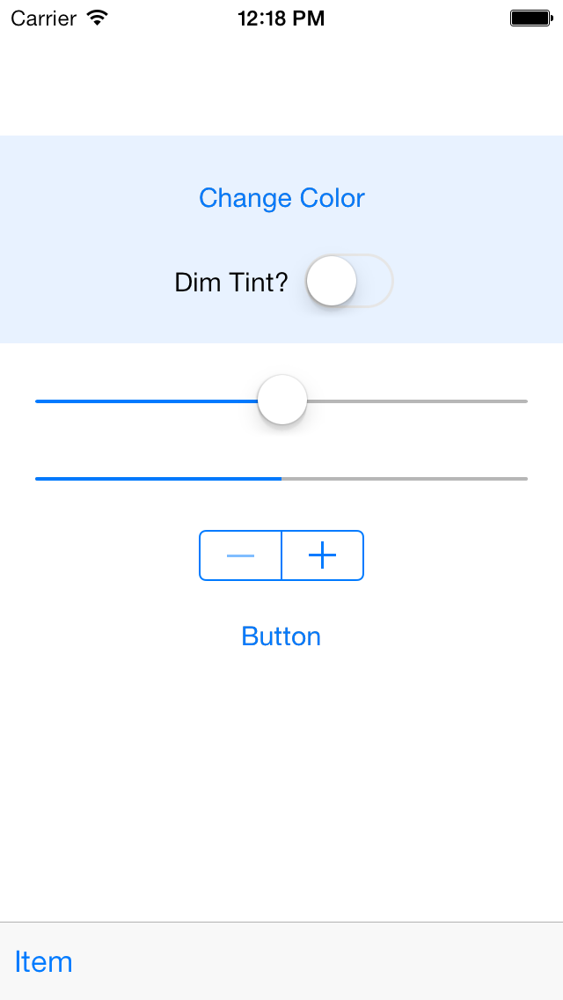
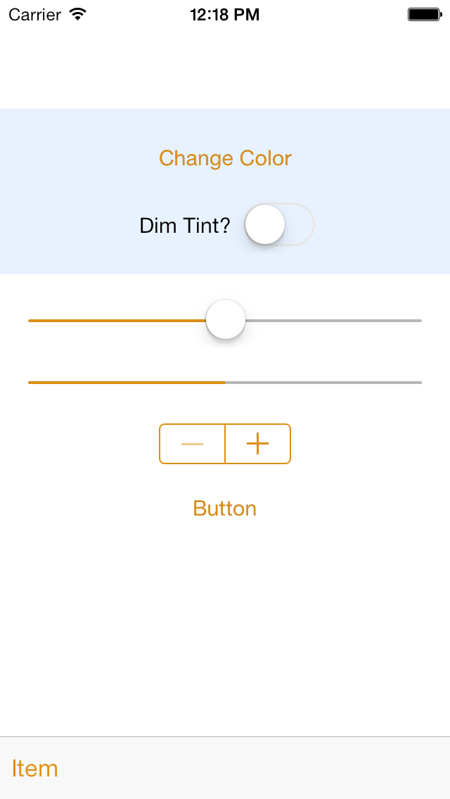
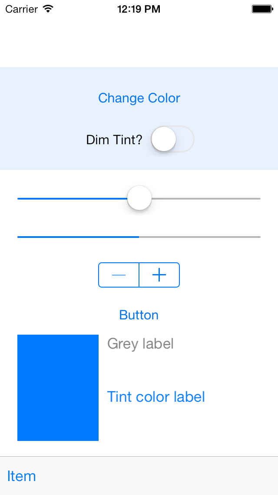
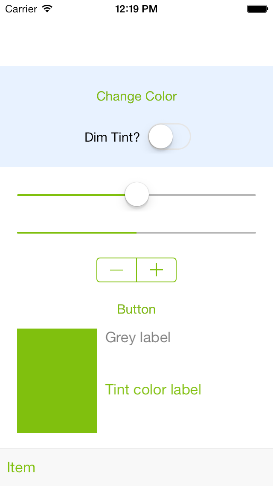
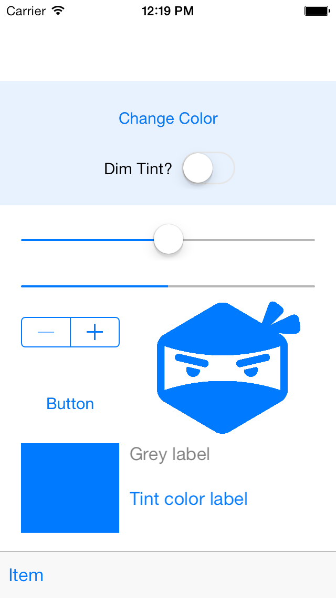
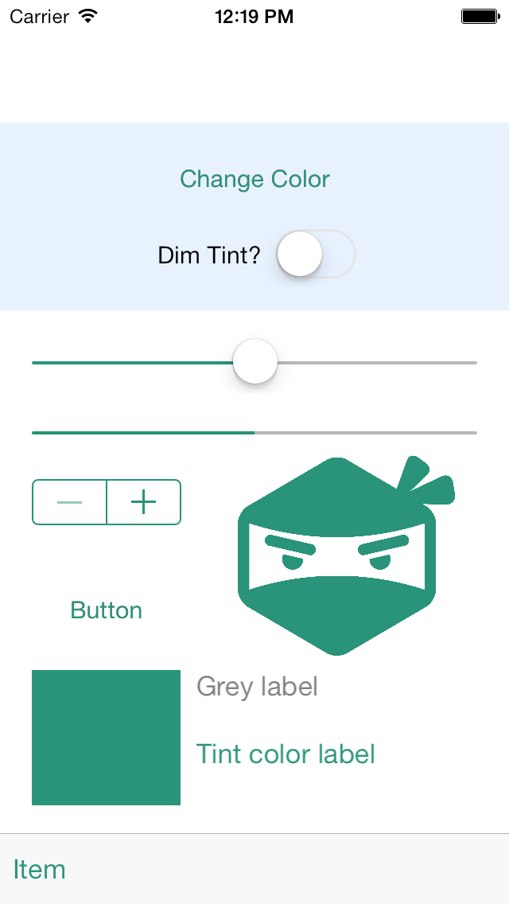

# iOS7 Day-by-Day: Day 6
## TintColor

A fairly small an seemingly unobtrusive addition to `UIView`, the `tintColor`
property is actually incredibly powerful. Today we'll look at how to use it,
including tinting iOS standard controls, using `tintColor` in our own controls
and even how to recolor images.

### Tint color of existing iOS controls

`UIView` adds a new property in iOS7 - `tintColor`. This is a `UIColor` and is
used by `UIView` subclasses to change the appearance of an app. `tintColor` is
`nil` by default, which means that it will use its parent in the view hierarchy
for its tint color. If no parents in the view hierarchy have a `tintColor` set
then the default system blue color will be used. Therefore, it's possible to
completely change the appearance of an entire app by setting the `tintColor` on
the view associated with the root view controller.

To demonstrate this, and to see how `tintColor` changes the appearance of some
standard controls, take a look at the ColorChanger app.

The storyboard contains a selection of controls - including `UIButton`, `UISlider`
and `UIStepper`. We've linked a 'change color' button to the following method in
the view controller:

    - (IBAction)changeColorHandler:(id)sender {
        // Generate a random color
        CGFloat hue = ( arc4random() % 256 / 256.0 );
        CGFloat saturation = ( arc4random() % 128 / 256.0 ) + 0.5;
        CGFloat brightness = ( arc4random() % 128 / 256.0 ) + 0.5;
        UIColor *color = [UIColor colorWithHue:hue saturation:saturation brightness:brightness alpha:1];
        self.view.tintColor = color;
    }

The majority of this method is concerned with generating a random color - the
final line is all that is needed to change the tint color, and hence the appearance
of all the different controls.

One UI control which doesn't respond to `tintColor` changes as you might expect
is `UIProgressView`. This is because it actually has 2 tint colors - one for the
progress bar itself, and one for the background track. In order to get this to
change color along with the other UI controls, we add the following method:

    - (void)updateProgressViewTint
    {
        self.progressView.progressTintColor = self.view.tintColor;
    }

This gets called at the end of `changeColorHandler:`.

### Tint Dimming

In addition to being able to set a tint color, there is another property on
`UIView`, which allows you to dim the tint color - hence 'dimming' an entire
view hierarchy. This property is `tintAdjustmentMode` and can be set to one of
three values: `UIViewTintAdjustmentModeNormal`, `UIViewTintAdjustmentModeDimmed` or
`UIViewTintAdjustmentModeAuto`. To demonstrate the effects this has we've added
a UISwitch and wired up its `valueChanged` event to the following method:

    - (IBAction)dimTintHandler:(id)sender {
        if(self.dimTintSwitch.isOn) {
            self.view.tintAdjustmentMode = UIViewTintAdjustmentModeDimmed;
        } else {
            self.view.tintAdjustmentMode = UIViewTintAdjustmentModeNormal;
        }
        [self updateProgressViewTint];
    }

When you flick the switch you'll see that all the regions which are usually the
tint color, now dim to a gray color. This is especially useful if you want to
display a modal popup, and want to dim the background so as not to detract attention
from the content you want the user to be concentrating on.

### Using tint color in custom views

There is a new method on `UIView` which gets called whenever the `tintColor`
property (or the `tintAdjustmentMode` property) gets changed in such a way that
it affects this view. i.e. it changes on the current view, or if the current
view has a `nil` value for `tintColor` then when the `tintColor` of the ancestor
in the `UIView` hierarchy whose `tintColor` we're adopting changes.

To demonstrate how this works we'll build a really simple `UIView` subclass. It
will contain a solid block of the tint color, a label which has a text color the
same as the tint color, and a label whose text color will remain gray.

    @implementation SCSampleCustomControl {
        UIView *_tintColorBlock;
        UILabel *_greyLabel;
        UILabel *_tintColorLabel;
    }

    - (id)initWithCoder:(NSCoder *)aDecoder
    {
        self = [super initWithCoder:aDecoder];
        if(self)
        {
            self.backgroundColor = [UIColor clearColor];
            [self prepareSubviews];
        }
        return self;
    }

    - (void)prepareSubviews
    {
        _tintColorBlock = [[UIView alloc] init];
        _tintColorBlock.backgroundColor = self.tintColor;
        [self addSubview:_tintColorBlock];
        
        _greyLabel = [[UILabel alloc] init];
        _greyLabel.text = @"Grey label";
        _greyLabel.textColor = [UIColor grayColor];
        [_greyLabel sizeToFit];
        [self addSubview:_greyLabel];
        
        _tintColorLabel = [[UILabel alloc] init];
        _tintColorLabel.text = @"Tint color label";
        _tintColorLabel.textColor = self.tintColor;
        [_tintColorLabel sizeToFit];
        [self addSubview:_tintColorLabel];
    }
    @end

This first chunk of code creates the three aforementioned elements, and sets their
initial colors. Note that since we're being created from a story board, we need
to set the sizes of each of our components inside `layoutSubviews`:

    - (void)layoutSubviews
    {
        _tintColorBlock.frame = CGRectMake(0, 0, CGRectGetWidth(self.bounds) / 3, CGRectGetHeight(self.bounds));
        
        CGRect frame = _greyLabel.frame;
        frame.origin.x = CGRectGetWidth(self.bounds) / 3 + 10;
        frame.origin.y = 0;
        _greyLabel.frame = frame;
        
        frame = _tintColorLabel.frame;
        frame.origin.x = CGRectGetWidth(self.bounds) / 3 + 10;
        frame.origin.y = CGRectGetHeight(self.bounds) / 2;
        _tintColorLabel.frame = frame;
    }

So far we've done nothing new or clever - we've just built up a simple `UIView`
subclass in code. The interesting part comes now - when we override the new
`tintColorDidChange` method:

    - (void)tintColorDidChange
    {
        _tintColorLabel.textColor = self.tintColor;
        _tintColorBlock.backgroundColor = self.tintColor;
    }

All we're doing here is setting the colors of the views we want to respect the
`tintColor`.

And that's it. The tint color changing code in the view controller doesn't need
to change. Because of the way that `tintColor` works with the `UIView` hierarchy
we don't have to touch anything else.

### Tinting images with tintColor

The final rather cool part of the `tintColor` story is the ability to recolor
images using the view's tint color. Image tinting takes any pixels which have a
alpha value of 1 and sets them to the tint color. All other pixels are set to
transparent. This is ideal for adding image backgrounds to custom controls etc.

In this demo we'll show how to recolor the famous Shinobi ninja head logo.

We've added `UIImageView` to our storyboard, and created an outlet in the
view controller called `tintedImageView`. Then in `viewDidLoad` we add the following
code:

    // Load the image
    UIImage *shinobiHead = [UIImage imageNamed:@"shinobihead"];
    // Set the rendering mode to respect tint color
    shinobiHead = [shinobiHead imageWithRenderingMode:UIImageRenderingModeAlwaysTemplate];
    // And set to the image view
    self.tintedImageView.image = shinobiHead;
    self.tintedImageView.contentMode = UIViewContentModeScaleAspectFit;

We first load the image, and then we call `imageWithRenderingMode:` to change the
rendering mode to `UIImageRenderingModeAlwaysTemplate`. Other options here are
`UIImageRenderingModeAlwaysOriginal` and `UIImageRenderingModeAutomatic`. The
automatic version is default, in which case the mode will change according to the
context of the image's use - e.g. tab bars, toolbars etc. automatically use their
foreground images as template images.

Once we've set the image mode to templated, we simply set it as the image for our
image view, and set the scaling factor to ensure the ninja's head doesn't get
squashed.

### Conclusion

On the surface `tintColor` seems a really simple addition to `UIView`, however,
it actually represents some incredibly powerful appearance customization functionality.
If you're creating your own `UIView` subclasses or custom controls, then I
encourage you to make sure that you implement `tintColorDidChange` - it'll make
your work a lot more in-line with the standard UIKit components.

