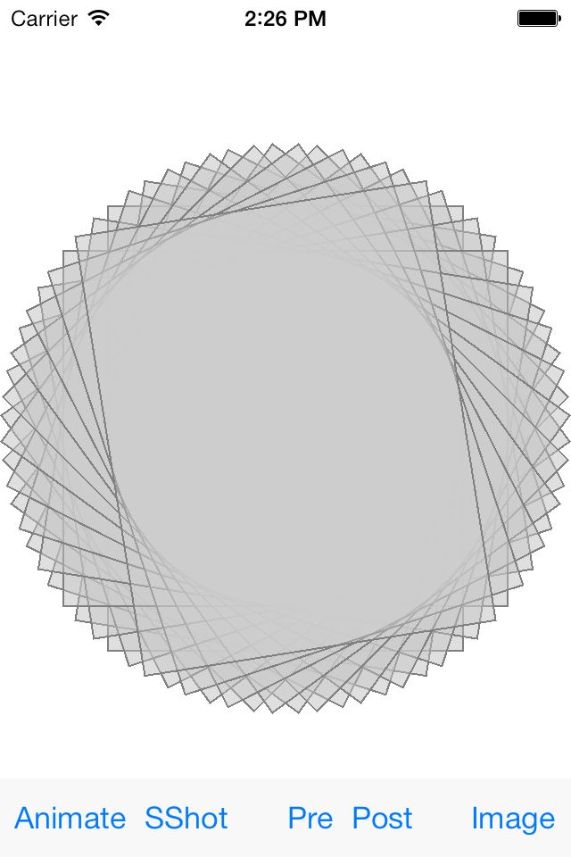
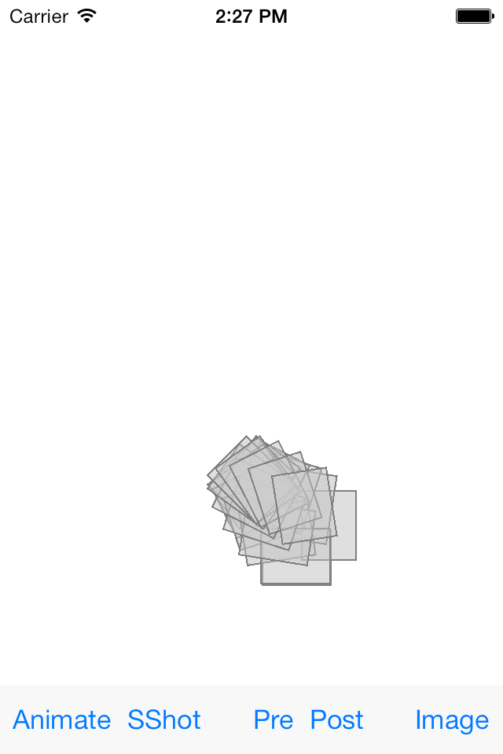
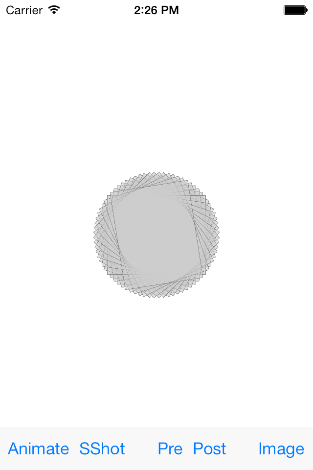
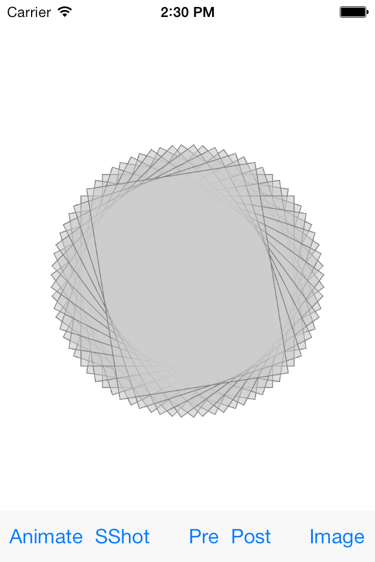
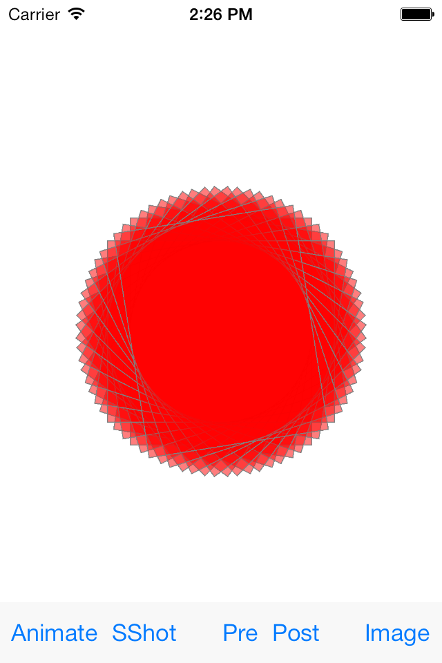
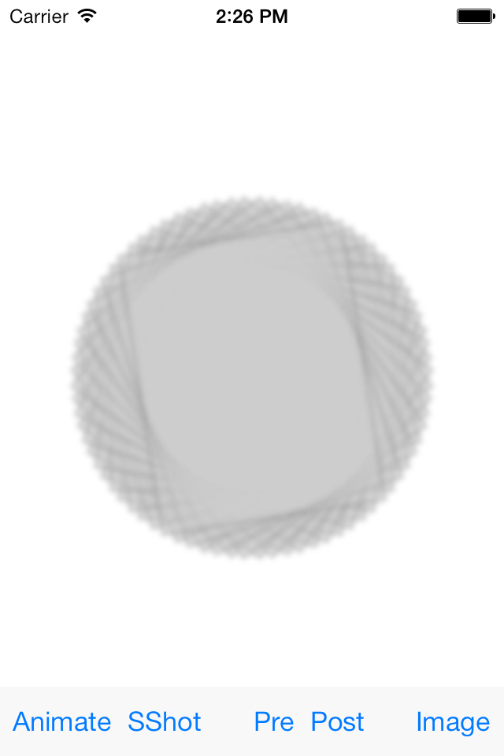
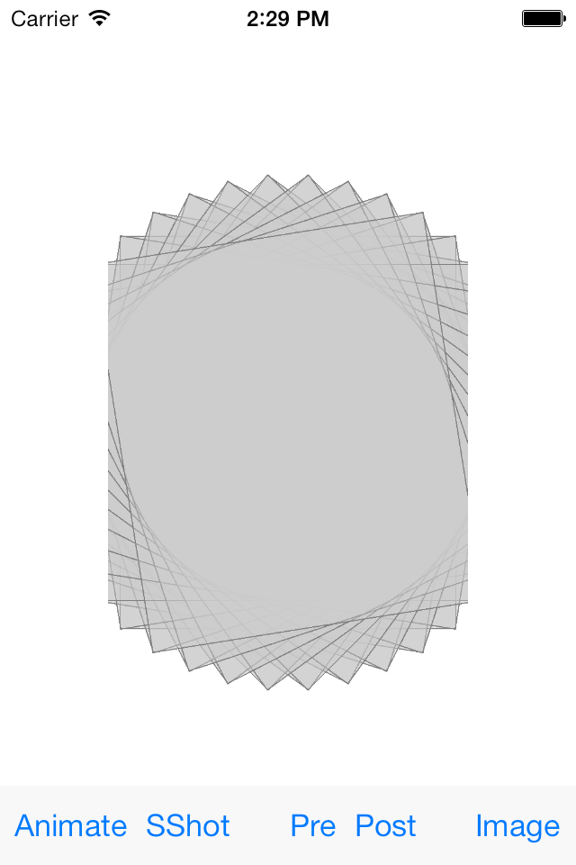

# iOS7 Day-by-Day
## Taking Snapshots of UIViews

### Introduction

It has always been possible to take snapshots of `UIView` objects - and there
are several reasons that you might want to - from improving the performance of
animations to sharing screenshots of your app. The existing approach has suffered
from several issues:

- The code isn't very simple
- Complex rendering options such as layer masks have been difficult to reproduce
- OpenGL layers have required special case code
- The snapshotting process has been quite slow

In fact, there isn't really any generic 'snapshot' code which can cope with every
possible scenario.

This has all changed with iOS7 with new methods on `UIView` and `UIScreen` which
allow easy snapshotting for a variety of use cases.

### Snapshotting for Animation

Often we might want to animate a view, but that view is sufficiently complex that
animating it is either too intensive, or would involve additional code to control
its behavior correctly.

As an example in the project associated with this post we've created a `UIView`
subclass which simply consists of a set of subviews, each of which is rotated
to generate a pleasing geometric arrangement:

This is generated by calling the following method in the constructor:

    - (void)generateRotations
    {
        for (CGFloat angle = 0; angle < 2 * M_PI; angle += M_PI / 20.0) {
            UIView *newView = [[UIView alloc] initWithFrame:CGRectMake(0, 0, 200, 250)];
            newView.center = CGPointMake(CGRectGetMidX(self.bounds), CGRectGetMidY(self.bounds));
            newView.layer.borderColor = [UIColor grayColor].CGColor;
            newView.layer.borderWidth = 1;
            newView.backgroundColor = [UIColor colorWithWhite:0.8 alpha:0.4];
            newView.transform = CGAffineTransformMakeRotation(angle);
            newView.autoresizingMask = UIViewAutoresizingFlexibleHeight | UIViewAutoresizingFlexibleWidth;
            [self addSubview:newView];
        }
    }

In creating this view I'm not suggesting that it's the best way to create this
effect, or indeed that it is useful, but it does demonstrate a point.

In the view controller we'll create a couple of utility methods which we'll use
repeatedly in this project. The first creates one of these rotating views and
adds it as a subview:

- (void)createComplexView
{
    _complexView = [[SCRotatingViews alloc] initWithFrame:self.view.bounds];
    [self.containerView addSubview:_complexView];
}

The second is a sample animation method, which animates a view supplied by reducing
its size to `(0,0)`:

- (void)animateViewAwayAndReset:(UIView *)view
{
    [UIView animateWithDuration:2.0
                     animations:^{
                         view.bounds = CGRectZero;
                     }
                     completion:^(BOOL finished) {
                         [view removeFromSuperview];
                         [self performSelector:@selector(createComplexView)
                                    withObject:nil
                                    afterDelay:1];
                     }];
}

When the animation is complete it removes the supplied view, and then after a short
delay resets the app by recreating a new `_complexView`.

The following method is linked up to the toolbar button labelled 'Animate':

    - (IBAction)handleAnimate:(id)sender {
        [self animateViewAwayAndReset:_complexView];
    }

The following picture demonstrates the problem that we have animating the rotating
view we've created:

This problem definitely isn't insurmountable, but it would involve us changing
the way `SCRotatingViews` is constructed.

The new snapshotting methods come to the rescue here though. The following method
is wired up to the 'SShot' toolbar button:

    - (IBAction)handleSnapshot:(id)sender {
        UIView *snapshotView = [_complexView snapshotViewAfterScreenUpdates:NO];
        [self.containerView addSubview:snapshotView];
        [_complexView removeFromSuperview];
        [self animateViewAwayAndReset:snapshotView];
    }

We call `snapshotViewAfterScreenUpdates:` to create a snapshot of our complex
view. This returns a `UIView` which represents the appearance of the view it has
been called on. It's an incredibly efficient way of getting a snapshot of the
view - faster than the old method of making a bitmap representation.

Once we've got our snapshot view we add it to the container view, and remove the
actual complex view. Then we can animate the snapshot view:

### Pre/post View Updates

The `snapshotViewAfterScreenUpdates:` has a single `BOOL` argument, which specifies
whether the snapshot should be taken immediately, or whether any pending view
updates should be committed first.

For example, we add the following method to the `SCRotatingViews` class:

    - (void)recolorSubviews:(UIColor *)newColor
    {
        for (UIView *subview in self.subviews) {
            subview.backgroundColor = newColor;
        }
    }

This simply recolors all the subviews when called.

To demonstrate the effect of the argument on the snapshot method we create 2 methods
on the view controller, and wire them up to the 'Pre' and 'Post' toolbar buttons:

    - (IBAction)handlePreUpdateSnapshot:(id)sender {
        // Change the views
        [_complexView recolorSubviews:[[UIColor redColor] colorWithAlphaComponent:0.3]];
        // Take a snapshot. Don't wait for changes to be applied
        UIView *snapshotView = [_complexView snapshotViewAfterScreenUpdates:NO];
        [self.containerView addSubview:snapshotView];
        [_complexView removeFromSuperview];
        [self animateViewAwayAndReset:snapshotView];
    }

    - (IBAction)handlePostUpdateSnapshot:(id)sender {
        // Change the views
        [_complexView recolorSubviews:[[UIColor redColor] colorWithAlphaComponent:0.3]];
        // Take a snapshot. This time, wait for the render changes to be applied
        UIView *snapshotView = [_complexView snapshotViewAfterScreenUpdates:YES];
        [self.containerView addSubview:snapshotView];
        [_complexView removeFromSuperview];
        [self animateViewAwayAndReset:snapshotView];
    }

The methods are identical, apart from the argument to the `snapshotViewAfterUpdates:`
method. Firstly we call the `recolorSubviews:` method, then perform the same
snapshot procedure we did in the previous example. The following images show
the difference in behavior of the 2 methods:

As expected, setting `NO` will snapshot immediately, and therefore doesn't include
the result of the recoloring method call. Setting `YES` allows the render loop
to complete the currently queued changes before snapshotting.

### Snapshotting to an image

When animating it's actually far more useful to be able to snapshot straight to
a `UIView`, however there are times when it's helpful to have an actual image. For
example, we might want to blur the current view before animating it away. There
is another snapshotting method on `UIView` for this exact purpose:
`drawViewHierarchyInRect:afterScreenUpdates:`. This will allow you to draw the
view into a core graphics context, and hence you can get hold of a bitmap for
the current view. It's worth noting that this method is significantly less
efficient than `snapshotViewAfterScreenUpdates:`, but if you need a bitmap
representation then this is the best way to go about it.

We wire the following method up to the 'Image' toolbar button:

    - (IBAction)handleImageSnapshot:(id)sender {
        // Want to create an image context - the size of complex view and the scale of the device screen
        UIGraphicsBeginImageContextWithOptions(_complexView.bounds.size, NO, 0.0);
        // Render our snapshot into the image context
        [_complexView drawViewHierarchyInRect:_complexView.bounds afterScreenUpdates:NO];
        
        // Grab the image from the context
        UIImage *complexViewImage = UIGraphicsGetImageFromCurrentImageContext();
        // Finish using the context
        UIGraphicsEndImageContext();
        
        UIImageView *iv = [[UIImageView alloc] initWithImage:[self applyBlurToImage:complexViewImage]];
        iv.center = _complexView.center;
        [self.containerView addSubview:iv];
        [_complexView removeFromSuperview];
        // Let's wait a bit before we animate away
        [self performSelector:@selector(animateViewAwayAndReset:) withObject:iv afterDelay:1.0];
    }

Firstly we create an core graphics image context, the correct size and scale
for the `_complexView`, and then call the `drawHierarchyInRect:afterScreenUpdates:`
method - the second argument being the same as the argument to the previous
snapshotting method.

Then we pull the graphics context into a `UIImage`, which we display in a
`UIImageView`, with the same pattern of replacing the complex view and animating
it out. To demonstrate a possible reason for needing a `UIImage` rather than a
`UIView` we've created a method which blurs a `UIImage`:

    - (UIImage *)applyBlurToImage:(UIImage *)image
    {
        CIContext *context = [CIContext contextWithOptions:nil];
        CIImage *ci_image = [CIImage imageWithCGImage:image.CGImage];
        CIFilter *filter = [CIFilter filterWithName:@"CIGaussianBlur"];
        [filter setValue:ci_image forKey:kCIInputImageKey];
        [filter setValue:@5 forKey:kCIInputRadiusKey];
        CIImage *result = [filter valueForKey:kCIOutputImageKey];
        CGImageRef cgImage = [context createCGImage:result fromRect:[result extent]];
        return [UIImage imageWithCGImage:cgImage scale:image.scale orientation:image.imageOrientation];
    }

This is a simple application of a CoreImage filter, and just applies a Gaussian
filter and returns a new `UIImage`.

The following is a shot of the effect we've created:

### Limitations

If you've ever tried to take a snapshot of a OpenGL-backed `UIView` you'll know
that it is quite an involved process (users of ShinobiCharts might be familiar
with the pain). Excitingly the new `UIView` snapshot methods handle OpenGL
seamlessly.

Because the snapshot methods create versions which respect the appearance of the
views on-screen, they are only able to snapshot views which are on-screen. This
means it's not possible to use these methods to create snapshots of views which
you want to animate into view - an alternative approach must be used. It also
means that if your view is clipped by the edge of the screen, then your snapshot
will be clipped, as shown here:

### Conclusion

Taking snapshots of `UIView` elements in iOS has always been really useful, and
with iOS7 we've finally got a sensible API method to allow us to take snapshots
of views for most of the common purposes. That doesn't mean that there aren't
and limitations - you'll still need to use alternative approaches for some
scenarios, but 90% of use cases just got a whole lot easier!

