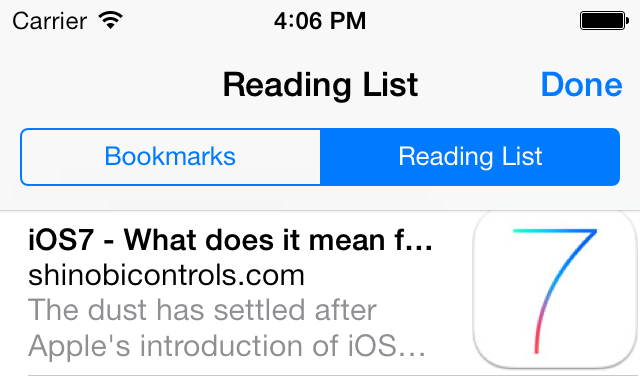

# iOS7 Day-by-day: Day 8
## Reading list with SafariServices

### Introduction

The concept of a reading list is a simple one - often when you're browsing
you'll come across an article you want to read, but don't have time to read
it immediately. A reading list is a way to temporarily bookmark the page so
that it can be read later. There are various 3rd party reading list apps, but
with iOS7 SafariServices exposes an API for the reading list which is integral
to Safari.

### Usage

Using the Safari reading list is remarkably easy - there are just 3 methods of
interest. A reading list item consists of a URL, a title and a description.
The only URLs which are acceptable are of type HTTP or HTTPS - you can check the
validity of a URL using the `supportsURL:` class method:

    if([SSReadingList supportsURL:[NSURL urlFromString:@"http://sample/article/url"]]) {
        NSLog(@"URL is supported");
    }

Once you've checked that the URL you want to add is valid adding it involves
getting hold of the default reading list and calling the add method:

    SSReadingList *readingList = [SSReadingList defaultReadingList];
    NSError *error;
    [readingList addReadingListItemWithURL:[NSURL urlFromString:@"http://sample/article/url"]
                                     title:@"Item Title"
                               previewText:@"Brief preview text"
                                     error:&error];
    if(error) {
        NSLog(@"There was a problem adding to a reading list");
    } else {
        NSLog(@"Successfully added to reading list");
    }

That's all there is to it! The pic below shows Safari's updated reading list:

### Sample project

The sample project for this article pulls down the RSS feed from the
ShinobiControls blog and displays them in a table view. The detail page contains
a toolbar button which allows the user to "Read Later" - i.e. add to their
Safari reading list.

It's worth noting that the entirety of the code we're interesting in for this
article is in the method called when the button is pressed:

    - (IBAction)readLaterButtonPressed:(id)sender {
        if([SSReadingList supportsURL:[self.detailItem url]]) {
            SSReadingList *readingList = [SSReadingList defaultReadingList];
            NSError *error;
            [readingList addReadingListItemWithURL:[self.detailItem url] title:[self.detailItem title] previewText:[self.detailItem description] error:&error];
            if(error) {
                NSLog(@"There was a problem adding to a reading list");
            } else {
                NSLog(@"Successfully added to reading list");
            }
        }
    }

The point of the app isn't to demonstrate how to build an RSS parser, and as
such the RSS feed is munged into a JSON feed by Yahoo! pipes.

### Conclusion

A pretty short article today, revealing one of the lesser noticed features of
iOS7. It isn't groundbreaking, but if your app has content which might be
suitable for adding to the Safari reading list then it's definitely worth the
10 minutes it takes to add the functionality.

