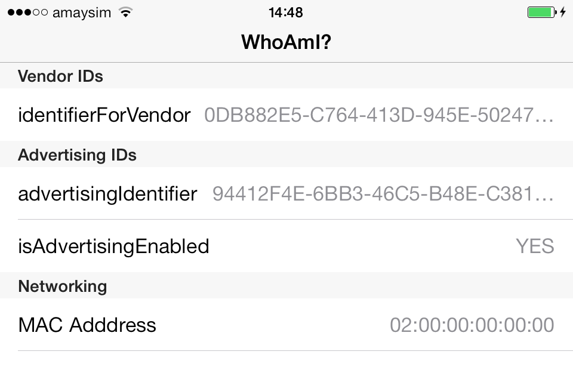

# iOS7 Day-by-day: Day 13
## Device Identification

### Introduction

Today's post will be quite brief, but is an important one for any developers who
have have been using the device unique ID to track their users. There are many
reasons that you might want to use the device ID, however it can also be
deemed a privacy concern - allowing tracking of users without their permission.

The device UDID was deprecated in iOS5, and has been removed in iOS7. iOS6
introduced alternatives, which are now the only approaches which are supported:

### Vendor Identification

The closest replacement for `uniqueIdentifier` is another method on `UIDevice` - 
`identifierForVendor`, which returns a `NSUUID`. This is shared between all apps
from the same vendor on the same device. Different vendors on the same device
will return different `identifierForVendor` values, as will the same vendor
across different devices.

This value provides pretty much the same functionality from the point of view
of the app developer, but without the privacy concerns for the user.

It is worth noting that if a user uninstalls all apps for a specified vendor then
the vendor ID will be destroyed. When they install another app from that vendor
a new vendor ID will be generated.

### Advertising Identification

If you need a unique ID for the purposes of implementing in-app advertising 
(irrespective of whether it is iAd or not) then an alternative approach is
required. The `AdSupport` module includes a class called `ASIdentifierManager`
which has a `advertisingIdentifier` method. This returns a `NSUUID` which may
be used for the purposes of tracking advertising. There is also a method 
`advertisingTrackingEnabled`, which returns a `BOOL` specifying whether or not
a user has allowed advertising tracking. If the return value is `NO` then there
is a short list of things that the app is allowed to use the ID for - none of 
which involves tracking users.

The advertising ID is unique across an entire device - so that if tracking is 
enabled ads can be tailored to the specific user. More often than not an app
developer won't have to interact with this class, but will instead drop in an
ad-serving framework which will use the `ASIdentifierManager` class behind the
scenes.

### Network Identification

When `uniqueIdentifier` was deprecated, using the device's MAC address became
popular. A MAC address is a unique identifier allocated to every piece of
networking equipment in the world - from WiFi adaptors to datacenter switches.
It's possible to query an iOS device for its MAC address, which will be both
unique and persistent - so ideal for tracking. However, with iOS7, Apple have
made it impossible to obtain the MAC address programmatically on an iOS
device - in fact a constant will be returned: `02:00:00:00:00:00`. This closes
this 'loophole' and will drive developers to the Apple-preferred device
identification approaches.

### Conclusion

Apple are stamping out the alternatives to device identification, so now's the
time to adopt their chosen approach. This offers greater privacy for the end
user, so it's a good thing to do.

The attached sample project with this post (WhoAmI) gives a brief demo of the
different approaches we've outlined here.

