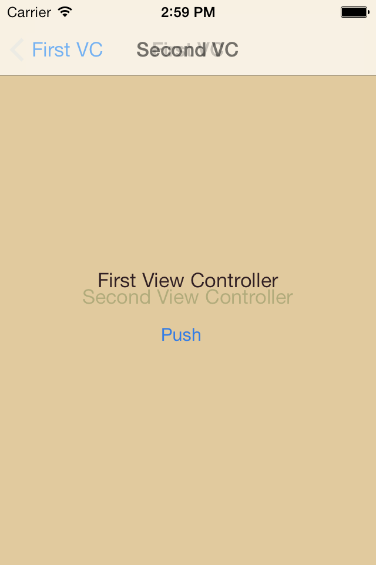
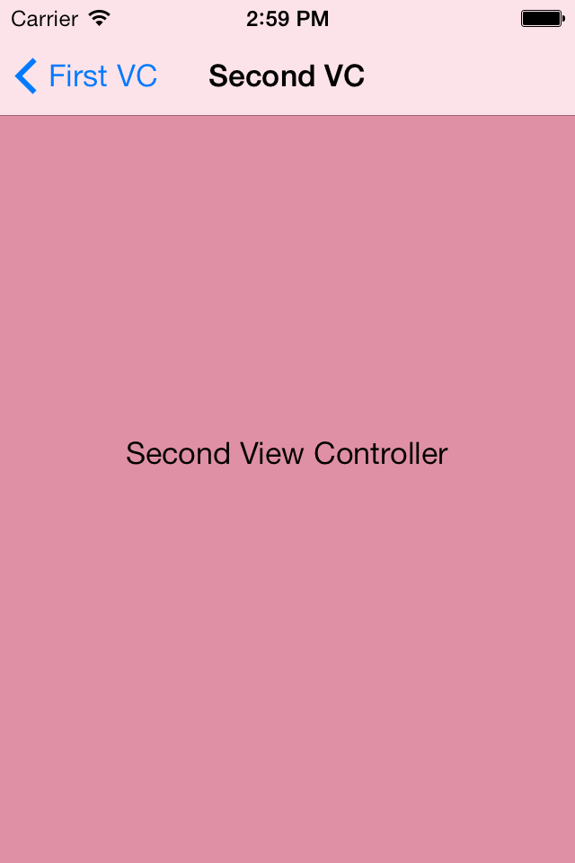

# iOS7 Day-by-Day: Day 10

## Custom UIViewController Transitions

A much requested feature has to be able to customise the animations which
appear as a user transitions between different view controllers, both for
`UINavigationController` stacks, and modal presentation. iOS7 introduces this
functionality - both for automatic transitions, and interactive transitions 
(where the transitions are controlled interactively by the user). In today's
post we'll take a look at how to get an automatic transition working - by
implementing a fade transition for push and pops on a navigation controller.

### Navigation Controller Delegate

The world of custom transitions is full of protocols - however, for the example
we're going to create here we only need to look at a few. The additional
protocols are required for interactive transitions, and modal presentation.

In order to determine what transition should be used when pushing or popping a
view controller, a `UINavigationController` has a delegate which it can ask. This
delegate must adopt the `UINavigationControllerDelegate` protocol, which has
4 new methods for transitioning. The method we're interested in for our custom
transition is:

    - (id<UIViewControllerAnimatedTransitioning>)navigationController:
                                      animationControllerForOperation:
                                                   fromViewController:
                                                     toViewController:

This method will get called every time the navigation controller is transitioning
between view controllers (whether through code or through a segue in a story
board). We get told the view controller we're transitioning from and to, so at
this point we can make a decision what kind of transition we need to return.

We create a class which will act as the nav controller delegate:

    @interface SCNavControllerDelegate : NSObject <UINavigationControllerDelegate>
    @end

Which has a simple implementation:

    @implementation SCNavControllerDelegate
        - (id<UIViewControllerAnimatedTransitioning>)navigationController:(UINavigationController *)navigationController
                                          animationControllerForOperation:(UINavigationControllerOperation)operation
                                                       fromViewController:(UIViewController *)fromVC
                                                         toViewController:(UIViewController *)toVC
        {
            return [SCFadeTransition new];
        }
    @end

We want all of our transitions to be the same (whether forward or backward) and
therefore we can just return an `SCFadeTransition` object for every transition.
We'll look at what this object is and does in the next section.

Setting this delegate is simple - and the same as we see all over iOS:

    - (id)initWithCoder:(NSCoder *)aDecoder
    {
        self = [super initWithCoder:aDecoder];
        if(self) {
            _navDelegate = [SCNavControllerDelegate new];
            self.delegate = _navDelegate;
        }
        return self;
    }

where `_navDelegate` is an ivar of type `id<UINavigationControllerDelegate>`.

### Creating a custom transition

We saw that the delegate needs to return some kind of transition object. More
specifically it has to return an object which conforms to the 
`UIViewControllerAnimatedTransitioning` protocol. This protocol has just 3 methods
on it, 2 of which are required:

- `transitionDuration:` (required). This should return the duration of the
animation. This is used by the OS to synchronise other events - e.g. animating
the nav bar on the nav controller.
- `animateTransition:` (required). This method is where you will actually
implement the animation to transition between the view controllers. We're
provided with an object which gives us access to the different components
we're going to need.
- `animationEnded:`. This gets called once the transition is complete to allow
you to do any tidying up that might be required.

We only need to implement the 2 required methods to get our fade transition
working. Create an object which adopts this protocol:

    @interface SCFadeTransition : NSObject <UIViewControllerAnimatedTransitioning>
    @end

The implementation of the `transitionDuration:` method is really simple:

    - (NSTimeInterval)transitionDuration:(id<UIViewControllerContextTransitioning>)transitionContext
    {
        return 2.0;
    }

When the `animateTransition:` method is called we get provided with an object
which conforms to the `UIViewControllerContextTransitioning` protocol, which
gives us access to all the bits and pieces we need to complete the animation.
The first method we'll use is `viewControllerForKey:` which allows us to get
hold of the two view controllers involved in the transition:

    // Get the two view controllers
    UIViewController *fromVC = [transitionContext viewControllerForKey:UITransitionContextFromViewControllerKey];
    UIViewController *toVC = [transitionContext viewControllerForKey:UITransitionContextToViewControllerKey];

The context also provides us with a `UIView` in which to perform the animations, 
and this is accessible through the `containerView` method:

    // Get the container view - where the animation has to happen
    UIView *containerView = [transitionContext containerView];

We need to make sure that the views associated with each of the view controllers
is a subview of the container view. It's likely that the view we're transitioning
from is already a subview, but we ensure it:

    // Add the two VC views to the container
    [containerView addSubview:fromVC.view];
    [containerView addSubview:toVC.view];

We don't want to see the view we're transitioning to, so we should set its
alpha to 0:

    toVC.view.alpha = 0.0;

Now we're in a position to perform the animation. Since we're doing a simple
fade between the two view controllers, we can use a `UIView` animation block:

    [UIView animateWithDuration:[self transitionDuration:transitionContext]
                          delay:0
                        options:0
                     animations:^{
                         toVC.view.alpha = 1.f;
                     }
                     completion:^(BOOL finished) {
                         // Let's get rid of the old VC view
                         [fromVC.view removeFromSuperview];
                         // And then we need to tell the context that we're done
                         [transitionContext completeTransition:YES];
                     }];

Points to note:
- We set the duration to be the same as the `transitionDuration:` method we've
implemented.
- The view associated with the 'from' view controller needs to be removed from
the view hierarchy once the transition is completed.
- The `completeTransition:` method on the transition context needs to be called
once we've finished the animation so that the OS knows that we've finished.

### Summary

With that we're done! It's actually quite simple once you get your head around
the protocols. The only thing we had to do with any of our existing view
controller code was to set the delegate on the navigation view controller. The
rest of the work was implemented with classes which set a transition object, and
then perform the animation itself.

As ever, the code is available on GitHub. Happy transitioning!