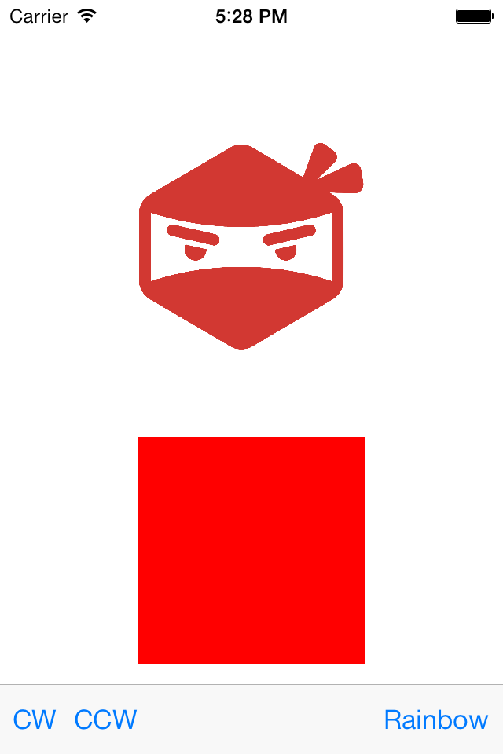
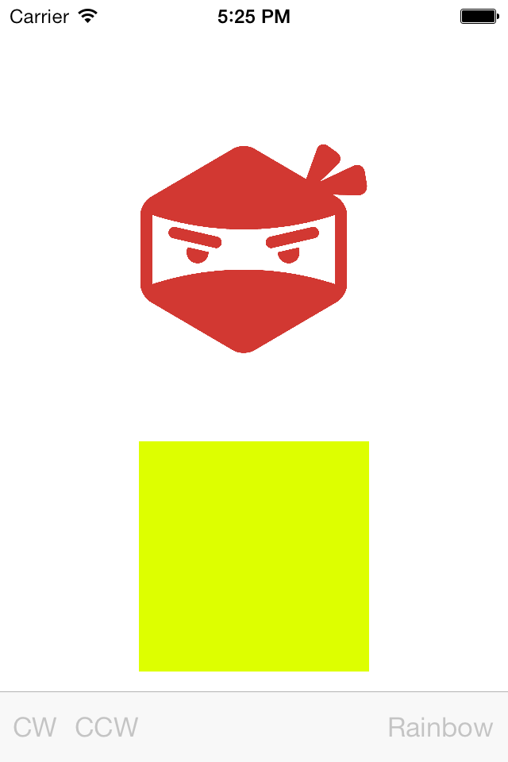
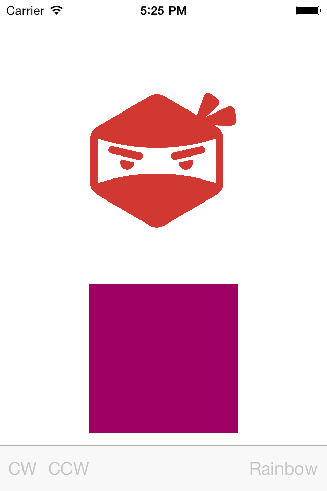
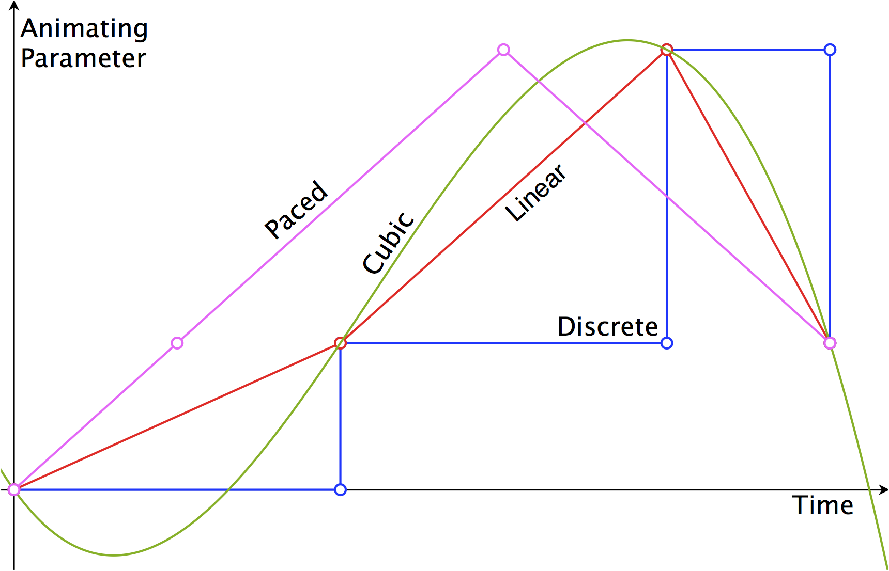
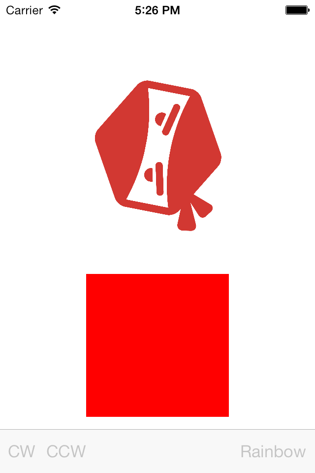
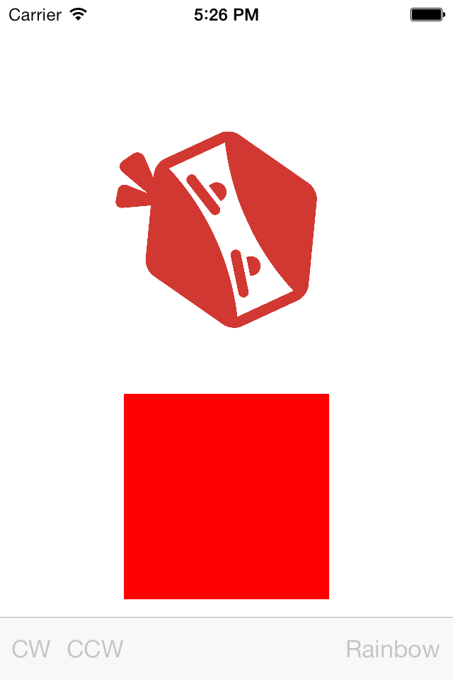

# iOS7 Day-by-Day: Day 11
## UIView Key-Frame Animations

### Introduction

`UIView` has had animation methods since iOS2, adding the favored block-based
API in iOS4. These methods are wrapper methods for the underlying CoreAnimation
layers, upon which `UIView` instances are rendered.

The animation methods in `UIView` have allowed animation of animatable properties
(such as `transform`, `backgroundColor`, `frame`, `center` etc) - by setting an
end-state, duration and other options such as animation curve. However, setting
intermediate states in the animation, so-called key-frames, has not been possible.
In this case it was necessary to drop down to CoreAnimation itself and create
a `CAKeyFrameAnimation`. This changes in iOS7 - with the addition of 2 methods
to `UIView`, key-frame animations are now supported without dropping down to
CoreAnimation.

To show how to use `UIView` key-frame animations we're going to create a couple
of demos which use it. The first is an animation which changes the background
color of a view through the colors of the rainbow, and the second demonstrates
a full 360 degree rotation of a view, specifying the rotation direction.

### Rainbow Changer

`UIView` key-frame animations require the use of 2 methods, the first of which
is similar to the other block-based animation methods:
`animateKeyframesWithDuration:delay:options:animations:completion:`. This takes
floats for duration and delay, a bit-mask for options and blocks for animation
and completion - all pretty standard in the world of `UIView` animations. The
difference comes in the method we call inside the animation block:
`addKeyframeWithRelativeStartTime:relativeDuration:animations:`. This method
is used to add the fixed points within the animation sequence.

The best way to understand this is with a demonstration. We are going to create
an animation which animates the background color of a `UIView` through the
colors of the rainbow (before we start a flamewar about what the colors of the
rainbow are, I've made an arbitrary choice, which happens to be correct). We'll
trigger this animation on a bar button press, so we add a bar button in the
storyboard, and wire it up to the following method:

    - (IBAction)handleRainbow:(id)sender {
        [self enableToolbarItems:NO];
        
        void (^animationBlock)() = ^{
            // Animations here
        };
        
        [UIView animateKeyframesWithDuration:4.0
                                       delay:0.0
                                     options:UIViewKeyframeAnimationOptionCalculationModeLinear |
                                             UIViewAnimationOptionCurveLinear
                                  animations:animationBlock
                                  completion:^(BOOL finished) {
                                      [self enableToolbarItems:YES];
                                  }];
    }

This creates a local variable to contain the animation `animationBlock`, and then
calls the `animateKeyframesWithDuration:delay:options:animations:completion:`
method. When we start the animation we disable the toolbar buttons, and then
re-enable them when the animation is complete, using the following utility method:

    - (void)enableToolbarItems:(BOOL)enabled
    {
        for (UIBarButtonItem *item in self.toolbar.items) {
            item.enabled = enabled;
        }
    }

We'll take a look at some of the options available when performing key-frame
animations later - right now let's fill out that animation block:

    void (^animationBlock)() = ^{
        NSArray *rainbowColors = @[[UIColor orangeColor],
                                   [UIColor yellowColor],
                                   [UIColor greenColor],
                                   [UIColor blueColor],
                                   [UIColor purpleColor],
                                   [UIColor redColor]];
        
        NSUInteger colorCount = [rainbowColors count];
        for(NSUInteger i=0; i<colorCount; i++) {
            [UIView addKeyframeWithRelativeStartTime:i/(CGFloat)colorCount
                                    relativeDuration:1/(CGFloat)colorCount
                                          animations:^{
                                              self.rainbowSwatch.backgroundColor = rainbowColors[i];
                                          }];
        }
    };

We start by creating an array of the colors we want to animate through, before
looping through each of them. For each color we call the method to add a key-frame
to the animation:

    [UIView addKeyframeWithRelativeStartTime:i/(CGFloat)colorCount
                            relativeDuration:1/(CGFloat)colorCount
                                  animations:^{
                                      self.rainbowSwatch.backgroundColor = rainbowColors[i];
                                  }];

For each key-frame we specify a start time, a duration and an animation block.
The times are relative - i.e. we specify them as floats in the range `(0,1)`, and
they will get scaled appropriately to match the animation duration. Here we want
the color changes to be evenly spaced throughout the animation, so we set the 
relative start time of each animation to be the index of the current color over
the total number of colors, and the relative duration to be the 1 over the
total number of colors. The animation block specifies the end state of the animation,
in the same manner it does for all `UIView` block-based animations, so here we just
need to set the background color.

If you run the app up now and press the 'Rainbow' button then you'll see your
first `UIView` key-frame animation in action.

### Keyframe animation options

The options parameter of the `animateKeyFrames:` method accepts `UIViewAnimationOptions`
arguments, along with some new values specified in `UIViewKeyframeAnimationOptions`,
notably the way in which the animation phases are fitted to the animation curve.
The following are the options which govern this behavior:

    UIViewKeyframeAnimationOptionCalculationModeLinear
    UIViewKeyframeAnimationOptionCalculationModeDiscrete
    UIViewKeyframeAnimationOptionCalculationModePaced
    UIViewKeyframeAnimationOptionCalculationModeCubic
    UIViewKeyframeAnimationOptionCalculationModeCubicPaced

The graph below shows how the different options control the animation. The
horizontal axis represents the time of the animation, whereas the vertical axis
represents a one-dimensional parameter we are animating (this could be for example
the `alpha` of a view, or the `width` of a `frame`). We have specified 3 key-frames
in this example, each with different durations and end values.

Let's look at each of the options in more detail:

- __Linear__ The transitions between keyframes are linearly interpolated, as
shown in red on the graph below. This means that an animation can appear to
speed up and slow down, as the animation deltas vary.
- __Discrete__ The transitions are instantaneous at the end of each keyframe
duration, as shown in blue on the graph. In this case there is effectively no
animation - just jumps between the keyframe values.
- __Paced__ A simple algorithm which attempts to maintain a constant velocity
between keyframe animation points.
- __Cubic__ A cubic spline is drawn between the keyframe points, and then the
animation occurs along this line - as demonstrated in green. This could result
in animations initially going in the opposite direction to that you expect.
- __CubicPaced__ This ignores the timings specified in the keyframe animations
and instead forces a constant velocity between the different keyframe locations.
A similar concept is demonstrated in pink on the graph. This will result in a
smooth looking animation, with constant velocity, but it will ignore the timings
you initially requested.

I would suggest that other than discrete, it's worth playing around with the
different options in your specific example. Since the algorithms are complete
black-boxes, and you have no control over their parameters, trying to fully
understand their operation is somewhat futile. An empirical approach to option
selection will be more fruitful in this case (this isn't usually true - it's good
to understand what the different options actually mean rather than guessing).

### Rotation Directions

As a bonus example, we're also going to take a look at how to perform full 
rotations of views, specifying direction. When you specify an animation then
CoreAnimation will animate the shortest route from the start state to the end
state. Therefore with rotation transforms, we can only specify the start angle
and the end angle, but not the direction in which it will rotate. With key-frame
animations we can overcome this by specifying some intermediate states.

Therefore for a full-rotation clockwise we can write the following method:

    - (IBAction)handleRotateCW:(id)sender {
        [self enableToolbarItems:NO];
        [UIView animateKeyframesWithDuration:2.0
                                       delay:0.0
                                     options:UIViewKeyframeAnimationOptionCalculationModeLinear
                                  animations:^{
                                      [UIView addKeyframeWithRelativeStartTime:0.0
                                                              relativeDuration:1/3.0
                                                                    animations:^{
                                                                        self.rotatingHead.transform = CGAffineTransformMakeRotation(2.0 * M_PI / 3.0);
                                                                    }];
                                      [UIView addKeyframeWithRelativeStartTime:1/3.0
                                                              relativeDuration:1/3.0
                                                                    animations:^{
                                                                        self.rotatingHead.transform = CGAffineTransformMakeRotation(4.0 * M_PI / 3.0);
                                                                    }];
                                      [UIView addKeyframeWithRelativeStartTime:2/3.0
                                                              relativeDuration:1/3.0
                                                                    animations:^{
                                                                        self.rotatingHead.transform = CGAffineTransformMakeRotation(0);
                                                                    }];
                                      
                                  }
                                  completion:^(BOOL finished) {
                                      [self enableToolbarItems:YES];
                                  }];
    }

We perform a key-frame animation with 3 states, equally spaced throughout the
animation duration. We start with a rotation angle of `0`, so next we move to
`2π/3`, `4π/3` before finishing back at `0`. In order to completely specify a
rotation of `2π`, then we need to have exactly 2 intermediate fixed points, since
as soon as there is an angle difference of greater than `π` then it will rotate
in the opposite direction to that you'd like. At an angle difference of exactly
`π`, the behavior will be undefined.

In order to change the direction of rotation we can just reverse the key-frames
i.e. starting at an angle of `0` we then move to `4π/3`, followed by `2π/3`
before finishing back at `0`:

    - (IBAction)handleRotateCCW:(id)sender {
      [self enableToolbarItems:NO];
      [UIView animateKeyframesWithDuration:2.0
                                     delay:0.0
                                   options:UIViewKeyframeAnimationOptionCalculationModeLinear
                                animations:^{
                                    [UIView addKeyframeWithRelativeStartTime:0.0
                                                            relativeDuration:1/3.0
                                                                  animations:^{
                                                                      self.rotatingHead.transform = CGAffineTransformMakeRotation(4.0 * M_PI / 3.0);
                                                                  }];
                                    [UIView addKeyframeWithRelativeStartTime:1/3.0
                                                            relativeDuration:1/3.0
                                                                  animations:^{
                                                                      self.rotatingHead.transform = CGAffineTransformMakeRotation(2.0 * M_PI / 3.0);
                                                                  }];
                                    [UIView addKeyframeWithRelativeStartTime:2/3.0
                                                            relativeDuration:1/3.0
                                                                  animations:^{
                                                                      self.rotatingHead.transform = CGAffineTransformMakeRotation(0);
                                                                  }];
                                    
                                }
                                completion:^(BOOL finished) {
                                    [self enableToolbarItems:YES];
                                }];
    }

The Shinobi ninja head can now rotate in either a clockwise or a counter-clockwise
direction - without having to drop down to CoreAnimation layers.

### Conclusion

`UIView` animations have always been a high-level way to perform simple animations
on views, and have benefited from being exceptionally simple to understand and 
build. Now, with the addition of key-frame animations, more complex animations
can now benefit from the same simple API. This post has demonstrated how powerful
it can be - with some trivial examples (although choosing a direction for rotation
is a common request).

