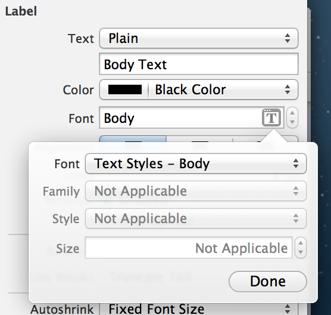
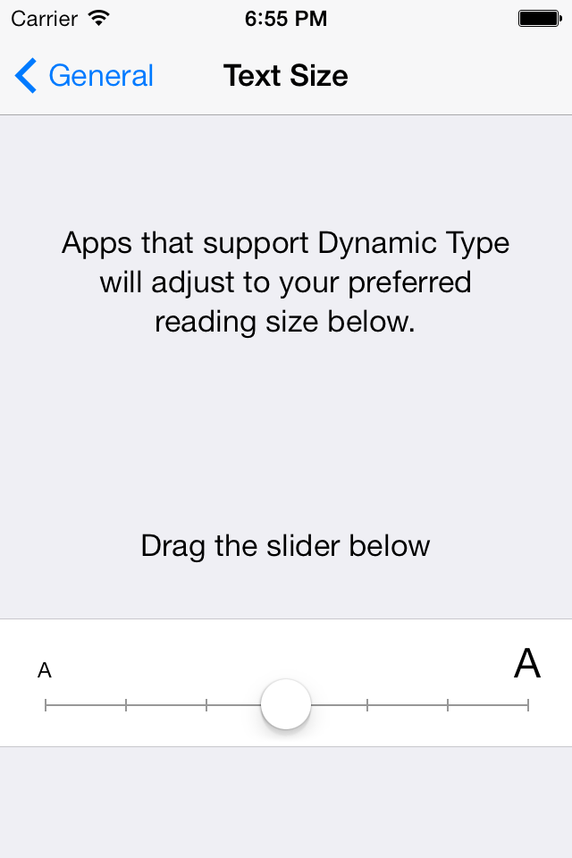
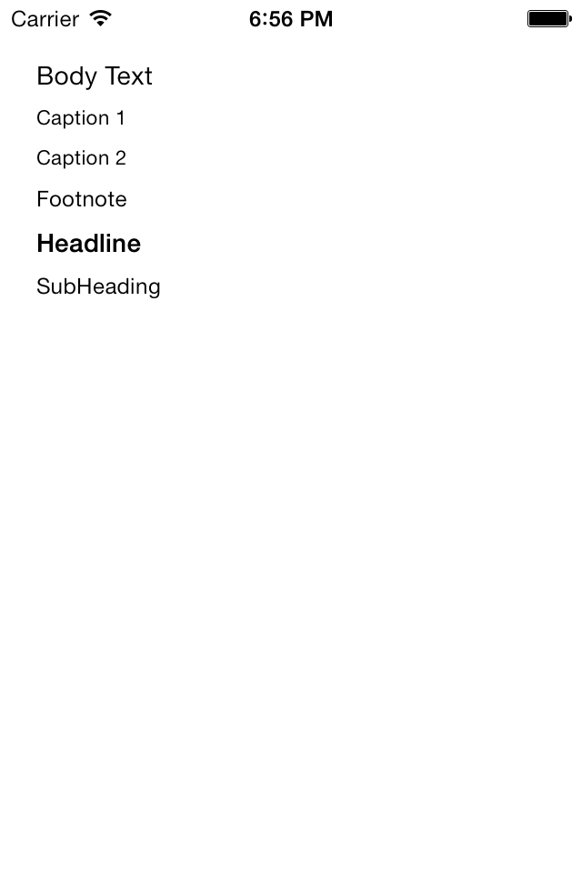
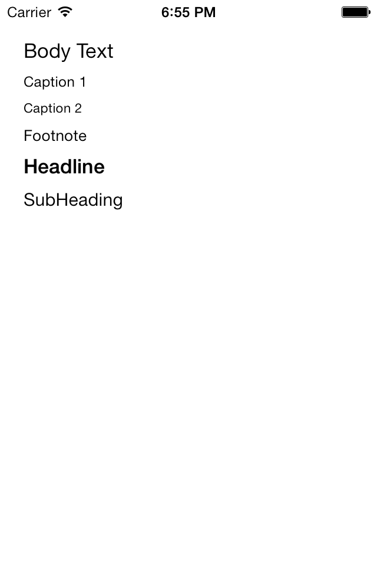
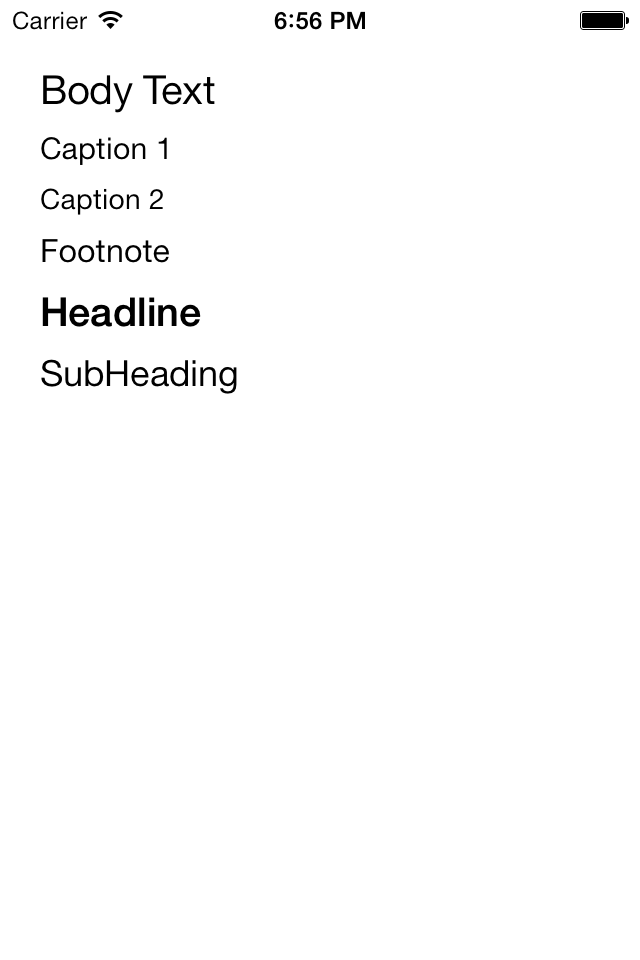
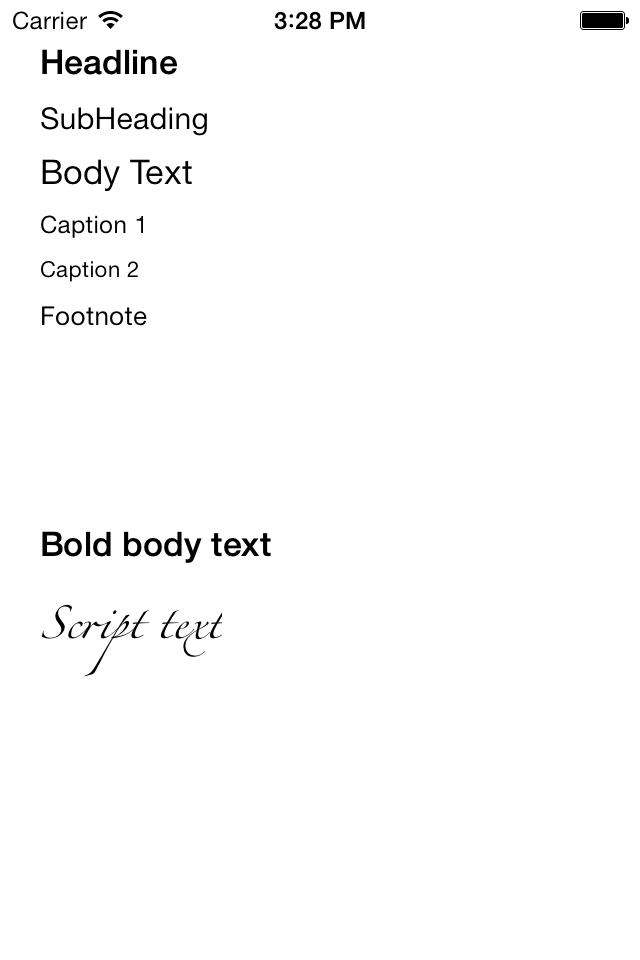

# iOS7 Day-by-Day: Day 12
## Dynamic Type

### Introduction

iOS7 introduced a new high-level text-rendering framework called TextKit. TextKit
is based on the extremely powerful CoreText rendering engine, and all the
Apple-provided text-based controls have been updated to use the TextKit engine.
TextKit is a significant addition to iOS, and one of the things it adds is the
concept of Dynamic Type, and font descriptors. We'll look at these features of
TextKit in today's post.

### Dynamic Type

Dynamic type is a concept of allowing users to specify how large the typeface
is in the apps on their device. This isn't simply the ability to alter the font
size, but also alter other properties of the type such as the kerning and the
line-spacing. This ensures that the text is the most readable as it can be at the
different type sizes. In order to do this you no longer specify particular fonts
for your different text elements, but instead set what they semantically represent,
i.e. rather than specifying Helvetica 11pt, you would set the type to be body
text. This is in-line with the way in which something like HTML works - semantic
markup of your text, allowing the user to control the appearance. As such, rather
than specifying fonts per-se, there is a new class method on `UIFont` which will
pull out the correct font:

    self.subHeadingLabel.font = [UIFont preferredFontForTextStyle:UIFontTextStyleSubheadline];

There are 6 different text styles available in iOS7:

- `UIFontTextStyleHeadline`
- `UIFontTextStyleBody`
- `UIFontTextStyleSubheadline`
- `UIFontTextStyleFootnote`
- `UIFontTextStyleCaption1`
- `UIFontTextStyleCaption2`

As well as being able to specify the font via code, you can set it using
interface builder:

When combined with autolayout, using dynamic type means that a user can control
the appearance of the text inside your app. There is a "Text Size" options screen
within the settings screens which allows changing of the type size:

There are a total of 7 different font sizes - the following shots demonstrate
some of them:

In future OS updates the specific font might change as the appearance of the
operating system develops, but by adopting dynamic type you can be assured that
your app will both be accessible and match the OS style with no further work
down the line.

### Font Descriptors

Another addition which TextKit brings in is the concept of font descriptors. These
are much more in-line with the way we're used to thinking of fonts - where we can
modify a font, as opposed to having to completely specify a new one. For example,
we have some text we'd like to make the same font as our body text, but we'd like
to make it bold. Previously in iOS we would have had to know the font being used
for the body text, and then find its bold equivalent, and then construct a new
font object using `fontWithName:size:` with the string name of the bold equivalent
of the body font.

This isn't very intuitive, and with the introduction of dynamic type, it's not 
always possible to know exactly which font you're using. Font descriptors make
this a lot easier to use - as a collection of attributes about a font it's possible
to change attributes and hence change the font. For example, if we would like to
get a bold version of the body text font:

    UIFontDescriptor *bodyFontDesciptor = [UIFontDescriptor preferredFontDescriptorWithTextStyle:UIFontTextStyleBody];
    UIFontDescriptor *boldBodyFontDescriptor = [bodyFontDesciptor fontDescriptorWithSymbolicTraits:UIFontDescriptorTraitBold];
    self.boldBodyTextLabel.font = [UIFont fontWithDescriptor:boldBodyFontDescriptor size:0.0];

First we get the descriptor for the body text style, and then using the 
`fontDescriptorWithSymbolicTraits:` method we can override a so-called font trait.
Then the `UIFont` method `fontWithDescriptor:size:` can be used to actually get
the required font - noting that setting the `size:` parameter to `0.0` will result
in returning the font sized as determined in the font descriptor.

This is an example of modifying a `UIFontDescriptor` using using a font trait, other
examples of which are as follows:

- `UIFontDescriptorTraitItalic`
- `UIFontDescriptorTraitExpanded`
- `UIFontDescriptorTraitCondensed`

It's also possible to specify other features of the font appearance (such as
the type of serifs) using attributes. Have a read of the documentation of
`UIFontDescriptorSymbolicTraits` for more information.

As well as modifying a existing font descriptor, you can create a dictionary of
attributes and then find a font descriptor which matches your request. For example:

    UIFontDescriptor *scriptFontDescriptor = [UIFontDescriptor fontDescriptorWithFontAttributes:
                                                          @{UIFontDescriptorFamilyAttribute: @"Zapfino",
                                                            UIFontDescriptorSizeAttribute: @15.0}
                                              ];
    self.scriptTextLabel.font = [UIFont fontWithDescriptor:scriptFontDescriptor size:0.0];

We're here specifying a font with a given family and size in a dictionary of
attributes. Other attributes which can be used include:

- `UIFontDescriptorNameAttribute`
- `UIFontDescriptorTextStyleAttribute`
- `UIFontDescriptorVisbileNameAttribute`
- `UIFontDescriptorMatrixAttribute`

This list is not exhaustive - `UIFontDescriptor` is incredibly powerful and brings
iOS inline with many other text rendering engines used elsewhere.

### Conclusion

Dynamic type is an incredibly useful tool to improve both the appearance and
accessibility of your app. When combined with autolayout it allows user content
to be beautiful and easily readable. Font descriptors offer a much easier way
to work with fonts - much closer to the concept we hold in our heads from years
of using word processing software. It should make working with fonts a lot less
painful. We've only seen the tip of the iceberg here today - type rendering is
a complex concept, and with these new concepts iOS is providing much easier access
to the underlying engine.

