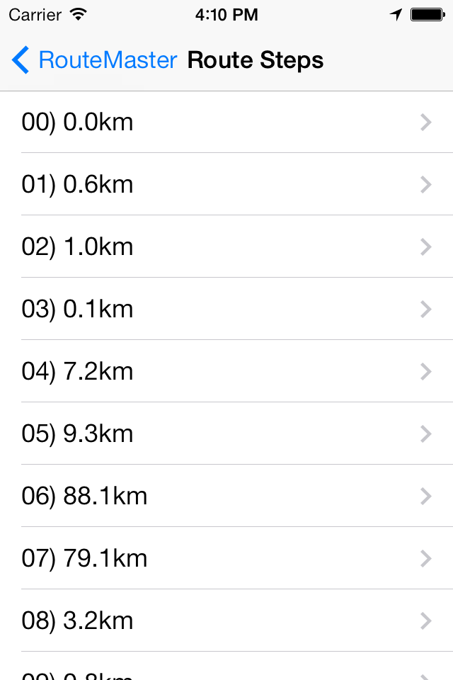
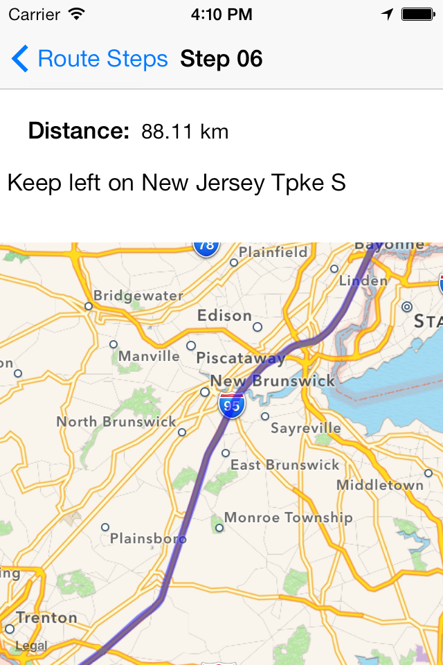
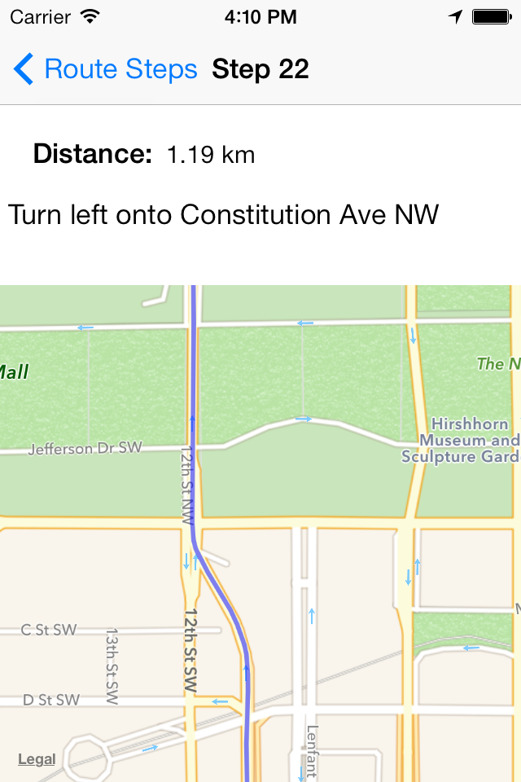
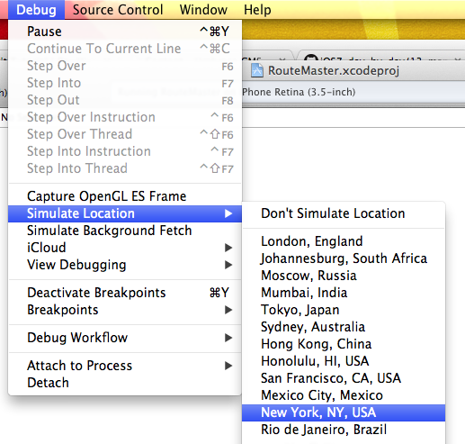

# iOS7 Day-by-Day: Day 13
## Route Directions with MapKit

### Introduction

iOS7 saw a few changes and additions to MapKit - the mapping framework in iOS.
One of the key examples is the addition of an API which can provide routing
directions between two points. In today's post we're going to take a look at
how to use this API by building a simple routing application. This is also going
to involve taking a brief look a the overlay rendering API.

### Requesting Directions

There are quite a lot of different classes which we need in MapKit, but it's
pretty simple to work through them in turn. In order to query Apple's servers
for a set of directions, we need to encapsulate the details in a
`MKDirectionsRequest` object. This class has existed since iOS6 for use by apps
which were capable of generating their own turn-by-turn directions, but have been
expanded in iOS7 to allow developers to request directions from Apple themselves.

    MKDirectionsRequest *directionsRequest = [MKDirectionsRequest new];

In order to make a request we need to set the source and the destination, both
of which are `MKMapItem` objects. These are objects which represent a location on
a map, including its position and other metadata such as name, phone number and
URL. There are a couple of options for creating these - one of which is to use
the user's current location:

    MKMapItem *source = [MKMapItem mapItemForCurrentLocation];
    
When the user fires up the app for the first time they will then be asked for
permission to use their current location:

You can also create a map item using a specific location using the
`initWithPlacemark:` method, which brings us on to another MapKit class.
`MKPlacemark` represents the actual location on a map - i.e. its latitude and
longitude. We could use a reverse geo-coder from CoreLocation to generate a
placemark, but since that's not the point of this post, we're going to create a
placemark for some fixed coordinates. Putting all this together we can complete
setting up our `MKDirectionsRequest` object.

    // Make the destination
    CLLocationCoordinate2D destinationCoords = CLLocationCoordinate2DMake(38.8977, -77.0365);
    MKPlacemark *destinationPlacemark = [[MKPlacemark alloc] initWithCoordinate:destinationCoords addressDictionary:nil];
    MKMapItem *destination = [[MKMapItem alloc] initWithPlacemark:destinationPlacemark];
    // Set the source and destination on the request
    [directionsRequest setSource:source];
    [directionsRequest setDestination:destination];

There are some other optional properties on a `MKDirectionsRequest` which can be
used to control the route we're going to be sent back:

- `departureDate` and `arrivalDate`. Setting these values will enable the returned
routes to be optimized for the time of day for travel - e.g. allowing for standard
traffic conditions.
- `transportType`. Currently Apple can provide either walking or driving directions
using the enum values `MKDirectionsTransportTypeAutomobile` or
`MKDirectionsTransportTypeWalking`. The default value is
`MKDirectionsTransportTypeAny`.
- `requestsAlternateRoutes`. If the routing server can find more than one reasonable
route then setting this property to `YES` will enable this. Otherwise it will just
return one route.

Now that we've got a valid directions request we can send it off to get a route.
This is done using the `MKDirections` class - which has a constructor which takes
a `MKDirectionsRequest` object:

    MKDirections *directions = [[MKDirections alloc] initWithRequest:directionsRequest];

There are 2 methods which can be used: `calculateETAWithCompletionHandler:` 
estimates the time a route will take, whereas
`calculateDirectionsWithCompletionHandler` calculates the actual route. Both of
these methods are asynchronous, and take completion handling blocks. `MKDirections`
objects also have a `cancel` method, which does as suggested for any currently
running requests, and a `calculating` property which is true when there is 
currently a request in progress. A single `MKDirections` object can only run
a single request at once - additional requests will fail. If you want to run
multiple simultaneous requests then you can have more than one `MKDirections`
object, but be aware that asking for too many might well result in receiving
throttling errors from Apple's servers.

    [directions calculateDirectionsWithCompletionHandler:^(MKDirectionsResponse *response, NSError *error) {
        // Handle the response here
    }];

### Directions Response

The response from Apple's server is returned to us as a `MKDirectionsResponse`
object, which as well as the source and destination, contains an array of 
`MKRoute` objects. Note that this array will contain just one object unless
we set `requestsAlternateRoutes` to `YES` on the request.

`MKRoute` objects, as their name suggests, represents a route between two points
which a user can follow. It contains a set of properties with information about
the route:

- `name`: Generated by the route finding servers, this will be based on the
route's significant features.
- `advisoryNotices`: An array of strings which contain details of any warnings
or the suchlike which are appropriate to the generated route.
- `distance`: Along the route itself - not direct. Measured in metres.
- `expectedTravelTime`: An `NSTimeInterval` - i.e. measured in seconds.
- `transportType`:
- `polyline`: `MKPolyline` object which represents the path of the route as a
line on the map. This can be drawn on a `MKMapView`, and we'll look at doing this
in the next section.
- `steps`: An array of `MKRouteStep` objects which make up the route.

The other argument provided to our handler block is an `NSError` object, so we
can use the following block to handle the directions response:

    [directions calculateDirectionsWithCompletionHandler:^(MKDirectionsResponse *response, NSError *error) {        
        // Now handle the result
        if (error) {
            NSLog(@"There was an error getting your directions");
            return;
        }
        
        // So there wasn't an error - let's plot those routes
        _currentRoute = [response.routes firstObject];
        [self plotRouteOnMap:_currentRoute];
    }];

We have a created a utility method to plot a route on the map, which we'll take
a look at in the next section.

### Rendering a Polyline

We've been sent a polyline of the route, which we want to plot on the map. iOS7
changes the way in which we plot overlays on the map, with the introduction of
a `MKOverlayRenderer` class. If we want to do custom shapes, or a non-standard
rendering technique then we can subclass to create our own renderer, however,
there are a set of overlay renderers for standard use cases. We want to render
a polyline, so we can use the `MKPolylineRenderer`. We'll look in a second at
when and where to create our renderer, but let's take a look at the
`plotRouteOnMap:` method we referred to in the previous section.

An `MKPolyline` is an object which represents a line made from multiple segments,
and adopts the `MKOverlay` protocol. This means that we can add it as an overlay
to an `MKMapView` object, using the `addOverlay:` method:

    - (void)plotRouteOnMap:(MKRoute *)route
    {
        if(_routeOverlay) {
            [self.mapView removeOverlay:_routeOverlay];
        }
        
        // Update the ivar
        _routeOverlay = route.polyline;
        
        // Add it to the map
        [self.mapView addOverlay:_routeOverlay];
    }

This method takes an `MKRoute` object and adds the polyline of the route as an
overlay to the `MKMapView` referenced to by the `mapView` property. We have an
ivar `_routeOverlay` which we use to keep a reference to the polyline. This means
that when the method is called we can remove an existing route, and replace it
with the new one instead.

Although we've now added the overlay to the map view, it won't yet be drawn. This
is because the map doesn't know how to draw this overlay object - and this is where
the new `MKOverlayRenderer` class comes in. When an overlay is present on a map
view, the map view will ask its delegate for a renderer to draw it. Then, as the
user zooms and pans around the map the renderer will be asked to draw the overlay
at in the different map states.

We need to adopt the `MKMapViewDelegate` protocol, and implement the following
method to provide the map view with a renderer for our polyline:

    - (MKOverlayRenderer *)mapView:(MKMapView *)mapView rendererForOverlay:(id<MKOverlay>)overlay
    {
        MKPolylineRenderer *renderer = [[MKPolylineRenderer alloc] initWithPolyline:overlay];
        renderer.strokeColor = [UIColor redColor];
        renderer.lineWidth = 4.0;
        return  renderer;
    }

We've got a somewhat simplified situation here where we know that there will only
be one overlay, and it will be of type `MKPolyline`, and therefore don't require
any code to decide what renderer to return. We create a `MKPolylineRenderer`, which
is a subclass of `MKOverlayRenderer` whose purpose is to draw polyline overlays.
We set some simple properties (`strokeColor` and `lineWidth`) so that we can see
the overlay, and then return the new object.

All that remains is setting the `delegate` property on the map view so that this
delegate method is called when the overlay is added to the map:

    - (void)viewDidLoad
    {
        [super viewDidLoad];
        // Do any additional setup after loading the view, typically from a nib.
        self.mapView.delegate = self;
    }

### Route steps

As well as the polyline representing the route, we're also provided with an array
of `MKRouteStep` objects - which form the turn-by-turn directions a user should
follow to travel along the route. `MKRouteStep` objects have the following
properties:

- `polyline`: Much the same as the route has a polyline, each step has a line
which can be used to show this section of the route on a map.
- `instructions`: A string which gives the details of what the user should do
to follow this section of the route.
- `notice`: Any useful information regarding this section of the route.
- `distance`: Measured in metres.
- `transportType`: It's not unreasonable that routes comprise multiple modes of
transport, so each step should have its own transport type.

In the RouteMaster app accompanying today's post we populate a table view with
the list of steps, and then show a new map view with the map for the section when
requested.

### Building RouteMaster

We've now discussed the process we used to request directions and the response we
get, but not given many details about the app which accompanies today's post. Even
though it doesn't really demonstrate any further details of MapKit, it's worth
having a quick look at how the app is constructed.

This app isn't especially useful since it only determines the route from your
current location to the White House in Washington DC. The app is built using
a storyboard, and is based around a navigation controller. The following are the
view controllers which make up the app:

- `SCViewController`. Main screen. Allows the user to kick off the routing request
and when a response is received plots the entire route on the embedded map view.
It contains a button (which appears when a route has been received) to view the
route details. This pushes the next view controller onto the stack.
- `SCStepsViewController`. This is a `UITableViewController`, which displays
a cell for each of the steps in the route. Selecting one of these cells will push
the final view controller onto the stack:
- `SCIndividualStepViewController`. This displays the details of a specific step,
including a map, the distance, and the instructions provided by the routing server.

Since we're using storyboards, we override the `prepareForSegue:sender:` method
in each of our view controllers to provide the next view controller with the
data it needs to display. For example, the `SCStepsViewController` has a `route`
property (of type `MKRoute`) which we set as we segue from the main view controller:

    - (void)prepareForSegue:(UIStoryboardSegue *)segue sender:(id)sender
    {
        if ([segue.destinationViewController isKindOfClass:[SCStepsViewController class]]) {
            SCStepsViewController *vc = (SCStepsViewController *)segue.destinationViewController;
            vc.route = _currentRoute;
        }
    }

Similarly, the `SCIndividualStepViewController` has a `routeStep` property (of
type `MKRouteStep`), which we set as we transition from the table of steps:

    - (void)prepareForSegue:(UIStoryboardSegue *)segue sender:(id)sender
    {
        if ([[segue destinationViewController] isKindOfClass:[SCIndividualStepViewController class]]) {
            SCIndividualStepViewController *vc = (SCIndividualStepViewController *)[segue destinationViewController];
            NSIndexPath *selectedRow = [self.tableView indexPathForSelectedRow];
            
            // If we have a selected row then set the step appropriately
            if(selectedRow) {
                vc.routeStep = self.route.steps[selectedRow.row];
                vc.stepIndex = selectedRow.row;
            }
        }
    }

Since the individual step view controller contains an `MKMapView` we add the 
polyline as an overlay in exactly the same we did for the main view controller.

The rest of the app is pretty self-explanatory, and if you run it up you should
be provided with the best route from your current location (or simulated equivalent
in the simulator) to the White House. You can change the simulated location in the
Debug menu in Xcode, although it only seems to be possible to get routing results
for a start location within the continental US (seems reasonable - driving across
the Atlantic isn't that easy).

 Maybe not the most useful app, but with a sprinkling of CoreLocation, you could
 make your own directions app without too much difficulty.

### Conclusion

MapKit is starting to mature a little in iOS7 with the addition of some really
useful APIs. The directions API is fairly easy to use, despite the plethora of
different classes, and returns results which are really easy to work with in an
app. All we need now is the constant improvement in Apple's mapping back-end to
continue so that the results we provide to users are sensible.

