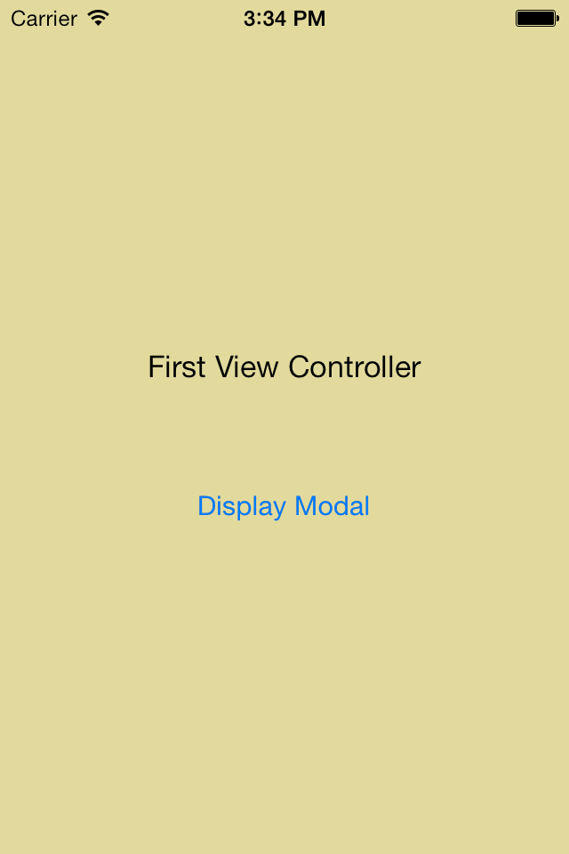
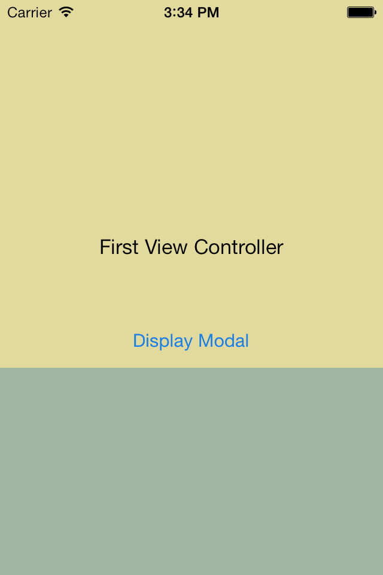
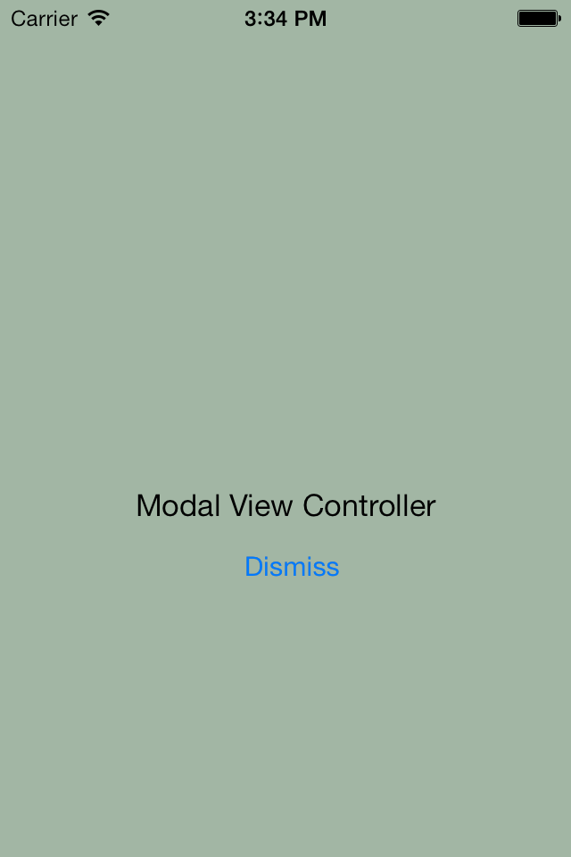
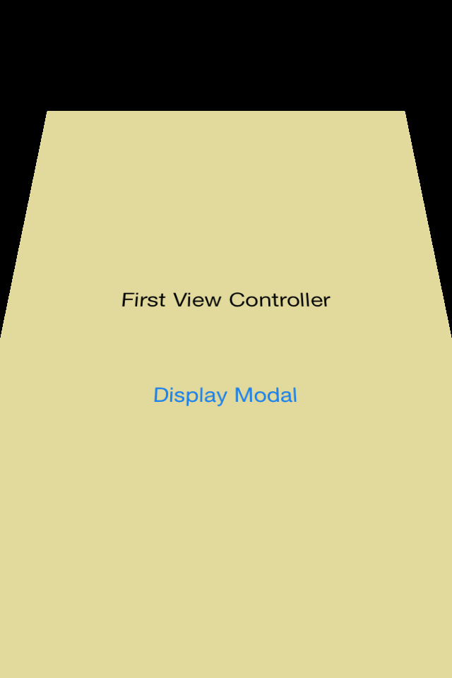
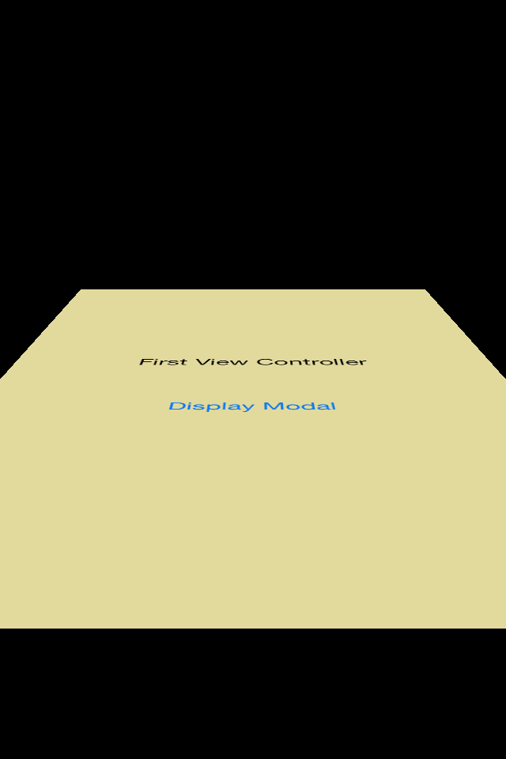
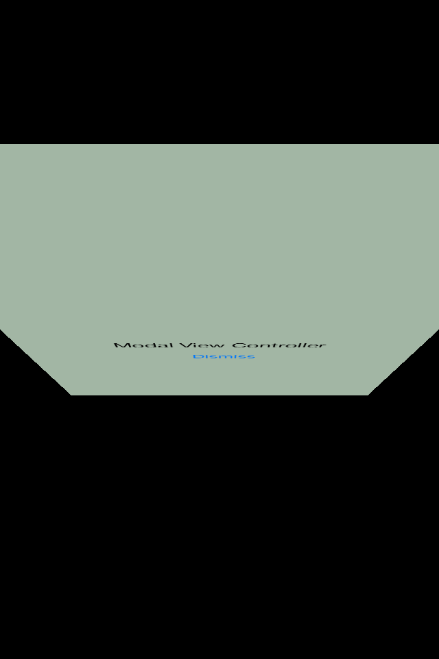
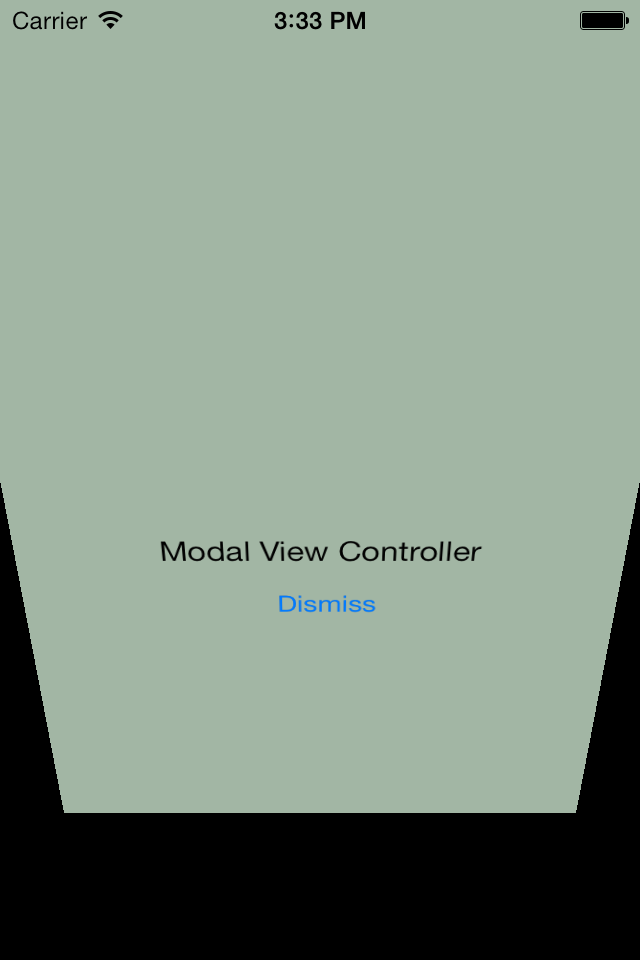

# iOS7 Day-by-Day: Day 14
## Interactive View Controller Transitions

### Introduction

Back on day 10 of DbD we looked at how to create custom view controller
transitions by creating a fade transition for a navigation controller. Interactive
view controller transitions add another dimension to this, allowing the transition
to be controlled interactively, usually with gestures.

Today's post is going to take a look at how to create a interactive view transition
for a modal view controller which will look like a card flip. As the user pans
down the view the card flip animation will follow the user's finger.

### Flip Transition Animation

Interactive transitions augment custom animations, and therefore we need to
start out by creating a custom animation the same we we did for the fader. We need
an object which adopts the `UIViewControllerAnimatedTransitioning` protocol.

    @interface SCFlipAnimation : NSObject <UIViewControllerAnimatedTransitioning>
    @property (nonatomic, assign) BOOL dismissal;
    @end

We define a `dismissal` property which is going to determine which direction the
card flip will go in.

As before we need to implement 2 methods:

    - (void)animateTransition:(id<UIViewControllerContextTransitioning>)transitionContext
    {
        // Get the respective view controllers
        UIViewController *fromVC = [transitionContext viewControllerForKey:UITransitionContextFromViewControllerKey];
        UIViewController *toVC = [transitionContext viewControllerForKey:UITransitionContextToViewControllerKey];
        
        // Get the views
        UIView *containerView = [transitionContext containerView];
        UIView *fromView = fromVC.view;
        UIView *toView = toVC.view;
        
        // Add the toView to the container
        [containerView addSubview:toView];
        
        // Set the frames
        CGRect initialFrame = [transitionContext initialFrameForViewController:fromVC];
        fromView.frame = initialFrame;
        toView.frame = initialFrame;
        
        // Start building the transform - 3D so need perspective
        CATransform3D transform = CATransform3DIdentity;
        transform.m34 = -1/CGRectGetHeight(initialFrame);
        containerView.layer.sublayerTransform = transform;
        
        CGFloat direction = self.dismissal ? -1.0 : 1.0;
        
        toView.layer.transform = CATransform3DMakeRotation(-direction * M_PI_2, 1, 0, 0);
        [UIView animateKeyframesWithDuration:[self transitionDuration:transitionContext]
                                       delay:0.0
                                     options:0
                                  animations:^{
                                      // First half is rotating in
                [UIView addKeyframeWithRelativeStartTime:0.0
                                        relativeDuration:0.5
                                              animations:^{
            fromView.layer.transform = CATransform3DMakeRotation(direction * M_PI_2, 1, 0, 0);
                                              }];
                [UIView addKeyframeWithRelativeStartTime:0.5
                                        relativeDuration:0.5
                                              animations:^{
            toView.layer.transform = CATransform3DMakeRotation(0, 1, 0, 0);
                                              }];
                                  } completion:^(BOOL finished) {
                                      [transitionContext completeTransition:![transitionContext transitionWasCancelled]];
                                  }];
    }

    - (NSTimeInterval)transitionDuration:(id<UIViewControllerContextTransitioning>)transitionContext
    {
        return 1.0;
    }

The animation method looks quite complicated, but in reality it just uses the
new `UIView` keyframe animations we looked at on day 11. The important part to
note is that the `dismissal` property is used to determine in which direction the
rotation will be performed. Other than that, the animation is pretty straight
forward, and we won't go into detail here. For more information check out custom
view controller transitions on day 10 and UIView key-frame animations on day 11.

Now that we have an animation object we have to wire it into our view controller
transitions. We have created a storyboard which contains 2 view controllers. The
first contains a button which triggers a segue to present the modal view controller,
and the second contains a button which dismisses the modal view controller via the
following method:

    - (IBAction)handleDismissPressed:(id)sender {
        [self dismissViewControllerAnimated:YES completion:NULL];
    }

If we run up the app now then we can see the standard transition animation to
present and dismiss a modal view controller. There is a standard flip transition
which would could use, but we're interested in using custom animations, so let's
add our custom transition animation.

In day 10 we were controlling the transitions of a navigation controller, so we
implemented the `UINavigationControllerDelegate` protocol. Here we're controlling
the transitions associated with a modal view controller, so instead need to
implement the `UIViewControllerTransitioningDelegate` protocol. This has similar
methods, but the 2 we need right now are `animationControllerForPresentedController:presentingController:sourceController:`
and `animationControllerForDismissedController:`. We implement these methods on
the primary view controller, and return the animation object we created above:

    @interface SCViewController () <UIViewControllerTransitioningDelegate> {
        SCFlipAnimation *_flipAnimation;
    }
    @end

    @implementation SCViewController

    - (void)viewDidLoad
    {
        [super viewDidLoad];
        // Do any additional setup after loading the view, typically from a nib.
        _flipAnimation = [SCFlipAnimation new];
    }

    - (id<UIViewControllerAnimatedTransitioning>)animationControllerForPresentedController:(UIViewController *)presented presentingController:(UIViewController *)presenting sourceController:(UIViewController *)source
    {
        _flipAnimation.dismissal = NO;
        return _flipAnimation;
    }

    - (id<UIViewControllerAnimatedTransitioning>)animationControllerForDismissedController:(UIViewController *)dismissed
    {
        _flipAnimation.dismissal = YES;
        return _flipAnimation;
    }
    
It's important to note that the difference between the 'present' and 'dismiss'
methods is the setting of the `dismissal` property on the animation - which
determines which direction the flip will take. All that is left to do is to
set this as the transitioning delegate on the appropriate view controller. Since
we're talking about presenting and dismissing a view controller, these methods
both refer to the modal view controller, and so the delegate must be set on this
controller. Since the modal view controller is being created by the storyboard
segue process, we can set this in the `prepareForSegue:sender:` method:

    - (void)prepareForSegue:(UIStoryboardSegue *)segue sender:(id)sender
    {
        if([segue.destinationViewController isKindOfClass:[SCModalViewController class]]) {
            // Set the delegate
            SCModalViewController *vc = (SCModalViewController *)segue.destinationViewController;
            vc.transitioningDelegate = self;
        }
    }

If you run the app up now, then you should see that we've replaced the original
slide animation with our custom vertical card-flip animation.

### Interactive transitioning

There are 2 more methods on the `UIViewControllerTransitioningDelegate` protocol
which are provided to support interactive transitioning - both of which return
an object which implements the `UIViewControllerInteractiveTransitioning` protocol.
We could go ahead an create an object which implements this ourselves, but Apple
has provided a concrete class in the form of `UIPercentDrivenInteractiveTransition`
which covers the majority of use cases.

The concept of an interactor (which is what I shall refer to objects which conform
to the `UIViewControllerInteractiveTransitioning` as) is that it controls the
progress of an animation  (which is provided by an object conforming to the 
`UIViewControllerAnimatedTransitioning` protocol). The `UIPercentDrivenInteractiveTransition` class provides methods to enable specifying
the current progress of the animation as a percentage, as well as cancelling and
completing the animation.

This will all become a lot clearer once we see how it all fits with our project.
We want to create a pan gesture, which as the user drags vertically, will control
the transition of presenting/dismissing the modal view controller. We'll create
a subclass of `UIPercentDrivenInteractiveTransition` which has the following
properties:

    @interface SCFlipAnimationInteractor : UIPercentDrivenInteractiveTransition

    @property (nonatomic, strong, readonly) UIPanGestureRecognizer *gestureRecogniser;
    @property (nonatomic, assign, readonly) BOOL interactionInProgress;
    @property (nonatomic, weak) UIViewController<SCInteractiveTransitionViewControllerDelegate> *presentingVC;

    @end

The gesture recognizer is as we've already discussed, we also provide a property
for determining whether or not an interaction is in progress, and finally a property
which specifies the presenting view controller. We'll see why we need this later
on, but for now we need to observe that it adopts the following simple protocol:

    @protocol SCInteractiveTransitionViewControllerDelegate <NSObject>
    - (void)proceedToNextViewController;
    @end

On to the implementation of this subclass:

    @interface SCFlipAnimationInteractor ()
    @property (nonatomic, strong, readwrite) UIPanGestureRecognizer *gestureRecogniser;
    @property (nonatomic, assign, readwrite) BOOL interactionInProgress;
    @end

    @implementation SCFlipAnimationInteractor
    - (instancetype)init
    {
        self = [super init];
        if (self) {
            self.gestureRecogniser = [[UIPanGestureRecognizer alloc] initWithTarget:self action:@selector(handlePan:)];
        }
        return self;
    }
    @end

Firstly we need to redefine 2 of the properties as internally read-write, and
at construction time we create the gesture recognizer and set its target to an
internal method. Notice that we don't attach it to any views at this stage - we
have provided this as a property so that we can do this externally.

The pan handling method is as follows:

    - (void)handlePan:(UIPanGestureRecognizer *)pgr
    {
        CGPoint translation = [pgr translationInView:pgr.view];
        CGFloat percentage  = fabs(translation.y / CGRectGetHeight(pgr.view.bounds));
        switch (pgr.state) {
            case UIGestureRecognizerStateBegan:
                self.interactionInProgress = YES;
                [self.presentingVC proceedToNextViewController];
                break;
                
            case UIGestureRecognizerStateChanged: {
                [self updateInteractiveTransition:percentage];
                break;
            }
                
            case UIGestureRecognizerStateEnded:
                if(percentage < 0.5) {
                    [self cancelInteractiveTransition];
                } else {
                    [self finishInteractiveTransition];
                }
                self.interactionInProgress = NO;
                break;
                
            case UIGestureRecognizerStateCancelled:
                [self cancelInteractiveTransition];
                self.interactionInProgress = NO;
                
            default:
                break;
        }
    }

This is a fairly standard gesture recognizer handling method, with cases for
the different recognizer states. Before we start the switch we calculate the 
percentage complete - i.e. given how far the gesture has travelled, how complete
do we consider the transition to be. Then the switch behaves as follows:

- __Began__ Here we set that the interaction is currently in progress, and use
the method we added to our `presentingViewController` to begin the transition.
This is important - we're using the gesture to begin the transition. The interactor
isn't currently being used other than for handling the gesture because there is
no transition occurring. Once we've called this method on the view controller 
(provided we implement it correctly) a transition will begin and the interactor
will begin performing its animation control job.
- __Changed__ We must now be in the middle of an interactive transition (since we
started one when the gesture began) and therefore we just call the method provided
by our superclass to specify how complete our transition is `updateInteractiveTransition:`.
This will set the current transition appearance to be as if the animation is
the specified proportion complete.
- __Ended__ When a gesture ends we need to decide whether or now we should finish
the transition or cancel it. We call the helper methods provided by the superclass
to cancel the transition (`cancelInteractiveTransition`) if the percentage is lower
than `0.5` and complete the transition (`finishInteractiveTransition`) otherwise.
We also need to update our in-progress property since the transition is finished.
- __Canceled__ If the gesture is canceled then we should cancel the transition
and update the `interactionInProgress` property.

That completes all the code that we need in the interactor - all that remains
is to wire it all up.

Firstly let's add the new methods for interactive transitions on the
`UIViewControllerTransitioningDelegate`, which is our primary view controller:

    - (id<UIViewControllerInteractiveTransitioning>)interactionControllerForPresentation:(id<UIViewControllerAnimatedTransitioning>)animator
    {
        return _animationInteractor.interactionInProgress ? _animationInteractor : nil;
    }

    - (id<UIViewControllerInteractiveTransitioning>)interactionControllerForDismissal:(id<UIViewControllerAnimatedTransitioning>)animator
    {
        return _animationInteractor.interactionInProgress ? _animationInteractor : nil;
    }

These are both identical (for presentation and dismissal). We only want to return
an interactor if we're performing an interactive transition - i.e. if a user
clicked on the button rather than by panning then we should perform a
non-interactive transition. This is the purpose of the `interactionInProgress`
property on our interactor. We're returning an ivar `_animationInteractor` here,
which we set up in `viewDidLoad`:

    - (void)viewDidLoad
    {
        [super viewDidLoad];
        // Do any additional setup after loading the view, typically from a nib.
        _animationInteractor = [SCFlipAnimationInteractor new];
        _flipAnimation = [SCFlipAnimation new];
    }

When we created the gesture recognizer in the interactor, we didn't actually add
it to a view, so we can do that now, in our view controller's `viewDidAppear`:

    - (void)viewDidAppear:(BOOL)animated
    {
        // Add the gesture recogniser to the window first render time
        if (![self.view.window.gestureRecognizers containsObject:_animationInteractor.gestureRecogniser]) {
            [self.view.window addGestureRecognizer:_animationInteractor.gestureRecogniser];
        }
    }

We normally add gesture recognizers to views, but here we're adding it to the
window object instead. This is because as the animation occurs, the view
controller's view will move, and hence the gesture recognizer won't behave as
expected. Adding it to the window instead will ensure the behavior we expect. If
we were performing a navigation controller transition instead we could add the
gesture to the navigation controller's view. The gesture recognizer is added in
`viewDidAppear:` since at this point the `window` property is set correctly.

The final piece of the puzzle is to set the `presentingVC` property on the
interactor. In order to do this we need to make our view controllers implement
the `SCInteractiveTransitionViewControllerDelegate` protocol. On our main
view controller this is pretty simple:

    @interface SCViewController () <SCInteractiveTransitionViewControllerDelegate, UIViewControllerTransitioningDelegate> {
        SCFlipAnimationInteractor *_animationInteractor;
        SCFlipAnimation *_flipAnimation;
    }
    @end

    #pragma mark - SCInteractiveTransitionViewControllerDelegate methods
    - (void)proceedToNextViewController
    {
        [self performSegueWithIdentifier:@"displayModal" sender:self];
    }

And now we have implemented the required method we can set the correct property
on the interactor in the `viewDidAppear`. This will ensure that it is set correctly
every time the primary view controller is displayed, whether it be on the first
display or when the modal view controller is dismissed:

    - (void)viewDidAppear:(BOOL)animated
    {
        ...
        // Set the recipeint of the interactor
        _animationInteractor.presentingVC = self;
    }

So, when the user starts the pan gesture, the interactor will call
`proceedToNextViewController` on the primary view controller, which will kick
off the segue to present the modal view controller - this is exactly what we want!

To perform the same operation on the modal view controller it must have a reference
to the interactor as well (so that it can update the `presentingVC` property):

    @interface SCModalViewController : UIViewController <SCInteractiveTransitionViewControllerDelegate>

    ...

    @property (nonatomic, weak) SCFlipAnimationInteractor *interactor;

    @end

We set this property in the `prepareForSegue:` method on the main view controller:

    - (void)prepareForSegue:(UIStoryboardSegue *)segue sender:(id)sender
    {
        if([segue.destinationViewController isKindOfClass:[SCModalViewController class]]) {
            // Set the delegate
            ...
            vc.interactor = _animationInteractor;
        }
    }

The `SCInteractiveTransitionViewControllerDelegate` is implemented with the
`proceedToNextViewController` method:

    - (void)proceedToNextViewController
    {
        [self dismissViewControllerAnimated:YES completion:NULL];
    }

And finally, once the modal view controller has appeared then we need to update
the property on the interactor to make sure that the next time an interactive
transition is started (i.e. the user begins a vertical pan) it calls the method
on the modal VC, not the main one:

    - (void)viewDidAppear:(BOOL)animated
    {
        // Reset which view controller should be the receipient of the
        // interactor's transition
        self.interactor.presentingVC = self;
    }

And that's it. If you run the app up now and drag vertically you'll see that the
transition to show the modal view controller will follow your finger. If you
drag further than half way and let go then the transition will complete, otherwise
it will return to its original state.

### Conclusion

Interactive view controller transitions can appear to be quite a complicated
topic - primarily due to the vast array of different protocols that you need to
implement, and also because it's not immediately obvious which bits pieces of
the puzzle should be responsible for what (e.g. who should own the gesture
recogniser?). However, in reality, we've got some really quite powerful functionality
for a small amount of code. I encourage you to give this custom view controller
transitions a try, but be aware, with great power comes great responsibility - 
just because we can now do lots of whacky transitions between view controllers
we should ensure that we don't overcomplicate the UX for our app users.
