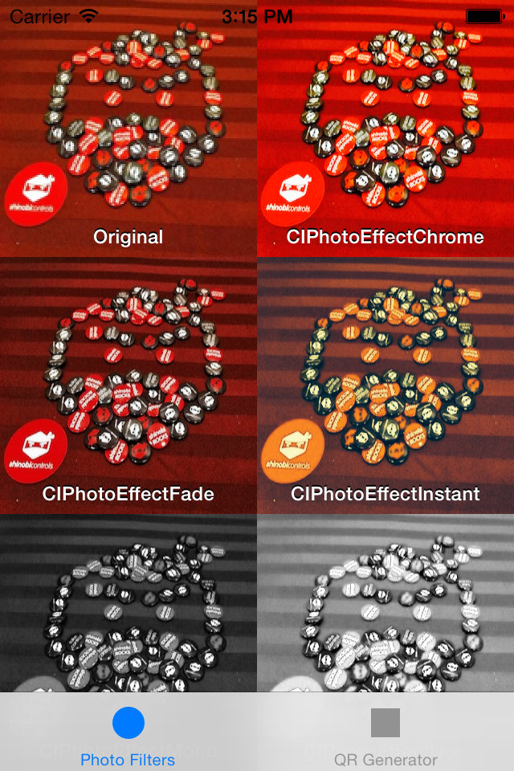
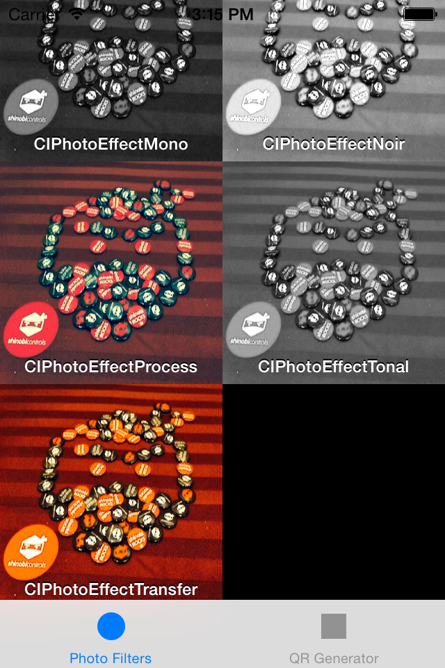
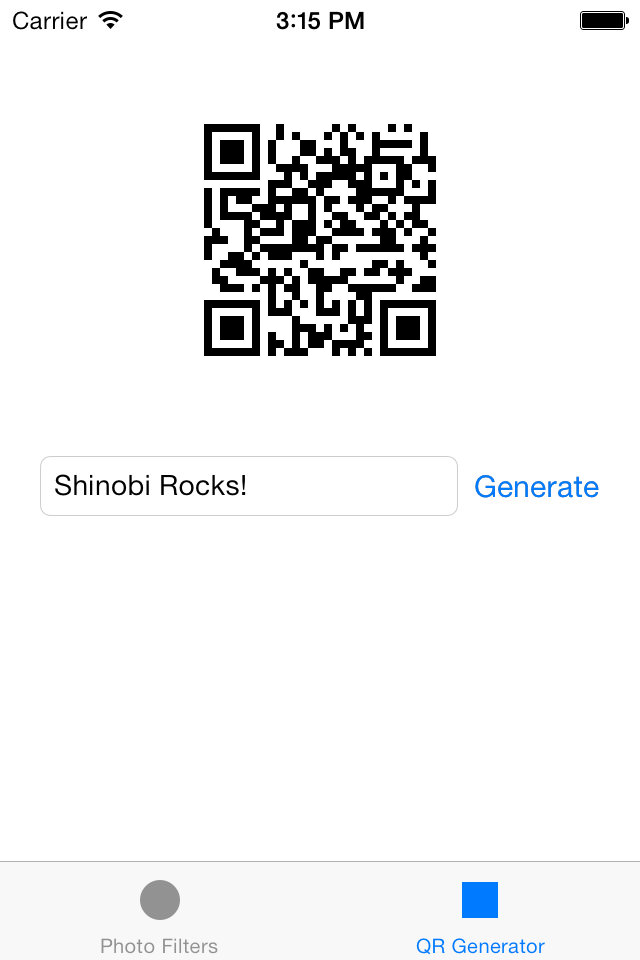

# iOS7 Day-by-Day: Day 15
## CoreImage Filters

### Introduction

CoreImage is a framework for image processing which was introduced in iOS5. It
abstracts all the low-level guff associated with dealing with images away from
the user and has an easy-to-use filter-chain architecture. iOS7 introduces new
filters, some of which we're going to take a look at in today's DbD. We'll start
by taking a look at some more traditional photo effect filters, before taking a
look at a new creative filter which generates QR codes.

### Photo Effect Filters

The ability to apply 'cool' effects to your photos is now ever-present in the
mobile app world. Made popular by instagram, it seems that it's no longer
possible to take a photo without being encouraged to make it appear that you
took it on a 40 year old camera which has a light-leak. Well, CoreImage has
added some really easy to use filters to help you out with adding this
functionality to your apps.

In order to use these filters we'll need to have do a bit of CoreImage. CoreImage
specifies it's own image type - `CIImage`, which can be created from lots of 
different sources, including the CoreGraphics equivalent `CGImage`:

    UIImage *_inputUIImage = [UIImage imageNamed:@"shinobi-badge-head.jpg"];
    CIImage *_inputImage = [CIImage imageWithCGImage:[_inputUIImage CGImage]];

Using filters is really simple - they can even be chained together, but for our
purposes we just want to specify a single filter:

    CIFilter *filter = [CIFilter filterWithName:@"CIPhotoEffectChrome"];
    [filter setValue:_inputImage forKey:kCIInputImageKey];

A CoreImage filter is represented by the `CIFilter` class, which has a factory
method to create a specific filter object. These filter object then use KVC to
specify the relevant filter arguments. All of the new photo-effect filters take
just a single argument - the input image, which is specified using the string
constand `kCIInputImageKey`.

We can then turn this back into a `UIImage` for display in a `UIImageView`:

    UIImage *outputImage = [UIImage imageWithCIImage:filter.outputImage];

The new photo-effect filters are referenced with the following strings:

    @"CIPhotoEffectChrome"
    @"CIPhotoEffectFade"
    @"CIPhotoEffectInstant",
    @"CIPhotoEffectMono"
    @"CIPhotoEffectNoir"
    @"CIPhotoEffectProcess"
    @"CIPhotoEffectTonal"
    @"CIPhotoEffectTransfer"

In the app which accompanies today's post we have a collection view which
demonstrates the output of each of the new filters on a single input image. Since
we don't have loads of images, we process the images up-front, to preserve the
scrolling performance we expect from iOS.

This also requires that we construct `CGImage` versions of each of the `CIImage`
filter outputs. This is because the `outputImage` property is generated lazily.
To do this, we use a `CIContext` to draw the `CIImage` into a CoreGraphics
context:

    // Create a CG-back UIImage
    CGImageRef cgImage = [[CIContext contextWithOptions:nil] createCGImage:filter.outputImage fromRect:filter.outputImage.extent];
    UIImage *image = [UIImage imageWithCGImage:cgImage];
    CGImageRelease(cgImage);
    
    [images addObject:image];

The rest of the code in the `SCPhotoFiltersViewController` is the boilerplate
code required to run a collection view with custom cells. If you run up the app
you can see the different filtered results:

### QR Code Generation

In addition to the photo effect filters iOS7 also introduces a filter which is
capable of generating QR codes to represent a specific data object. In the sample
app the second tab (`SCQRGeneratorViewController`) demonstrates this
functionality - when the 'Generate' button is pressed then the content of the
text field is encoded in a QR code, displayed above.

The method which creates the QR code is really rather simple:

    - (CIImage *)createQRForString:(NSString *)qrString
    {
        // Need to convert the string to a UTF-8 encoded NSData object
        NSData *stringData = [qrString dataUsingEncoding:NSUTF8StringEncoding];
        
        // Create the filter
        CIFilter *qrFilter = [CIFilter filterWithName:@"CIQRCodeGenerator"];
        // Set the message content and error-correction level
        [qrFilter setValue:stringData forKey:@"inputMessage"];
        [qrFilter setValue:@"H" forKey:@"inputCorrectionLevel"];
        
        // Send the image back
        return qrFilter.outputImage;
    }

The QR filter requires an `NSData` object which it will encode, and hence we
first take the `NSString` and encode it into an `NSData` object using UTF-8
encoding.

Then, same as we did before, we create a `CIFilter` using the `filterWithName:`
factory method, specifying the name to be `CIQRCodeGenerator`. The two keys we
need to set in this case are called `inputMessage`, which is the `NSData` object
we just created, and `inputCorrectionLevel`, which specifies how resilient to
error the code will be. There are 4 levels:

- `L` 7% error resilience
- `M` 15% error resilience
- `Q` 25% error resilience
- `H` 30% error resilience

Once we've done this we can return the `outputImage` of the filter, which will
be a `CIImage` with 1pt resolution for the smallest squares.

We want to be able to resize this image, but we don't want to allow any
interpolation since what we have is pixel-perfect. In order to do this we create
a new method which enables rescaling an image with interpolation disabled:

    - (UIImage *)createNonInterpolatedUIImageFromCIImage:(CIImage *)image withScale:(CGFloat)scale
    {
        // Render the CIImage into a CGImage
        CGImageRef cgImage = [[CIContext contextWithOptions:nil] createCGImage:image fromRect:image.extent];
        
        // Now we'll rescale using CoreGraphics
        UIGraphicsBeginImageContext(CGSizeMake(image.extent.size.width * scale, image.extent.size.width * scale));
        CGContextRef context = UIGraphicsGetCurrentContext();
        // We don't want to interpolate (since we've got a pixel-correct image)
        CGContextSetInterpolationQuality(context, kCGInterpolationNone);
        CGContextDrawImage(context, CGContextGetClipBoundingBox(context), cgImage);
        // Get the image out
        UIImage *scaledImage = UIGraphicsGetImageFromCurrentImageContext();
        // Tidy up
        UIGraphicsEndImageContext();
        CGImageRelease(cgImage);
        return scaledImage;
    }

Like we did in the previous example, we first create a `CGImage` representation
of the `CIImage`. Then we create a core graphics context of the correctly
rescaled resolution. The important line here is that we set the interpolation
quality to none. If we were rescaling a photo, this would look pretty terrible
and pixelized, but pixelized is exactly what we want for a QR code:

    CGContextSetInterpolationQuality(context, kCGInterpolationNone);

Once we've drawn the image into the context then we can grab it out as a
`UIImage` and return it. Thus, our completed generation handler looks like this:

    - (IBAction)handleGenerateButtonPressed:(id)sender {
        // Disable the UI
        [self setUIElementsAsEnabled:NO];
        [self.stringTextField resignFirstResponder];

        // Get the string
        NSString *stringToEncode = self.stringTextField.text;
        
        // Generate the image
        CIImage *qrCode = [self createQRForString:stringToEncode];
        
        // Convert to an UIImage
        UIImage *qrCodeImg = [self createNonInterpolatedUIImageFromCIImage:qrCode withScale:2*[[UIScreen mainScreen] scale]];
        
        // And push the image on to the screen
        self.qrImageView.image = qrCodeImg;
        
        // Re-enable the UI
        [self setUIElementsAsEnabled:YES];
    }

There's a call to a utility method to disable the UI whilst we're generating:

    - (void)setUIElementsAsEnabled:(BOOL)enabled
    {
        self.generateButton.enabled = enabled;
        self.stringTextField.enabled = enabled;
    }

If you run the app up now you'll be able to generate QR codes all day and night.
No idea what you're going to do with them... maybe soon we'll work out a way
to read them.

### Conclusion

CoreImage is a handy framework for doing some fairly advanced image processing
without having to get too involved with the low-level image manipulation. It has
its quirks, but it can be really useful. With the new photo-effect filters and
QR code generator it might just have saved you finding an external dependency
or writing your own versions.

