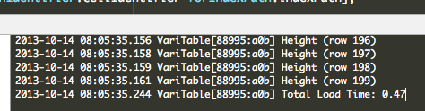
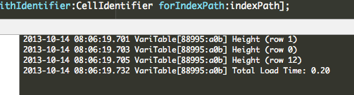

# iOS7 Day-by-Day: Day 19
## UITableView Row Height Estimation

### Introduction

Today we're going to take a look at a fairly small addition to the UIKit API, but
one which could make quite a difference to the user experience of apps with complex
table views. Row height estimation takes the form of an additional method on the
table view delegate, which, rather than having to return the exact height of every
row at initial load, allows an estimated size to be returned instead. We'll look
at why this is an advantage in today's post. In order to demonstrate its potential
we'll construct a slightly contrived app which has a table view which we can
view both with and without row height estimation.

### Without estimation

We create a simple `UITableView` with a `UITableViewController`, containing just
1 section with 200 rows. The cells contain their index and their height, which
varies on a row-by-row basis. This is important - if all the rows are the same
height then we don't need to implement the `heightForRowAtIndexPath:` method
on the delegate, and we won't get any improvement out of using the new row height
estimation method.

    - (NSInteger)numberOfSectionsInTableView:(UITableView *)tableView
    {
        // Return the number of sections.
        return 1;
    }

    - (NSInteger)tableView:(UITableView *)tableView numberOfRowsInSection:(NSInteger)section
    {
        // Return the number of rows in the section.
        return 200;
    }

    - (UITableViewCell *)tableView:(UITableView *)tableView cellForRowAtIndexPath:(NSIndexPath *)indexPath
    {
        static NSString *CellIdentifier = @"Cell";
        UITableViewCell *cell = [tableView dequeueReusableCellWithIdentifier:CellIdentifier forIndexPath:indexPath];
        
        // Configure the cell...
        cell.textLabel.text = [NSString stringWithFormat:@"Cell %03d", indexPath.row];
        CGFloat height = [self heightForRowAtIndex:indexPath.row];
        cell.detailTextLabel.text = [NSString stringWithFormat:@"Height %0.2f", height];
        return cell;
    }

The `heightForRowAtIndex:` method is a utility method which will return the height
of a given row:

    - (CGFloat)heightForRowAtIndex:(NSUInteger)index
    {
        CGFloat result;
        for (NSInteger i=0; i < 1e5; i++) {
            result = sqrt((double)i);
        }
        result = (index % 3 + 1) * 20.0;
        return result;
    }

If we had a complex table with cells of differing heights, it is likely that we
would have to construct the cell to be able to determine its height, which takes
a long time. To simulate this we've put a superfluous loop calculation in the
height calculation method - it isn't of any use, but takes some computational
time.

We also need a delegate to return the row heights as we go, so we create 
`SCNonEstimatingTableViewDelegate`:

    @interface SCNonEstimatingTableViewDelegate : NSObject <UITableViewDelegate>
    - (instancetype)initWithHeightBlock:(CGFloat (^)(NSUInteger index))heightBlock;
    @end

This has a constructor which takes a block which is used to calculate the row
height of a given row:

    @implementation SCNonEstimatingTableViewDelegate
    {
        CGFloat (^_heightBlock)(NSUInteger index);
    }

    - (instancetype)initWithHeightBlock:(CGFloat (^)(NSUInteger))heightBlock
    {
        self = [super init];
        if(self) {
            _heightBlock = [heightBlock copy];
        }
        return self;
    }
    @end

And we implement the relevant delegate method:

    #pragma mark - UITableViewDelegate methods
    - (CGFloat)tableView:(UITableView *)tableView heightForRowAtIndexPath:(NSIndexPath *)indexPath
    {
        NSLog(@"Height (row %d)", indexPath.row);
        return _heightBlock(indexPath.row);
    }

This logs that it has been called and uses the block to calculate the row height
for the specified index path. With a bit of wiring up in the view controller then
we're done:

    - (void)viewDidLoad
    {
        [super viewDidLoad];
        
        _delegate = [[SCNonEstimatingTableViewDelegate alloc] initWithHeightBlock:^CGFloat(NSUInteger index) {
            return [self heightForRowAtIndex:index];
        }];
        self.tableView.delegate = _delegate;
    }

Running the app up now will demonstrate the variable row height table:

Looking at the log messages we can see that the row height method gets called
for every single row in the table before we first render the table. This is because
the table view needs to know its total height (for drawing the scroll bar etc).
This can present a problem in complex table views, where calculating the height
of a row is a complex operation - it might involve fetching the content, or rendering
the cell to discover how much space is required. It's not always an easy operation.
Our `heightForRowAtIndex:` utility method simulates this complexity with a long
loop of calculations. Adding a bit of timing logic we can see that in this contrived
example (and running on a simulator) we have a delay of nearly half a second from
loading the tableview, to it appearing:

### With estimation

The new height estimation delegate methods provide a way to improve this initial
delay to rendering the table. If we implement
`tableView:estimatedHeightForRowAtIndexPath:` in addition to
`tableView:heightForRowAtIndexPath:` then rather than calling the `height` method
for every row before rendering the tableview, the `estimatedHeight` method will
be called for every row, and the `height` method just for rows which are being
rendered on the screen. Therefore, we have separated the height calculation into
a method which requires the exact height (since the cell is about to appear on
screen), and a method which is just used to calculate the height of the entire
tableview (hence doesn't need to be perfectly accurate).

To demonstrate this in action we create a new delegate which will implement the
height estimation method:

    @interface SCEstimatingTableViewDelegate : SCNonEstimatingTableViewDelegate
    - (instancetype)initWithHeightBlock:(CGFloat (^)(NSUInteger index))heightBlock
                        estimationBlock:(CGFloat (^)(NSUInteger index))estimationBlock;
    @end

Here we've got a constructor with 2 blocks, one will be used for the exact height
method, and one for the estimation:

    @implementation SCEstimatingTableViewDelegate {
        CGFloat (^_estimationBlock)(NSUInteger index);
    }

    - (instancetype)initWithHeightBlock:(CGFloat (^)(NSUInteger index))heightBlock
                        estimationBlock:(CGFloat (^)(NSUInteger index))estimationBlock
    {
        self = [super initWithHeightBlock:heightBlock];
        if(self) {
            _estimationBlock = [estimationBlock copy];
        }
        return self;
    }
    @end

And then we implement the new estimation method:

    #pragma mark - UITableViewDelegate methods
    - (CGFloat)tableView:(UITableView *)tableView estimatedHeightForRowAtIndexPath:(NSIndexPath *)indexPath
    {
        NSLog(@"Estimating height (row %d)", indexPath.row);
        return _estimationBlock(indexPath.row);
    }

Updating the view controller with a much cheaper height estimation method - just
returning the average height for our cells (`40.0`).

    - (void)viewDidLoad
    {
        [super viewDidLoad];
        
        if(self.enableEstimation) {
            _delegate = [[SCEstimatingTableViewDelegate alloc] initWithHeightBlock:^CGFloat(NSUInteger index) {
                return [self heightForRowAtIndex:index];
            } estimationBlock:^CGFloat(NSUInteger index) {
                return 40.0;
            }];
        } else {
            _delegate = [[SCNonEstimatingTableViewDelegate alloc] initWithHeightBlock:^CGFloat(NSUInteger index) {
                return [self heightForRowAtIndex:index];
            }];
        }
        self.tableView.delegate = _delegate;
    }

Running the app up now and observing the log and we'll see that the height method
no longer gets called for every cell before initial render, but instead the
estimated height method. The height method is called just for the cells which are
being rendered on the screen. Consequently see that the load time has dropped to
a fifth of a second:

### Conclusion

As was mentioned before, this example is a little contrived, but it does demonstrate
rather well that if calculating the actual height is hard work then implementing
the new estimation height method can really improve the responsiveness of your app,
particularly if you have a large tableview. There are additional height estimation
methods for section headers and footers which work in precisely the same manner.
It might not be a groundbreaking API change, but in some cases it can really
improve the user experience, so it's definitely worth doing.

