# iOS7 Day-by-Day: Day 20
## View controller content and navigation bars

### Introduction

Today's post is a little different from the previous posts in this series. Since
adopting iOS7, many developers have been struggling with the appearance of their
view controllers behind the navigation bar of `UINavigationController`s. We're
going to take a look at why this is and attempt to explain how to get the
desired behavior.

### iOS7 View Controller Changes: The theory

In iOS7 all view controllers use full screen layout, which means that the
`wantsFullScreenLayout` property is deprecated. However, we now have additional
control over the way in which view controllers are displayed. The following
properties are configurable both in code and in interface builder:

- __`edgesForExtendedLayout`__
This defines which of the view's edges should be extended to the edge of the
screen - underneath whatever bars might be in the way. i.e. underneath the bars
(such as the navigation bar) which are present. By default this is set to
 `UIRectEdgeAll`, to 

- __`extendedLayoutIncludesOpaqueBars`__
By default the edges will only be extended underneath bars if they are translucent,
however by setting this property to `YES` will cause the edges to be extended under
opaque bars as well.

- __`automaticallyAdjustsScrollViewInsets`__
This is probably the most powerful property - if your view contains a scroll
view then it will have its content insets set so that the content will scroll
underneath the bars, but it'll be possible to scroll to see all the content.
The is set to `YES` by default, and this is the iOS7 recommended behavior.

- __`topLayoutGuide`__, __`bottomLayoutGuide`__
These are properties which are generated to match the extent of the visible area
of the view - i.e. if there is a bar at the top of the screen then the `topLayoutGuide`
will be positioned at the bottom of the bar.

### In Practice

Reading through the property descriptions above might make you think that it's
all very easy, and in my experience it is. In some cases. Otherwise it's just
confusing.

#### View controller inside a navigation controller

Let's address the simplest case first: a view controller inside a navigation
controller.

Here we need to set the `edgesForExtendedLayout` correctly, otherwise your
view will appear underneath the bar. This can be set in interface builder as
follows:

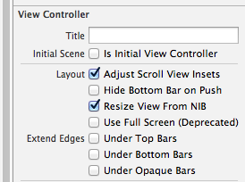

Or in code with:

    self.edgesForExtendedLayout = UIRectEdgeNone;

We can see 'before' and 'after' below:

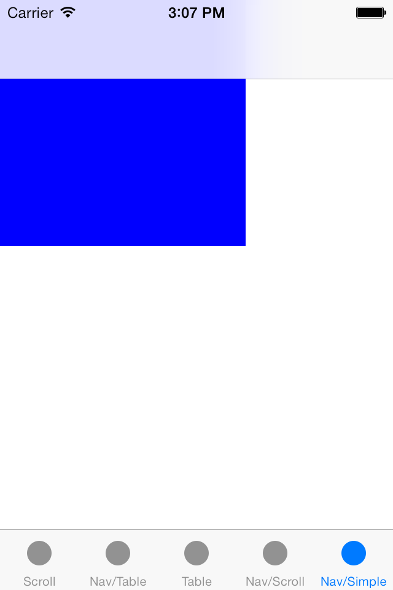
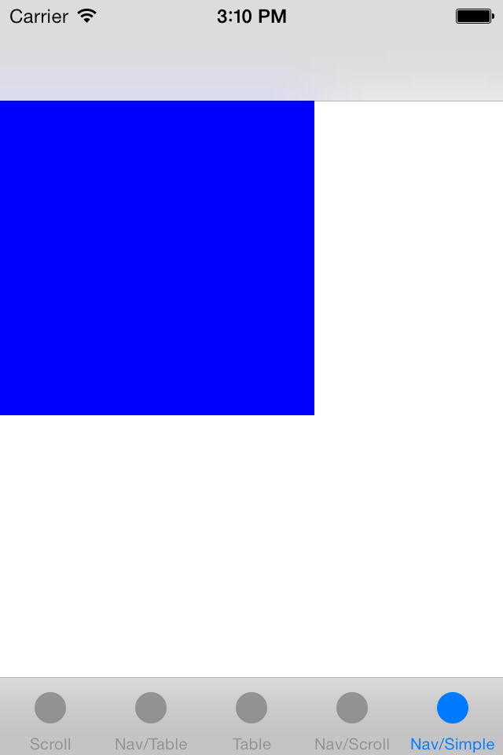

#### Scroll view inside a navigation controller

The effect we want for a scroll view inside a nav controller is that it is possible
to scroll to see all the content, but as you scroll the content disappears
underneath the bars. This is precisely what `automaticallyAdjustsScrollViewInsets`
does. With it set to `NO` we see the following behavior:

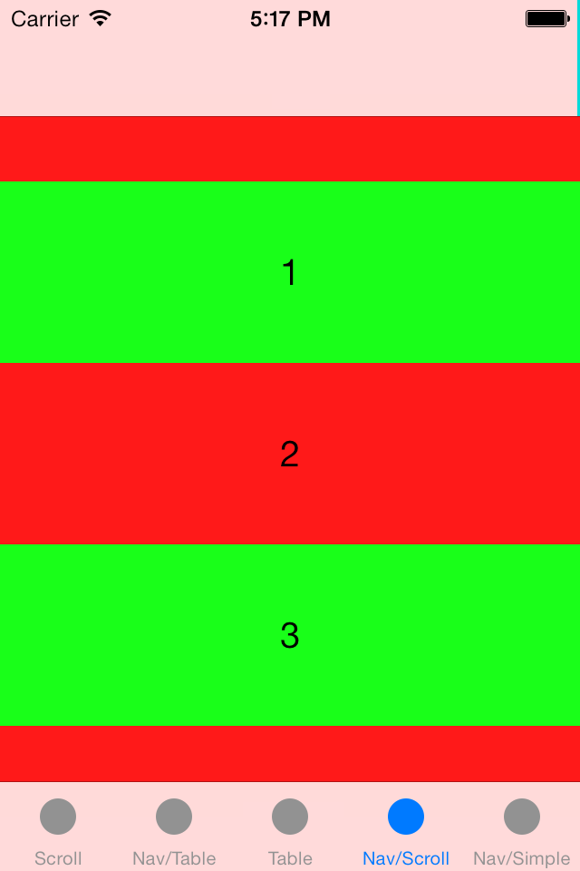
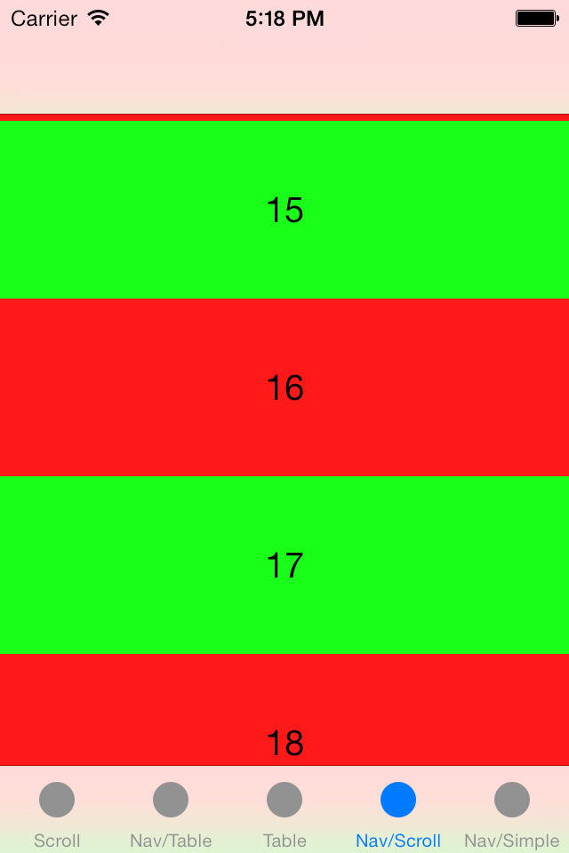

And changing it to `YES` the following:

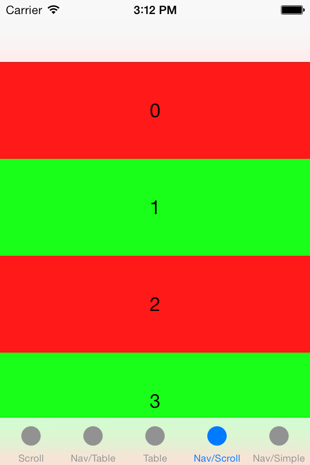

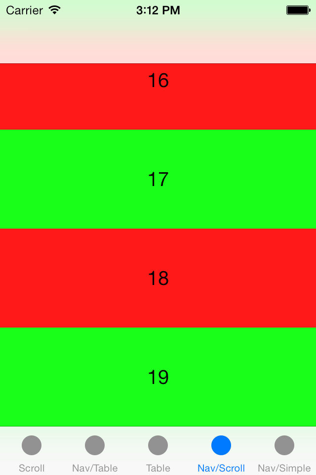

#### Table view inside a navigation controller

`UITableView` is a subclass of `UIScrollView` so we'd expect the same behavior
we saw in the previous section, and indeed we do. `automaticallyAdjustsScrollViewInsets`
is again the property we need to play with to get the desired behavior:

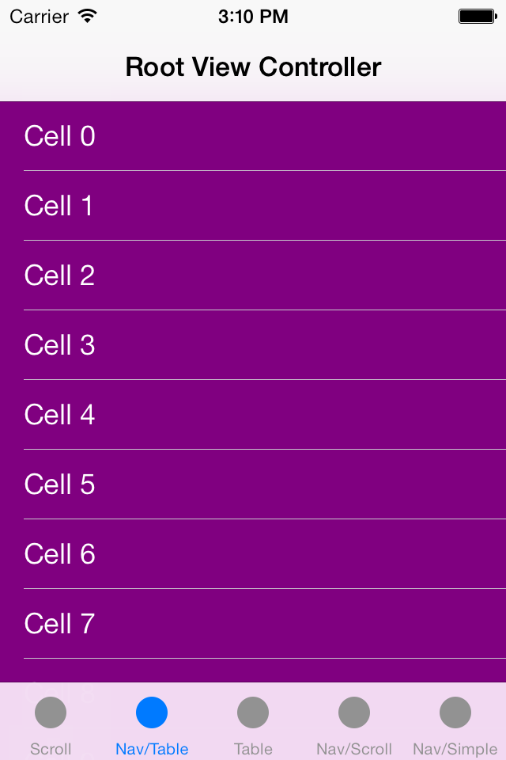
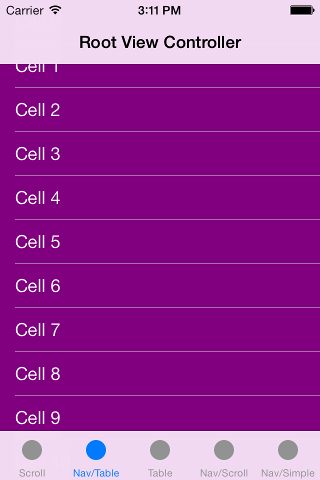
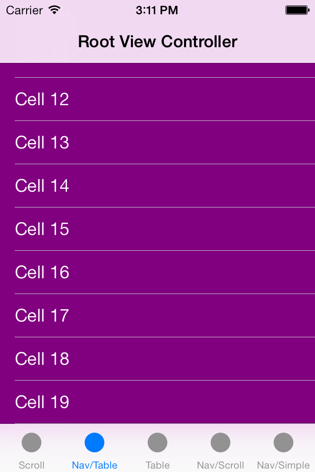

#### Other cases

If you run up the accompanying sample app for today's post then you'll notice
that there are some other examples provided - namely scrollview inside a tab
controller, and a tableview inside a tab controller. For some reason (I think it
is a bug, but would love to be corrected...), the scroll view insets are no
longer adjusted as they were inside the navigation controller:

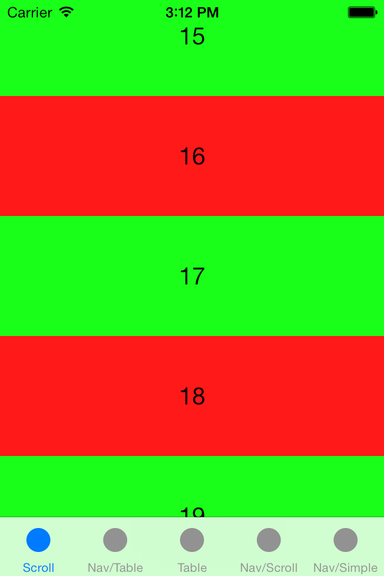
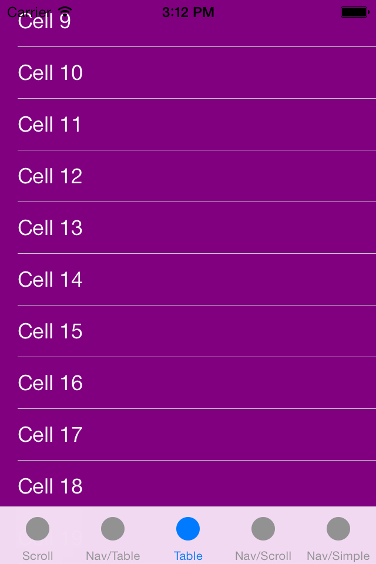

### Conclusion

The fact that all view controllers are now full screen has foxed a lot of
developers, and with good reason. The documentation around them isn't great, and 
I think there might be a bug in the scroll view inset adjustment for tab
bar controllers. However, it is worth playing around with - the concept of multiple
layers is integral to the new iOS7 look and feel, and when it works it does look
rather good.

