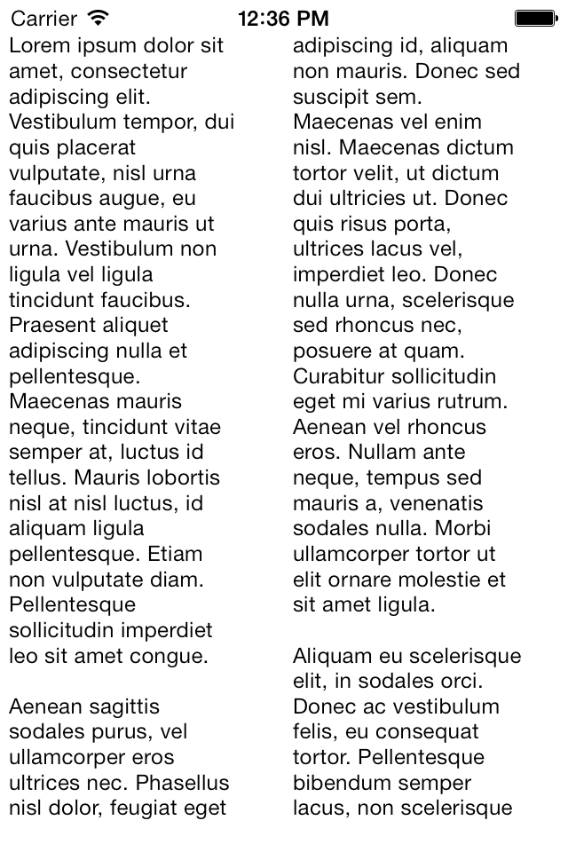
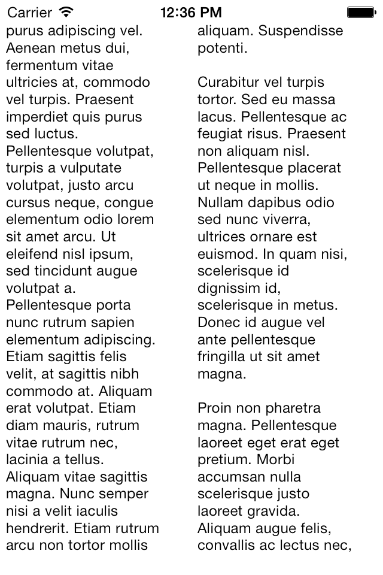
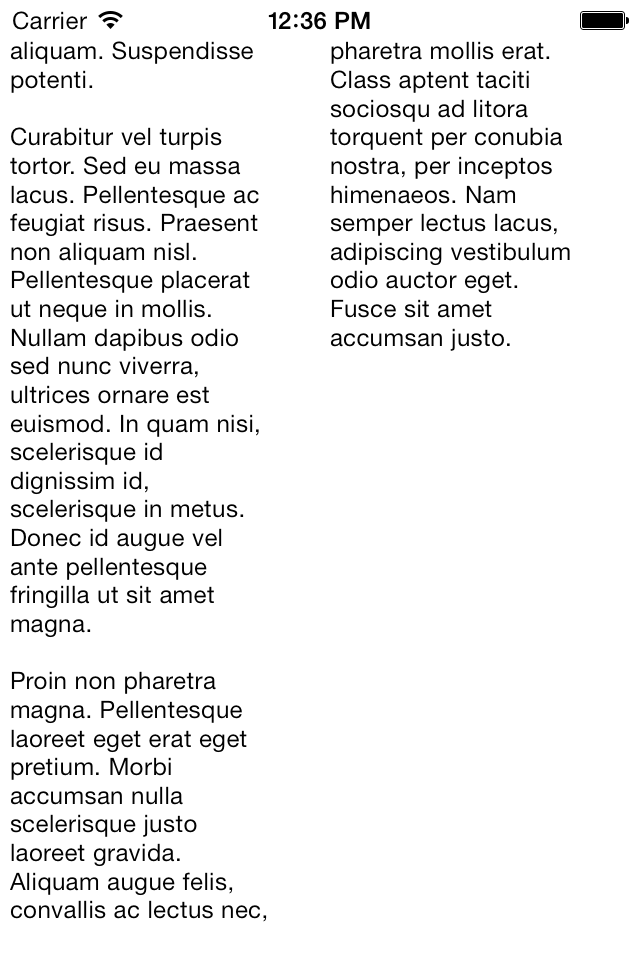

# iOS7 Day-by-Day: Day 21
## Multi-column TextKit text rendering

### Introduction

In day 12 we took a look at some of the powerful functionality available for
rendering text using TextKit, in the form of dynamic type and font descriptors.
Today we're going to look at another aspect of TextKit - with a demo of creating
multi-column text layouts.

In the past, creating a multi-column layout of text in iOS has been hard work:
potentially you could create multiple `UITextView`s and manually cut the text
to fit into each view, which will break with dynamic content, or you could drop
to the underlying layout engine CoreText, which is far from simple to use.

The introduction of TextKit in iOS7 changes this, and it's now incredibly easy
to create lots of different text layouts, including multi-page, multi-column and
exclusion zones. In today's DbD we'll take a look at how to build a multi-column
paging text display, which renders a simple text file.

### TextKit

TextKit is a massive framework, and this post isn't going to attempt to explain
it in great detail at all. In order to understand the multi-column project there
are 4 classes to be familiar with:

- `NSTextStorage`: A subclass of `NSAttributedString` and contains both the
content and formatting mark-up for the text we wish to render. It enabled editing
and keeps references to relevant layout managers to inform them of changes in the
underlying text store.
- `NSLayoutManager`: Responsible for managing the rendering the text from a store
in one or multiple text container objects. Converts the underlying unicode
characters into glyphs which can be rendered on screen. Can have multiple text
containers to allow flowing of the text between different regions.
- `NSTextContainer`: Defines the region in which the text will be rendered. This
is provided with glyphs from the layout manager and fills the area it specifies.
Can use `UIBezierPath` objects as exclusion zones.
- `UITextView`: Actually render the text on screen. It has been updated for iOS7
with the addition of a constructor which takes an `NSTextContainer`.

We are going to use all of these classes to create a multi-column text view. For
far more information about the TextKit architecture and how to use it then take
a look at the [TextKit Tutorial](http://www.raywenderlich.com/50151/text-kit-tutorial)
from our very own [Colin Eberhardt](https://twitter.com/colineberhardt).

### Multiple Columns

We're going to put all the code into a view controller, so need some ivars to
keep hold of the text store and the layout manager:

    @interface SCViewController () {
        NSLayoutManager *_layoutManager;
        NSTextStorage *_textStorage;
    }
    @end

We'll create these in `viewDidLoad`, firstly let's look at the text storage. We've
got a `.txt` file as part of the bundle, which contains some plain-text _'Lorem Ipsum'_.
Since `NSTextStorage` is a subclass of `NSAttributedString` we can use the
`initWithFileURL:options:documentAttributes:error` constructor:

    // Import the content into a text storage object
    NSURL *contentURL = [[NSBundle mainBundle] URLForResource:@"content" withExtension:@"txt"];
    _textStorage = [[NSTextStorage alloc] initWithFileURL:contentURL
                                                  options:nil
                                       documentAttributes:NULL
                                                    error:NULL];

Creating a layout manager is simple too:

    // Create a layout manager
    _layoutManager = [[NSLayoutManager alloc] init];
    [_textStorage addLayoutManager:_layoutManager];
    
    // Layout the text containers
    [self layoutTextContainers];

Once we've created the `_layoutManager` we add it to the `_textStorage`. This
not only provides the text content to the layout manager, but will also ensure
that if the underlying content changes the layout manager will be informed
appropriately.

At the end of `viewDidLoad` we're calling `layoutTextContainers` which is a utility
method we'll take a look at now.

We are going to loop through each of the columns, creating a new `NSTextContainer`,
to specify the dimensions of the text, and a `UITextView` to render it on the screen.
The loop looks like this:

    NSUInteger lastRenderedGlyph = 0;
    CGFloat currentXOffset = 0;
    while (lastRenderedGlyph < _layoutManager.numberOfGlyphs) {
        ...
    }
    
    // Need to update the scrollView size
    CGSize contentSize = CGSizeMake(currentXOffset, CGRectGetHeight(self.scrollView.bounds));
    self.scrollView.contentSize = contentSize;

We set up a couple of variables - one which will allow the loop to end
(`lastRenderedGlyph`), and one to store the x-offset of the current column.
`NSLayoutManager` has a property which contains the total number of glyphs which
it is responsible for, so we're going to loop through until we've drawn all the
glyphs we have.

After the loop has completed we're going to work out the correct size of the content
we've created, and set it on the scrollview, so that we can move between the
pages as expected.

Inside the loop, the first thing we need to do is work out the dimensions of the
current column:

    CGRect textViewFrame = CGRectMake(currentXOffset, 10,
                                      CGRectGetWidth(self.view.bounds) / 2,
                                      CGRectGetHeight(self.view.bounds) - 20);
    CGSize columnSize = CGSizeMake(CGRectGetWidth(textViewFrame) - 20,
                                   CGRectGetHeight(textViewFrame) - 10);

We're setting the column to be the full height of the view, and half the width.

Now we can create an `NSTextContainer` to layout the glyphs within the column
area we have specified:

    NSTextContainer *textContainer = [[NSTextContainer alloc] initWithSize:columnSize];
    [_layoutManager addTextContainer:textContainer];

We also add the text container to the layout manager. This ensures that the
container is provided with a sequence of glyphs to render.

In order to get the container to render on the screen, we have to create a
`UITextView`:

    // And a text view to render it
    UITextView *textView = [[UITextView alloc] initWithFrame:textViewFrame
                                               textContainer:textContainer];
    textView.scrollEnabled = NO;
    [self.scrollView addSubview:textView];

Here we're specifying the `textContainer` the text view is going to represent -
using the newly introduced `initWithFrame:textContainer:` method.

Finally we need to update our local variables for tracking the last rendered
glyph and current column position:

    // Increase the current offset
    currentXOffset += CGRectGetWidth(textViewFrame);
    
    // And find the index of the glyph we've just rendered
    lastRenderedGlyph = NSMaxRange([_layoutManager glyphRangeForTextContainer:textContainer]);

For those of you who have tried to create text columns in iOS before, you'll be
amazed to hear that we're done! If you run the app up now you'll see the
_'Lorem Ipsum'_ content nicely laid out in columns half the screen width, and
with swiping enabled to move between pages:

### Conclusion

TextKit is a major addition to iOS and represents some extremely powerful
functionality. We've taken a look today at how easy it is to put text into
columns, and this barely scratches the surface of what is available. I encourage
you to investigate TextKit further if you are displaying any more than small
amounts of text - it's actually one of the new areas of iOS7 with pretty good
documentation.

