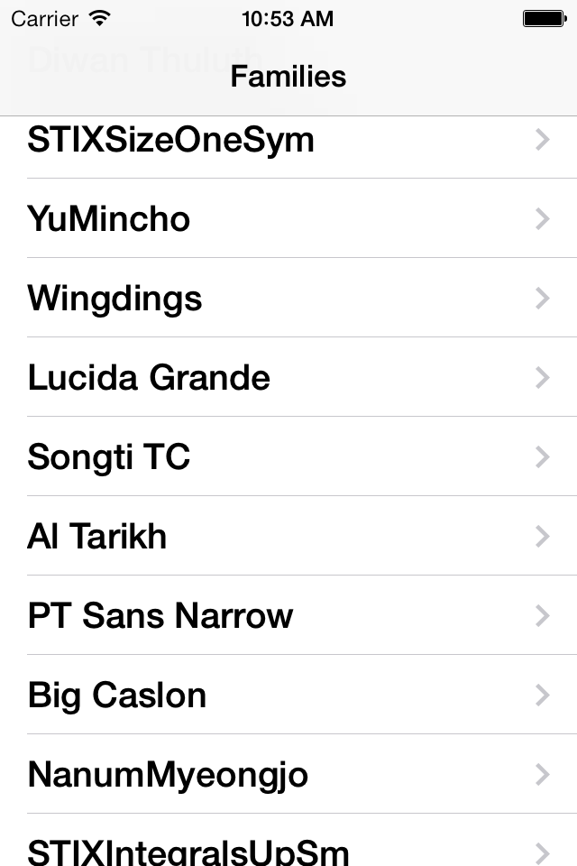
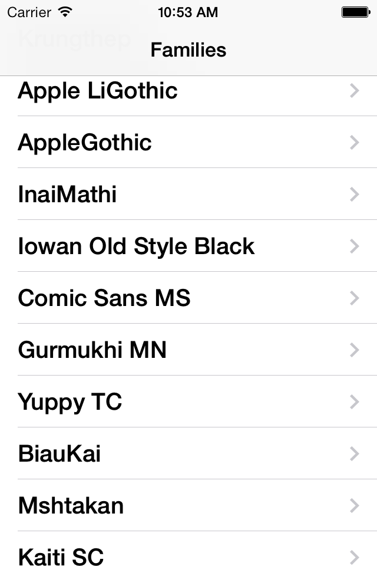
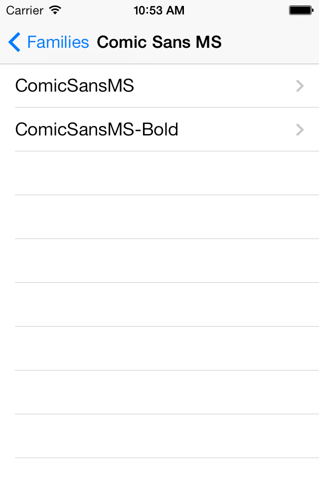
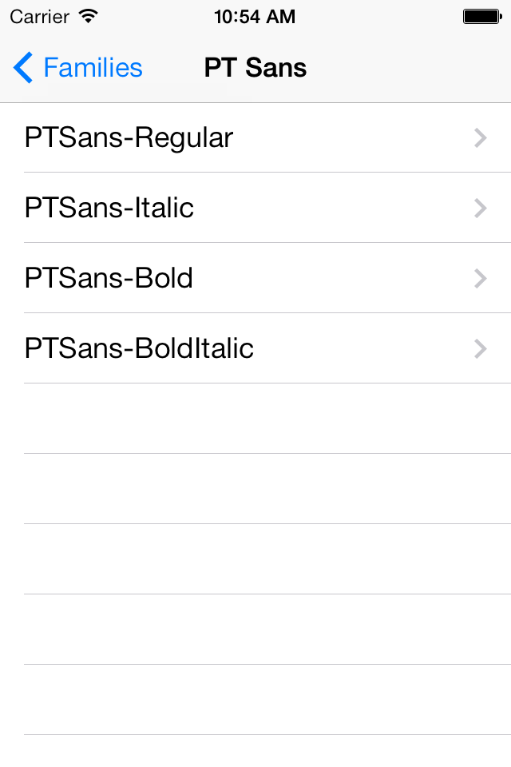
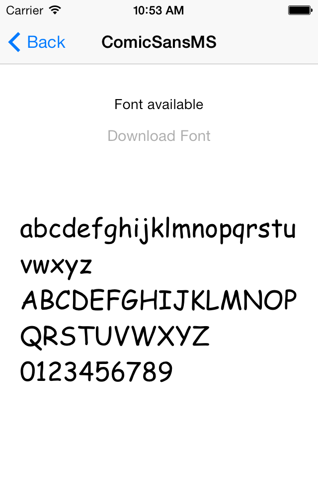
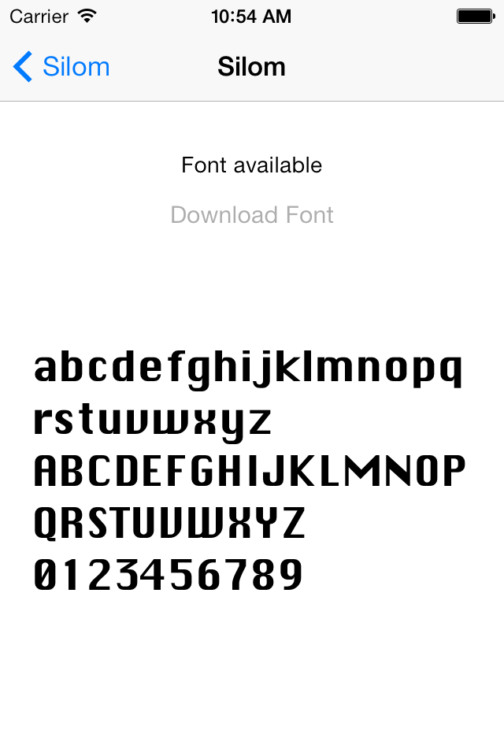
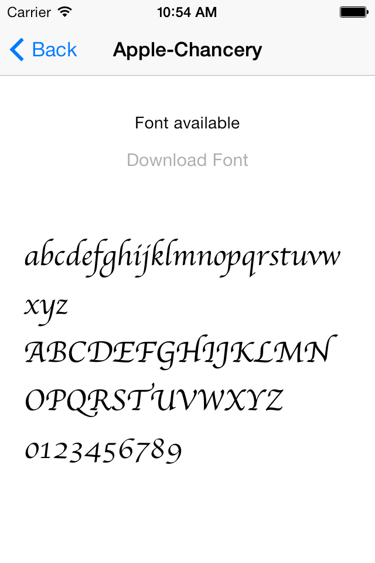

# iOS7 Day-by-Day: Day 22
## Downloadable Fonts

### Introduction

iOS comes with a selection of pre-installed fonts, but it is by no means
exhaustive. In order to save disk-space with the install image, iOS provides a
mechanism for downloading and using fonts at run-time.

Apple provides a set of fonts which they host and license for use, including
fonts for non-roman alphabets, and a selection of fonts users are used to using
on desktop applications. The font-downloading functionality has been available
since iOS6, but in iOS7 there's a much larger list of available fonts.

Downloaded fonts are stored somewhere on the system - as app developers we don't
have access to where the fonts are stored. The font we require might well have
already been downloaded at the request of another app, however, if this isn't the
case we need to be ready for the situation where the user doesn't have network
connectivity and therefore our chosen font isn't available. Or when there is a
delay downloading the requested font - do we switch the fonts out when they're
available?

Firstly we'll take a look at how to get a list of fonts, before then demonstrating
how to download and use a specific font.

### Listing available fonts

The API for downloading fonts is not part of TextKit, but rather the underlying
rendering engine CoreText. This therefore means that rather than dealing with
Cocoa objects, we're going to see a lot of CoreFoundation objects, and we'll be
leaning on toll-free bridging to make our lives easier.

The function in CoreText we need to use is `CTFontDescriptorCreateMatchingFontDescriptors`,
and we use it to match an attribute which labels the font as a downloadable one:
`kCTFontDownloadableAttribute`.

    NSDictionary *descriptorOptions = @{(id)kCTFontDownloadableAttribute : @YES};
    CTFontDescriptorRef descriptor = CTFontDescriptorCreateWithAttributes((CFDictionaryRef)descriptorOptions);
    CFArrayRef fontDescriptors = CTFontDescriptorCreateMatchingFontDescriptors(descriptor, NULL);

The first line, we create an `NSDictionary` of descriptor attributes - here just
specifying that we're only interested in fonts which are downloadable. Then we
create a `CTFontDescriptorRef` using this dictionary - note here that we cast
the `NSDictionary` to a `CFDictionaryRef` - making use of toll-free bridging.
Finally we call the method which will provide us with a list of fonts descriptors
which match this descriptor we provided - i.e. a list of descriptors which represent
downloadable fonts.

The call to this last method is blocking, and may require a network call, so we're
going to wrap this functionality up in a `requestDownloadableFontList` method:

    - (void)requestDownloadableFontList
    {
        dispatch_async(dispatch_get_global_queue(DISPATCH_QUEUE_PRIORITY_BACKGROUND, 0), ^{
            NSDictionary *descriptorOptions = @{(id)kCTFontDownloadableAttribute : @YES};
            CTFontDescriptorRef descriptor = CTFontDescriptorCreateWithAttributes((CFDictionaryRef)descriptorOptions);
            CFArrayRef fontDescriptors = CTFontDescriptorCreateMatchingFontDescriptors(descriptor, NULL);
            
            dispatch_async(dispatch_get_main_queue(), ^{
                [self fontListDownloadComplete:(NSArray *)CFBridgingRelease(fontDescriptors)];
            });
            
            // Need to release the font descriptor
            CFRelease(descriptor);
        });   
    }

Things to note about this completed method:

- We perform the request asynchronously on a background queue, so that we don't
block the main thread.
- Therefore we marshal a call to the `fontListDownloadComplete:` method back on
to the main queue.
- This completion method expects an `NSArray` but we have a `CFArrayRef`, so we
cast it to an `NSArray`. Since the method which created the `CFArrayRef` has the
word `Create` in its name, we need to transfer ownership of the object into ARC
with a `CFBridgingRelease` call.
- Finally, we need to release the font descriptor with `CFRelease`, for the same
reason.

In the sample app which accompanies today's post we present these results as a
table view which at the first level displays font family names. Tapping on one
of the family names will then push a new tableview into the navigation controller
which displays all the fonts within that family. Therefore, at the top level, we
implement the following method for `fontDownloadListComplete:`

    - (void)fontListDownloadComplete:(NSArray *)fontList
    {
        // Need to reorganise array into dictionary
        NSMutableDictionary *fontFamilies = [NSMutableDictionary new];
        for(UIFontDescriptor *descriptor in fontList) {
            NSString *fontFamilyName = [descriptor objectForKey:UIFontDescriptorFamilyAttribute];
            NSMutableArray *fontDescriptors = [fontFamilies objectForKey:fontFamilyName];
            if(!fontDescriptors) {
                fontDescriptors = [NSMutableArray new];
                [fontFamilies setObject:fontDescriptors forKey:fontFamilyName];
            }
            
            [fontDescriptors addObject:descriptor];
        }
        
        _fontList = [fontFamilies copy];
        
        [self.tableView reloadData];
    }

Here we are simply re-organising the array of font descriptors into a dictionary,
arranged by font family. We're making use here of the fact that `UIFontDescriptor`
is toll-free bridged with `CTFontDescriptorRef`.

Once we have arranged the data correctly, we can reload the table. With the
tableview datasource methods set appropriately, and `viewDidLoad`:

    - (void)viewDidLoad
    {
        [super viewDidLoad];
        // Do any additional setup after loading the view, typically from a nib.
        self.title = @"Families";
        
        [self requestDownloadableFontList];
    }

we can run the app up and see that the first page of the navigation controller
will look like this.

The next level of the navigation controller displays the fonts within a specific
family, so to do that we create an `NSArray` property which contains a list of
font descriptors. We set this in the `prepareForSegue:` method of the first view
controller:

    - (void)prepareForSegue:(UIStoryboardSegue *)segue sender:(id)sender
    {
        if ([[segue identifier] isEqualToString:@"ShowFamily"]) {
            SCFontViewController *vc = [segue destinationViewController];
            NSIndexPath *indexPath = [self.tableView indexPathForSelectedRow];
            NSString *fontFamilyName = [_fontList allKeys][indexPath.row];
            NSArray *fontList = _fontList[fontFamilyName];
            vc.fontList = fontList;
            vc.title = fontFamilyName;
        }
    }

With appropriate datasource methods, the second level of the drill-down will
look like this:

### Downloading a font

The final stage of the app will display what the font looks like with some sample
glyphs, if the font is available. Otherwise the user will have the opportunity
to download the font.

The download process is completely within the `handleDownloadPressed:` method, and
the function we're interested in is `CTFontDescriptorMatchFontDescriptorsWithProgressHandler`.
This takes a `CFArrayRef` of font descriptors and downloads the font if required.
It takes a block as a parameter which provides updates of the user. This method
returns immediately, and the operation is performed on a background queue. 

    - (IBAction)handleDownloadPressed:(id)sender {
        self.downloadProgressBar.hidden = NO;
        CTFontDescriptorMatchFontDescriptorsWithProgressHandler((CFArrayRef)@[_fontDescriptor],
                NULL,
                ^bool(CTFontDescriptorMatchingState state, CFDictionaryRef progressParameter) {
            double progressValue = [[(__bridge NSDictionary *)progressParameter objectForKey:(id)kCTFontDescriptorMatchingPercentage] doubleValue];
            if (state == kCTFontDescriptorMatchingDidFinish) {
                dispatch_async(dispatch_get_main_queue(), ^{
                    self.downloadProgressBar.hidden = YES;
                    [self updateView];
                });
            } else {
                dispatch_async(dispatch_get_main_queue(), ^{
                    self.downloadProgressBar.progress = progressValue;
                });
            }
            return (bool)YES;
        });
    }

In the progress block, we extract the current progress percentage from the
provided dictionary, and update the progress bar as appropriate. If the `state`
parameter suggests that the download has been completed, we call `updateView`, 
which is a method we have created to apply the font to the sample glyphs. Note
that we have to ensure that the UI updates are performed on the main thread, as
we usually do:

    - (void)updateView
    {
        NSString *fontName = [self.fontDescriptor objectForKey:UIFontDescriptorNameAttribute];
        self.title = fontName;
        UIFont *font = [UIFont fontWithName:fontName size:26.f];
        if(font && [font.fontName isEqualToString:fontName]) {
            self.sampleTextLabel.font = font;
            self.downloadButton.enabled = NO;
            self.detailDescriptionLabel.text = @"Font available";
        } else {
            self.sampleTextLabel.font = [UIFont systemFontOfSize:font.pointSize];
            self.downloadButton.enabled = YES;
            self.detailDescriptionLabel.text = @"This font is not yet downloaded";
        }
    }

Running the app up now will allow us to browse through the list of available fonts
from Apple, and download each of them to try them out.

### Conclusion

Downloadable fonts are a handy feature which will allow you to customize the
appearance of your app without having to license a font and bundle it with your
app. However, it's important to ensure that you handle the case where the user
doesn't have network connectivity - what should the fall-back font be, and does
the UI work with both options.

